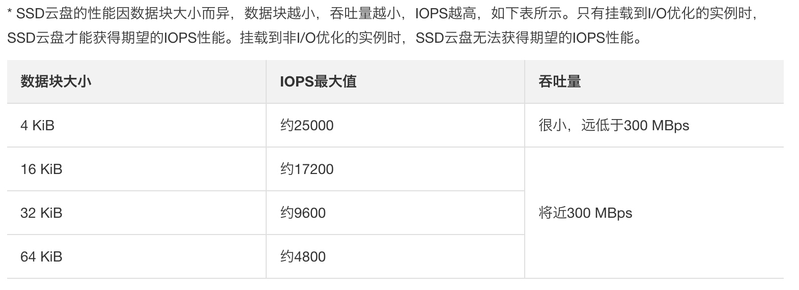
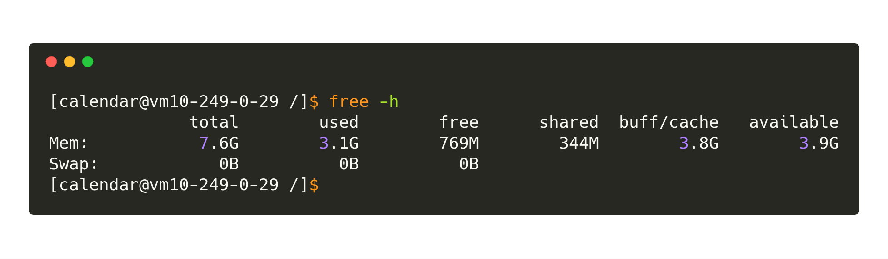
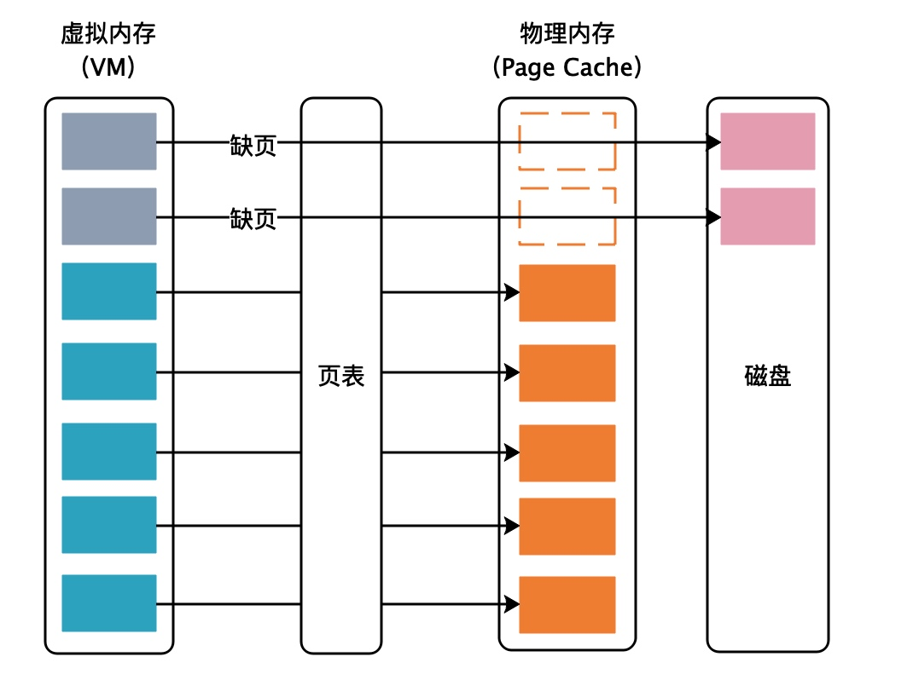

# 第01节 初识 FileChannel、Page Cache 以及 MMAP

## 概述

学习和理解 *RocketMQ* 底层存储设计，首先需要掌握一些基础知识，比如 *Page Cache*、*MMAP*（内存映射）、*DirectByteBuffer*（堆外内存）、顺序读写、随机读写等。这不需要你完全理解它们，但是起码对它们有一个基础的认识，以便后面学习 *RocketMQ* 源码时，能够轻松一些。

本节主要围绕 *Page Cache*、*MMAP*（内存映射）展开描述。*DirectByteBuffer*（堆外内存）、顺序读写和随机读写则放在后面几小节讲解。

*JAVA* 中文件IO有多少种呢？原生的读写方式大概可以被分为三种：普通IO，*FileChannel*（文件通道），*MMAP*（内存映射）。区分它们也很简单，例如 *FileWriter*，*FileReader* 存在于 *java.io* 包中，他们属于普通IO；*FileChannel* 存在于 *java.nio* 包中，属于 *NIO* 的一种，但是注意 *NIO* 并不一定意味着非阻塞，这里的 *FileChannel* 就是阻塞的；较为特殊的是后者 *MMAP*，它是由 *FileChannel* 调用 *map* 方法衍生出来的一种特殊读写文件的方式，被称之为内存映射。

## FileChannel

*FIleChannel* 的获取方式：

```java
FileChannel fileChannel = new RandomAccessFile(new File("db.data"), "rw").getChannel();
```

我们首先来看一下 *FIleChannel* 的读写操作。

```java
// 写操作
byte[] data = new byte[4096];
long position = 1024L;
// 在指定的位置写入数据
fileChannel.write(ByteBuffer.wrap(data), position);
// 在当前写位置写入数据
fileChannel.write(ByteBuffer.wrap(data));

// 读操作
ByteBuffer buffer = ByteBuffer.allocate(4096);
long position = 1024L;
// 从指定的位置读取数据
fileChannel.read(buffer, position)；
// 从当前读位置读取数据
fileChannel.read(buffer);
```

我们在写代码时，经常会将 *FileChannel* 和 *ByteBuffer* 配合起来使用。对于 *ByteBuffer*，你可以将它理解为一个 `byte[]` 的封装类，提供了丰富的 *API* 去操作字节，不了解的同学可以去熟悉下它的 *API*。

*FileChannel* 为什么比普通IO要快呢？

其实，这么说可能不严谨，因为你首先要用对它，*FileChannel* 只有在一次写入 *4kb* 的整数倍时，才能发挥出实际的性能。*4kb* 一定快吗？也不严谨，这主要取决你机器的磁盘结构，并且受到操作系统，文件系统，*CPU* 的影响。

下图是阿里云给出的数据，



得益于 *FileChannel* 采用了 *ByteBuffer* 这样的内存缓冲区，让我们可以非常精准的控制写盘的大小，这是普通IO无法实现的。

如果你不知道你的磁盘的 *IOPS* 和吞吐量，可以阅读文章最后的“性能测试”小节，凭借着 *benchmark everyting* 的技巧，我们完全可以测出来。

还有最关键的一点，成就了 *FileChannel* 的高效。介绍这点之前，我问一个问题：*FileChannel* 是直接把 *ByteBuffer* 中的数据写入到磁盘吗？

答案是否定的，这中间还有一层缓存，它就是 *Page Cache*。我们都知道磁盘IO和内存IO的速度可是相差了好几个数量级。我们可以认为 `filechannel.write` 写入 *Page Cache* 便是完成了落盘操作，但实际上，OS最终帮我们完成了数据从 *Page Cache* 到磁盘的最终写入。此外，*FileChannel* 还提供了一个 `force()` 方法，用于通知操作系统进行强制刷盘。

同理，当我们使用 *FileChannel* 进行读操作时，同样经历了 **磁盘 -> Page Cache -> 用户内存** 这三个阶段。一般来说，如果你的系统对读写性能没有太大的要求，是可以忽略掉 *Page Cache* 的，但作为RocketMQ消息中间件，其追求的就是高性能，*Page Cache* 在调优过程中是万万不能忽视的。

## Page Cache

通常文件读写比较慢，如果对文件进行顺序读写，速度几乎是接近于内存的随机读写，为什么会这么快，原因就是 *Page Cache*。



先来个直观的感受，整个 *OS* 有 *7.6G* 的物理内存，用掉了 *3.1G*，应当还剩下 *4.5G* 空闲的内存，但 *OS* 给出的却是 *769M*。

*OS* 发现系统的物理内存有大量剩余时，为了提高IO的性能，就会使用多余的内存当做文件缓存，也就是图上的 *buff/cache*。

*OS* 在读磁盘时会将当前区域的内容全部读到 *Cache* 中，以便下次读时能命中 *Cache*，写磁盘时直接写到 *Cache* 中就写返回，由 *OS* 的 *pdflush* 以某些策略将 *Cache* 的数据刷回磁盘。

但是系统上文件非常多，即使是多余的 *Page Cache* 也是非常宝贵的资源，*OS* 不可能将 *Page Cache* 随机分配给任何文件，*Linux* 底层就提供了 *mmap* 将一个程序指定的文件映射进虚拟内存（*Virtual Memory*），对文件的读写就变成了对内存的读写，能充分利用 *Page Cache*。不过，文件IO仅仅用到了 *Page Cache* 还是不够的，如果对文件进行随机读写，会使虚拟内存产生很多缺页（*Page Fault*）中断。



每个用户空间的进程都有自己的虚拟内存，每个进程都认为自己所拥有的是物理内存，但虚拟内存只是逻辑上的内存，要想访问内存的数据，还得通过内存管理单元（*MMU*）查找页表，将虚拟内存映射成物理内存。如果映射的文件非常大，程序访问局部映射不到物理内存的虚拟内存时，产生缺页中断，*OS* 需要读写磁盘文件的真实数据再加载到内存。如同我们的应用程序没有 *Cache* 住某块数据，直接访问数据库获取数据再把结果写到 *Cache* 一样，这个过程相对而言是非常慢的。

但是顺序IO时，读和写的区域都是被 *OS* 智能 *Cache* 过的热点区域，不会产生大量缺页中断，文件的IO几乎等同于内存的IO，性能当然就上去了。

说了这么多 *Page Cache* 的优点，也得稍微提一下它的缺点，内核把可用的内存分配给 *Page Cache* 后，空闲的内存相对就会变少，如果程序有新的内存分配需求或者缺页中断，恰好空闲的内存不够，内核还需要花费一点时间将热度低的 *Page Cache* 的内存回收掉，对性能非常苛刻的系统会产生毛刺。

关于 *mmap*，多说一句，关于这个函数复杂的用法这里不描述，但是有一点要记住，调用了 *mmap* 并且传入了一个文件的 *fd*，是在进程地址空间（虚拟内存）分配了一段连续的地址用以映射文件，内核是不会分配真实的物理内存来将文件装入内存。最终还是要通过缺页中断来分配内存，但是这样明显是会影响性能，所以最好要调用 *madvise* 传入 *WILLNEED* 的策略用以 *Page Cache* 的预热，防止这块内存又变冷被回收。

缺页中断分为两类，一种是内存缺页中断，这种的代表是 *malloc*，利用 *malloc* 分配的内存只有在程序访问到的时候，内存才会分配；另外就是硬盘缺页中断，这种中断的代表就是 *mmap*，利用 *mmap* 映射后的只是逻辑地址，当我们的程序访问时，内核会将硬盘中的文件内容读进物理内存页中，这里我们就会明白为什么 *mmap* 之后，访问内存中的数据延时会陡增。

出现问题解决问题，上述情况出现的原因本质上是 *mmap* 映射文件之后，实际并没有加载到内存中，要解决这个问题，需要我们进行索引的预加载，这里就会引出本文讲到的另一函数 *madvise*，这个函数会传入一个地址指针，以及一个区间长度，*madvise* 会向内核提供一个针对于地址区间的I/O的建议，内核可能会采纳这个建议，会做一些预读的操作。例如 *MADV_SEQUENTIAL* 这个就表明顺序预读。

如果感觉这样还不给力，可以采用 *read* 操作，从 *mmap* 文件的首地址开始到最终位置，顺序的读取一遍，这样可以完全保证 *mmap* 后的数据全部加载到内存中。

## MMAP

### MMAP原理

TODO

### MMAP实践

*MMAP* 的获取方式：

```java
MappedByteBuffer mappedByteBuffer = fileChannel.map(FileChannel.MapMode.READ_WRITE, 0, fileChannel.size();
```

先看一个简单的例子，

```java
// 写操作
byte[] data = new byte[4];
int position = 8;
// 在当前写位置写入数据
mappedByteBuffer.put(data);
// 在指定的位置写入数据
MappedByteBuffer subBuffer = mappedByteBuffer.slice();
subBuffer.position(position);
subBuffer.put(data);

// 读操作
byte[] data = new byte[4];
int position = 8;
// 从当前写位置读取数据
mappedByteBuffer.get(data)；
// 从指定的位置读取数据
MappedByteBuffer subBuffer = mappedByteBuffer.slice();
subBuffer.position(position);
subBuffer.get(data);
```

> 补充一个知识点，`slice` 是创建一个新的和 `mappedByteBuffer` 共享同一内存的 MappedByteBuffer 对象。

当我们执行 `fileChannel.map(FileChannel.MapMode.READ_WRITE, 0, 1.5 * 1024 * 1024 * 1024);` 之后，观察一下磁盘上的变化，会立刻获得一个 *1.5G* 的文件，但此时文件的内容全部是 *0*。这符合 *MMAP* 的中文描述：内存映射文件，我们之后对内存中 *MappedByteBuffer* 做的任何操作，都会被最终映射到文件之中。

> `mmap` 把文件映射到用户空间里的虚拟内存，省去了从内核缓冲区到用户空间的 *Copy*，文件中的位置在虚拟内存中有了对应的地址，可以像操作内存一样操作这个文件，相当于已经把整个文件放入内存。
> 
> 但在真正使用到这些数据前却不会消耗物理内存，也不会有读写磁盘的操作，只有真正使用这些数据时，虚拟内存管理系统 *VMS* 才根据缺页加载的机制从磁盘加载对应的数据块到物理内存。这样的读写文件方式少了数据从内核缓存到用户空间的拷贝，效率很高。

### MMAP vs FileChannel

看到这里，你也许会问，还有 `FileChannel` 存在的意义吗？！还有就是，网上很多文章都在说，*MMAP* 操作大文件性能比 *FileChannel* 高出一个数量级！

然而，在这里我只能很遗憾的告诉你，它只有在**一次写入很小量数据**的场景下才能表现出比 *FileChannel* 稍微优异的性能。紧接着我还要告诉你一些令你沮丧的事，至少在 *JAVA* 中使用 *MappedByteBuffer* 是一件非常麻烦并且痛苦的事，主要表现为三点：

1. *MMAP* 使用时必须指定好内存映射的大小，并且一次 *map* 的大小限制在 2G 左右，重复 *map* 又会带来虚拟内存的回收、重新分配的问题，对于文件不确定大小的情形实在是太不友好了。
    
    通过代码很容易看出，`map` 会限制在 *Integer.MAX_VALUE* 范围内。
    
    ```java
    public MappedByteBuffer map(MapMode var1, long var2, long var4) throws IOException {
        this.ensureOpen();
        if(var1 == null) {
            throw new NullPointerException("Mode is null");
        } else if(var2 < 0L) {
            throw new IllegalArgumentException("Negative position");
        } else if(var4 < 0L) {
            throw new IllegalArgumentException("Negative size");
        } else if(var2 + var4 < 0L) {
            throw new IllegalArgumentException("Position + size overflow");
        } else if(var4 > 2147483647L) { // 限制在Integer.MAX_VALUE范围内
            throw new IllegalArgumentException("Size exceeds Integer.MAX_VALUE");
        } else {
    ```
    
2. *MMAP* 使用的是虚拟内存，和 *Page Cache* 一样是由操作系统来控制刷盘的，虽然可以通过 `force()` 来手动控制，但这个时机把握不好，在小内存场景下会很令人头疼。
3. *MMAP* 的回收问题，当 *MappedByteBuffer* 不再需要时，需要手动释放占用的虚拟内存，且释放的方式也很麻烦。
    
    下面的代码是 *RocketMQ* 释放 *MappedByteBuffer* 方式。具体为什么这么做，后面我在分析 *RocketMQ* 源码时会详细讲解的。
    
    ```java
    public static void clean(final ByteBuffer buffer) {
        if (buffer == null || !buffer.isDirect() || buffer.capacity() == 0)
            return;
        invoke(invoke(viewed(buffer), "cleaner"), "clean");
    }

    private static Object invoke(final Object target, final String methodName, final Class<?>... args) {
        return AccessController.doPrivileged(new PrivilegedAction<Object>() {
            public Object run() {
                try {
                    Method method = method(target, methodName, args);
                    method.setAccessible(true);
                    return method.invoke(target);
                } catch (Exception e) {
                    throw new IllegalStateException(e);
                }
            }
        });
    }

    private static Method method(Object target, String methodName, Class<?>[] args)
        throws NoSuchMethodException {
        try {
            return target.getClass().getMethod(methodName, args);
        } catch (NoSuchMethodException e) {
            return target.getClass().getDeclaredMethod(methodName, args);
        }
    }

    private static ByteBuffer viewed(ByteBuffer buffer) {
        String methodName = "viewedBuffer";

        Method[] methods = buffer.getClass().getMethods();
        for (int i = 0; i < methods.length; i++) {
            if (methods[i].getName().equals("attachment")) {
                methodName = "attachment";
                break;
            }
        }

        ByteBuffer viewedBuffer = (ByteBuffer) invoke(buffer, methodName);
        if (viewedBuffer == null)
            return buffer;
        else
            return viewed(viewedBuffer);
    }
    ```
    
    对的，你没看错，这么长的代码仅仅是为了干回收 *MappedByteBuffer* 这一件事。
    
所以我建议，优先使用 *FileChannel* 来快速实现一个初版，在必须使用小数据量刷盘的场景下，再换成 *MMAP* 的实现，其他场景 *FileChannel* 完全可以 *cover*。至于 *MMAP* 为什么在一次写入少量数据的场景下表现的比 *FileChannel* 优异，我还没有查到理论根据，如果你有相关的线索，欢迎留言。理论分析下，*FileChannel* 同样是写入内存，但比 *MMAP* 多了一次内核缓冲区与用户空间互相复制的过程，所以在极端场景下，*MMAP* 表现的更加优秀。

对于这两种消息写入方式，*RocketMQ* 都提供了具体的实现，我们会在后面的章节中，通过源码具体分析其是如何实现的。

## 性能测试

*Linux* 实例和 *Windows* 实例都推荐使用 *FIO* 工具进行测试块存储性能。

本文以 *Linux* 实例和 *FIO* 为例，说明如何使用 *FIO* 测试块存储性能。在进行测试前，请确保块存储设备已经 *4KiB* 对齐。

测试随机写IOPS，运行以下命令：

```text
fio -direct=1 -iodepth=128 -rw=randwrite -ioengine=libaio -bs=4k -size=1G -numjobs=1 -runtime=1000 -group_reporting -filename=iotest -name=Rand_Write_Testing
```

测试随机读IOPS，运行以下命令：

```text
fio -direct=1 -iodepth=128 -rw=randread -ioengine=libaio -bs=4k -size=1G -numjobs=1 -runtime=1000 -group_reporting -filename=iotest -name=Rand_Read_Testing
```

测试顺序写吞吐量，运行以下命令：

```text
fio -direct=1 -iodepth=64 -rw=write -ioengine=libaio -bs=1024k -size=1G -numjobs=1 -runtime=1000 -group_reporting -filename=iotest -name=Write_PPS_Testing
```

测试顺序读吞吐量，运行以下命令：

```text
fio -direct=1 -iodepth=64 -rw=read -ioengine=libaio -bs=1024k -size=1G -numjobs=1 -runtime=1000 -group_reporting -filename=iotest -name=Read_PPS_Testing
```

下表以测试随机写IOPS的命令为例，说明命令中各种参数的含义。

|参数	|说明|
| --- | --- |
|-direct=1	|表示测试时忽略I/O缓存，数据直写。|
|-iodepth=128	|表示使用AIO时，同时发出I/O数的上限为128。|
|-rw=randwrite	|表示测试时的读写策略为随机写（random writes）。作其它测试时可以设置为：<br>- randread（随机读random reads）<br>- read（顺序读sequential reads）<br>- write（顺序写sequential writes）<br>- randrw（混合随机读写mixed random reads and writes）|
|-ioengine=libaio	|表示测试方式为libaio（Linux AIO，异步I/O）。应用程序使用I/O通常有两种方式：<br><br>- 同步<br>&nbsp;&nbsp;&nbsp;&nbsp;同步的I/O一次只能发出一个I/O请求，等待内核完成才返回。这样对于单个线程iodepth总是小于1，但是可以透过多个线程并发执行来解决。通常会用16～32个线程同时工作将iodepth塞满。<br><br>- 异步<br>&nbsp;&nbsp;&nbsp;&nbsp;异步的I/O通常使用libaio这样的方式一次提交一批I/O请求，然后等待一批的完成，减少交互的次数，会更有效率。|
|-bs=4k	|表示单次I/O的块文件大小为4 KB。未指定该参数时的默认大小也是4 KB。<br><br>测试IOPS时，建议将bs设置为一个比较小的值，如本示例中的4k。<br><br>测试吞吐量时，建议将bs设置为一个较大的值，如本示例中的1024k。|
|-size=1G	|表示测试文件大小为1 GiB。|
|-numjobs=1	|表示测试线程数为1。|
|-runtime=1000	|表示测试时间为1000秒。如果未配置，则持续将前述`-size`指定大小的文件，以每次`-bs`值为分块大小写完。|
|-group_reporting	|表示测试结果里汇总每个进程的统计信息，而非以不同job汇总展示信息。|
|-filename=iotest	|指定测试文件的名称，比如iotest。测试裸盘可以获得真实的硬盘性能，但直接测试裸盘会破坏文件系统结构，请在测试前提前做好数据备份。|
|-name=Rand_Write_Testing	|表示测试任务名称为Rand_Write_Testing，可以随意设定。|

> 最后，要感谢阿里徐靖峰同学、艾瑞克同学为撰写此文提供帮助。