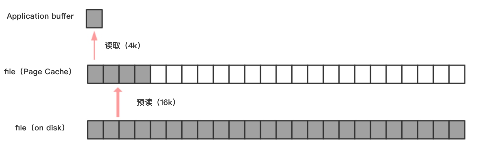

# 第02节 理解顺序与随机读写

## 什么是顺序与随机读写

“顺序读比随机读快，顺序写比随机写快。”无论是机械硬盘还是 *SSD*，这个结论都是成立的。我们这里不讨论机械硬盘这种古老的存储介质，重点关注在 *SSD* 上，来看看在它之上进行的随机读写为什么比顺序读写要慢。即使各个 *SSD* 和文件系统的构成具有差异性，但我们今天的分析同样具备参考价值。

首先，什么是顺序读，什么是随机读，什么是顺序写，什么是随机写？可能我们刚接触文件IO操作时并不会有这样的疑惑，但写着写着，自己都开始怀疑自己的理解了，不知道你有没有经历过这样类似的阶段，反正我有一段时间的确怀疑过。那么，先来看看两段代码：

**写入方式一、64个线程，用户自己使用一个 *atomic* 变量记录写入指针的位置，并发写入**

```java
ExecutorService executor = Executors.newFixedThreadPool(64);
AtomicLong wrotePosition = new AtomicLong(0);
for (int i = 0; i < 1024; i++) {
    executor.execute(() -> {
        fileChannel.write(ByteBuffer.wrap(new byte[4 * 1024]), wrotePosition.getAndAdd(4 * 1024));
    });
}
```

**写入方式二、给 write 加了锁，保证了同步。**

```java
ExecutorService executor = Executors.newFixedThreadPool(64);
AtomicLong wrotePosition = new AtomicLong(0);
for (int i = 0; i < 1024; i++) {
    executor.execute(() -> {
        write(new byte[4 * 1024]);
    });
}

public synchronized void write(byte[] data) {
    fileChannel.write(ByteBuffer.wrap(new byte[4 * 1024]), wrotePosition.getAndAdd(4 * 1024));
}
```

**方式二**才算顺序写，顺序读也是同理。对于文件操作，加锁并不是一件非常可怕的事，不敢同步 *write/read* 才可怕！有人会问：*FileChannel* 为什么要加锁同步？为什么这样会快？原因是，多线程并发 *write* 并且不加同步，其实际，它的执行次序可能是，

1. thread1 write position[0~4096)
2. thread3 write position[8194~12288)
3. thread2 write position[4096~8194)

所以并不是完全的“顺序写”。不过你也别担心加锁会导致性能下降，可以通过**文件分片**来减少多线程读写时锁的冲突。

再来分析原理，为什么顺序读会比随机读要快？顺序写为什么比随机写要快？其实是一个东西在起作用：*Page Cache*，前面我们已经提到了，它是位于 *application buffer*（用户内存）和 *disk file*（磁盘）之间的一层缓存。



以顺序读为例，当用户发起一个 `fileChannel.read(4kb)` 之后，实际发生了两件事

1. 操作系统从磁盘加载了 *16kb* 进入 *Page Cache*，这被称为预读；
2. *read* 操作通从 *Page Cache* 拷贝 *4kb* 进入用户内存；

最终我们在用户内存访问到了 *4kb*，为什么顺序读快？很容量想到，当用户继续访问接下来的[4kb, 16kb]的磁盘内容时，便是直接从 *Page Cache* 去访问了。试想一下，当需要访问 *16kb* 的磁盘内容时，是发生 4 次磁盘IO快，还是发生 1 次磁盘IO + 4 次内存IO快呢？

好了，聊了这么多，你是否有疑问呢？下面，我对大家普遍疑惑的几点问题做一下解答：

1. 当内存不足时，*Page Cache* 的分配会受影响吗？

    a) 写入数据到 *Page Cache* 时，如果内存不足，则OS尝试丢弃干净的 *PAGE*（即没有脏页），腾出内存供新数据使用，策略是 *LRU* 方式。
    
    b) 如果干净页不足，此时写入 *Page Cache* 会被阻塞，系统尝试刷盘部分数据，大约每次尝试 32 个 *PAGE*。
    
2. Page Cache 的大小有限制么？

    > 引用 *Kafka* 官网的一段话：*modern operating systems have become increasingly aggressive in their use of main memory for disk caching. A modern OS will happily divert all free memory to disk caching with little performance penalty when the memory is reclaimed. All disk reads and writes will go through this unified cache.* 
    
    现代操作系统在使用主存进行磁盘缓存方面变得越来越激进。现代操作系统很乐意将所有可用内存用作磁盘缓存，在回收内存时几乎没有性能损失。所有磁盘读写都将通过此统一缓存。
    
3. 我可以监控 *Page Cache* 的命中情况吗？

    *GitHub* 上一款工具可以监控 *Page Cache*：*https://github.com/brendangregg/perf-tools*    

## 文件分区

前面我们已经提到了顺序读写时我们需要对 *write/read* 加锁，值得强调的是，加锁并不可怕，文件IO操作并没有那么依赖多线程。但是加锁之后的顺序读写必然无法打满磁盘IO，如今系统强劲的 *CPU* 总不能不压榨吧？我们可以采用文件分区的方式来达到一举两得的效果：既满足了顺序读写，又减少了锁的冲突。

那么问题来啦，分区多少合适呢？

文件多了，锁冲突变降低了；文件太多了，碎片化太过严重。

在下一节《RocketMQ存储架构》，我们会拿 *Kafka* 与 *RocketMQ* 的底层存储设计做一个对比，来进一步阐述这一问题。

> 最后，要感谢阿里徐靖峰为撰写此文提供帮助。