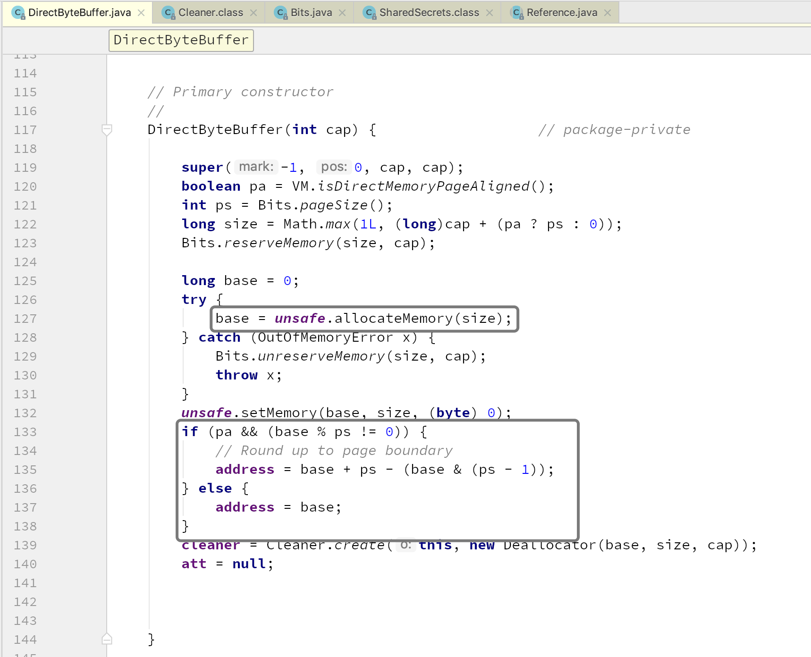

# 第03节 初识堆外内存 

## TODO

1、堆内内存为何一定要复制到堆外内存来读写？

## 前言

**堆外内存**是相对于堆内内存来说的。堆内内存是由 *JVM* 所管理的内存，我们平时在 *Java* 中创建的对象都处于堆内内存中，并且它们遵循 *JVM* 的内存管理机制，*JVM* 会采用垃圾回收机制来统一管理堆内内存。而堆外内存则是不受 *JVM* 管理的内存区域。

在 *Java* 中堆外内存所对应的类为 *DirectByteBuffer*，在讲解 *DirectByteBuffer* 之前，我们先来了解两个知识点：

1. *Java* 引用类型

    *DirectByteBuffer* 是通过虚引用（*Phantom Reference*）来实现堆外内存的释放的。*Phantom Reference* 是所有“弱引用”中最弱的引用类型。不同于软引用(*SoftReference*)和弱引用(*WeakReference*)，虚引用无法通过 `get()` 方法来取得目标对象的强引用从而使用目标对象，观察源码可以发现 `get()` 被重写为永远返回 *null*。

    那虚引用到底有什么作用？其实**虚引用主要被用来跟踪对象被垃圾回收的状态，通过查看引用队列中是否包含对象所对应的虚引用来判断它是否即将被垃圾回收。**它并不被期待用来取得目标对象的引用，而**目标对象被回收前，它的引用会被放入一个 *ReferenceQueue* 对象中，从而达到跟踪对象垃圾回收的作用。**

2. *Linux* 的内核态和用户态

    - **内核态**：控制计算机的硬件资源，并提供上层应用程序运行的环境。比如 *Socket I/0* 操作或者文件的读写操作等；
    - **用户态**：上层应用程序的运行空间，应用程序的执行必须依托于内核提供的资源；
    - **系统调用**：为了使上层应用能够访问到这些资源，内核为上层应用提供访问的接口；

    因此我们可以得知当我们通过 *JNI*（*JNI* 是 *Java Native Interface* 的缩写，它提供了若干的 *API* 实现了 *Java* 和其他语言的通信（主要是C&C++）），调用的 *native* 方法实际上就是从用户态切换到了内核态的一种方式。并且通过该系统调用使用操作系统所提供的功能。

**为什么需要用户进程（位于用户态中）要通过系统调用（*Java* 中即使用 *JNI*）来调用内核态中的资源，或者说调用操作系统的服务？**

*intel cpu* 提供 *Ring0* - *Ring3* 四种级别的运行模式，*Ring0* 级别最高，*Ring3* 最低。*Linux* 使用了 *Ring3* 级别运行用户态，*Ring0* 作为内核态。*Ring3* 状态不能访问 *Ring0* 的地址空间，包括代码和数据。因此**用户态是没有权限去操作内核态的资源的，它只能通过系统调用来完成用户态到内核态的切换，然后在完成相关操作后再由内核态切换回用户态。**

既然在 *linux* 中内核态的权限是最高的，那么在内核态的场景下，操作系统是可以访问任何一个内存区域的，所以操作系统是可以访问到 *Java* 堆的这个内存区域的。

那么问题来了，

**那为什么操作系统不直接访问 *Java* 堆内的内存区域呢？**

这是因为 *JNI* （*Java Native Interface*，**使用 *JNI* 技术，不仅可以实现 *Java* 访问 *C* 函数，也可以实现 *C* 语言调用 *Java* 代码。**）方法访问的内存区域是一个已经确定了的内存区域地址，那么该内存地址指向的是 *Java* 堆内内存的话，那么如果在操作系统正在访问这个内存地址的时候，*Java* 在这个时候进行了 *GC* 操作，而 *GC* 操作会涉及到数据的移动操作（ *GC* 经常会进行先标志再压缩的操作。即将可回收的空间做标志，然后清空标志位置的内存，然后会进行一个压缩，压缩就会涉及到对象的移动，移动的目的是为了腾出一块更加完整、连续的内存空间，以容纳更大的新对象），数据的移动会使 *JNI* 调用的数据错乱。所以 *JNI* 调用的内存是不能进行 *GC* 操作的。

**如上面所说，*JNI* 调用的内存是不能进行 *GC* 操作的，那该如何解决呢？**

① 堆内内存与堆外内存之间数据拷贝的方式（并且在将堆内内存拷贝到堆外内存的过程 *JVM* 会保证不会进行 *GC* 操作)：比如我们要完成一个从文件中读数据到堆内内存的操作，即 `fileChannelImpl.read(heapByteBuffer)` 。这里实际上 *File I/O* 会将数据读到堆外内存中，然后堆外内存再将数据拷贝到堆内内存，这样我们就读到了文件中的内存。

而写操作则反之，我们会将堆内内存的数据先写到堆外内存中，然后操作系统会将堆外内存的数据写入到文件中。

② 直接使用堆外内存，如 *DirectByteBuffer*：这种方式是直接在堆外分配一个内存（即 *native memory*）来存储数据，程序通过 *JNI* 直接将数据读/写到堆外内存中。因为数据直接写入到了堆外内存中，所以这种方式就不会再在 *JVM* 管理的堆内再分配内存来存储数据了，也就不存在堆内内存和堆外内存数据拷贝的操作了。这样在进行 *I/O* 操作时，只需要将这个堆外内存地址传给 *JNI* 的 *I/O* 的函数就好了。

## 初识堆外内存

*DirectByteBuffer* 是 *Java* 用于实现堆外内存的一个重要类，我们可以通过该类实现堆外内存的创建、使用和销毁。

下面我们简单了解下 *DirectByteBuffer* 这个类。

继承结构如下图所示，


> 注意，*DirectByteBuffer* 对象本身还是位于 *Java* 内存模型的堆中。

而 *DirectByteBuffer* 中的 `unsafe.allocateMemory(size);` 是个一个 *native* 方法，这个方法分配的是堆外内存，通过 *C* 的 `malloc` 来进行分配的。分配的内存是操作系统本地的内存，并不在 *Java* 的堆内内存中，不受 *JVM* 管理，所以 *DirectByteBuffer* 一定会存在某种方式来操纵堆外内存。

在 *DirectByteBuffer* 的父类 *Buffer* 中有个 *address* 属性：

```java
// Used only by direct buffers
// NOTE: hoisted here for speed in JNI GetDirectBufferAddress
long address;
```

> 代码中注释的意思是，*address* 只会被直接缓存（堆外内存）给使用到。之所以将 *address* 属性放在 *Buffer* 中，是为了在 *JNI* 调用 *GetDirectBufferAddress* 时提升它调用的效率。

*address* 表示分配的堆外内存的地址。



`unsafe.allocateMemory(size);` 分配完堆外内存后就会返回分配的堆外内存基地址`base`，并将这个地址赋值给了 `address` 属性。这样我们后面通过 *JNI* 对这个堆外内存操作时都是通过这个 `address` 来实现。

> 注意，上面代码关于 `address` 的赋值，需要考虑**内存页对齐**的情况。

这里，我们只是简单了解下 *DirectByteBuffer* 的构造函数，具体的源码解析我们会在下一小节讲。

> ⚠️ 注意，堆外内存是通过 *C* 的 `malloc` 来进行分配的，即是用户态内存。只有驱动程序才有可能申请到内核态内存。还有，堆外内存主要是为了脱离 *GC* 管理，来实现自己管理内存。
> 
> 此外，如果进程结束，堆外内存也会被释放。但是如果程序代码对堆外内存管理不当，程序运行过程中可能会出现堆外内存泄漏，触发 *OOME*。

下面举一个简单的例子，

```java
// DirectBufferAlloc.java
public class DirectBufferAlloc {

    public static final Unsafe UNSAFE;

    static {
        try {
            Field field = Unsafe.class.getDeclaredField("theUnsafe");
            field.setAccessible(true);
            UNSAFE = (Unsafe) field.get(null);
        } catch (Exception e) {
            throw new RuntimeException(e);
        }
    }

    public static void main(String[] args) throws InterruptedException, NoSuchFieldException, IllegalAccessException {

        ByteBuffer byteBuffer = ByteBuffer.allocateDirect(1024 * 1024 * 1024);
        byteBuffer.putInt(1024);

        int v = byteBuffer.getInt(0);
        System.out.println(v);

        System.out.println("===========================================");

        Field field = Buffer.class.getDeclaredField("address");
        field.setAccessible(true);
        Long address = (Long) field.get(byteBuffer);

        System.out.println("Address: " + address + ", value: " + Integer.reverseBytes(UNSAFE.getInt(address)));

        while (true) {
            System.out.println("===========================================");

            System.out.println("Address: " + address + ", value: " + Integer.reverseBytes(UNSAFE.getInt(address)));

            TimeUnit.SECONDS.sleep(1);
        }
    }
}
```

上面的程序代码会分配 *1G* 的堆外内存，程序运行过程中，通过 *free* 命令会发现已使用内存增加了 *1G*，结束程序后，已使用内存又回到了原来的值。


程序输出结果：

```text
1024
===========================================
Address: 4946894848, value: 1024
===========================================
Address: 4946894848, value: 1024
===========================================
...
```

此时通过 *free* 命令查看内存使用，


结束程序运行，再次通过 *free* 命令查看内存使用，


## 为什么要使用堆外内存

- 对垃圾回收停顿的改善；

    *full GC* 意味着彻底回收，垃圾收集器会对所有已分配的堆内内存进行扫描，这样一次垃圾收集对 *Java* 应用造成的影响跟堆的大小是成正比的。过大的堆会影响 *Java* 应用的性能。如果使用堆外内存的话，堆外内存不受 *JVM* 管理，也就是不会被垃圾收集器回收。这样做的结果就是能保持一个较小的堆内内存，以减少垃圾收集对应用的影响。

- 在某些场景下可以提升程序 *I/O* 操作的性能。避免了将数据从堆内内存拷贝到堆外内存这一步骤。

## 最佳实践

关于堆内内存和堆外内存的一些最佳实践：

1. 当需要申请大块的内存时，堆内内存会受到限制，只能分配堆外内存。
2. 堆外内存适用于生命周期中等或较长的对象。(如果是生命周期较短的对象，在 *YGC* 的时候就被回收了，就不存在大内存且生命周期较长的对象在 *FGC* 对应用造成的性能影响）。
3. 可以使用“堆外内存池”的方式，来对生命周期较短，但涉及到 *I/O* 操作的对象进行堆外内存的复用（*Netty*、*RocketMQ* 就使用了该方式）。创建堆外内存的消耗要大于创建堆内内存的消耗，所以当分配了堆外内存之后，尽可能复用它。

## 堆外内存的问题

- 堆外内存的回收以及内存泄漏问题。
- 堆外内存的数据结构问题，如果数据结构比较复杂，就要对其进行序列化，而序列化本身也会影响性能。
- 堆外内存由于可以申请更大的内存，而这些内存很有可能会被操作系统 *Swap* 到磁盘上，这会影响性能。在后面的章节中我们会学到 *RocketMQ* 是怎么来防止 *Swap* 的发生。