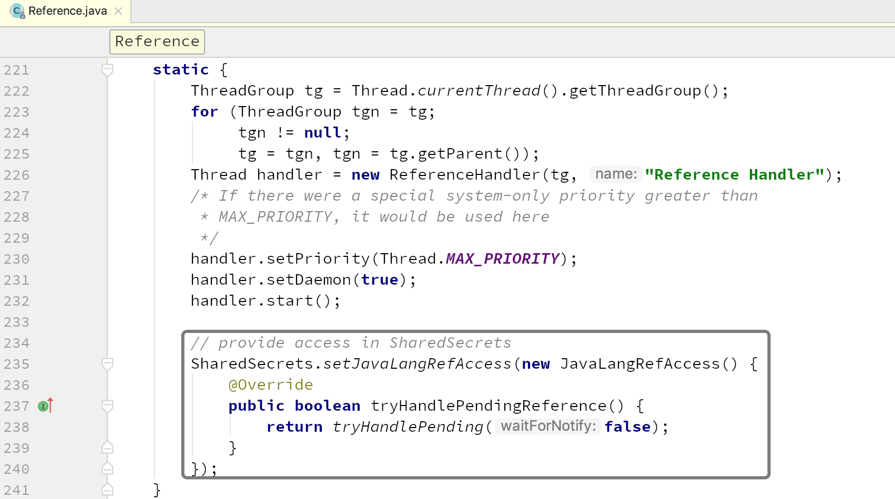

# 第04节 堆外内存源码剖析（上）

本小节，我们来对堆外内存 *DirectByteBuffer* 进行深度的源码解读。

我们先简单了解一下 *DirectByteBuffer* 的创建，其构造函数是私有的，可以通过`ByteBuffer#allocateDirect`创建 *DirectByteBuffer*。

```java
ByteBuffer byteBuffer = ByteBuffer.allocateDirect(fileSize);
```

```java
// ByteBuffer.java
public static ByteBuffer allocateDirect(int capacity) {
    return new DirectByteBuffer(capacity);
}
```

```java
// DirectByteBuffer.java
// 包私有构造函数
DirectByteBuffer(int cap) {                   // package-private

    // mark = -1, position = 0, limit = capacity, capacity = capacity
    super(-1, 0, cap, cap);
    // 内存是否按页分配对齐
    boolean pa = VM.isDirectMemoryPageAligned(); // @1
    // 获取内存页大小
    int ps = Bits.pageSize(); // @2
    // 实际分配内存的大小，如果是按页分配对齐方式，需要再加一内存页的大小
    long size = Math.max(1L, (long)cap + (pa ? ps : 0));
    // 使用Bits保存实际分配内存(按页分配时，与容量大小会有不同)的大小和容量（capacity）；
    // 如果堆外内存不足，还会触发相关的内存回收；
    Bits.reserveMemory(size, cap); // @3

    long base = 0;
    try {
        // 通过unsafe.allocateMemory分配堆外内存，并返回堆外内存的基地址
        // 可见，如果是按页分配对齐方式，实际分配内存的大小要大于容量
        base = unsafe.allocateMemory(size);
    } catch (OutOfMemoryError x) {
        // 堆外内存分配失败，则回滚总实际分配内存和总容量
        Bits.unreserveMemory(size, cap);
        throw x;
    }
    unsafe.setMemory(base, size, (byte) 0);
    // 计算堆外内存的地址
    // 如果不是页对齐，则address等于base；
    // 否则，如果base不是内存页大小的整数倍，则向上取整
    // @4
    if (pa && (base % ps != 0)) {
        // Round up to page boundary
        address = base + ps - (base & (ps - 1));
    } else {
        address = base;
    }
    // 构建Cleaner对象用于跟踪DirectByteBuffer对象的垃圾回收，以实现当DirectByteBuffer被垃圾回收时，堆外内存也会被释放
    // @5
    cleaner = Cleaner.create(this, new Deallocator(base, size, cap));
    att = null;
}
```

## 内存页对齐

代码@1，判断是否内存页对齐。如果你翻阅 *VM* 类的源码，你会发现它是通过`sun.nio.PageAlignDirectMemory` *JVM* 参数配置的。

```java
// VM.java
private static boolean pageAlignDirectMemory;

public static boolean isDirectMemoryPageAligned() {
    return pageAlignDirectMemory;
}
```

`pageAlignDirectMemory` 字段是通过如下方式初始化的，

```java
// System.java
private static Properties props;
private static native Properties initProperties(Properties props);

/**
 * 初始化System类
 */
private static void initializeSystemClass() {
    ...
    props = new Properties();
    initProperties(props);  // initialized by the VM
    
    sun.misc.VM.saveAndRemoveProperties(props);
    ...
}

public static void saveAndRemoveProperties(Properties var0) {
    if (booted) {
        throw new IllegalStateException("System initialization has completed");
    } else {
        savedProps.putAll(var0);
        ...
        var1 = (String)var0.remove("sun.nio.PageAlignDirectMemory");
        if ("true".equals(var1)) {
            pageAlignDirectMemory = true;
        }
        ...
    }
}
```

## 内存页大小

代码@2，通过`Unsafe#pageSize()`本地方法获取的，页大小与操作系统有关。32 位操作系统的内存页大小为 *4k*。

```java
// Bits.java
private static int pageSize = -1;
static int pageSize() {
    if (pageSize == -1)
        pageSize = unsafe().pageSize();
    return pageSize;
}
```

## 堆外内存分配

无论是分配或释放堆外内存，都应调用这些方法。它们允许用户控制进程可以访问的堆外内存大小。所有大小都以字节为单位。

代码@3，`Bits.reserveMemory(size, cap);`主要执行以下内容：
1. 初始化`maxMemory`；
2. 保存实际分配内存（按页分配时，与容量大小会有不同）的大小和容量（*capacity*）；
    如果堆外内存满足此次分配需求，则直接返回；否则，会继续执行以下步骤来回收堆外内存。
3. 调用类型为`Cleaner`的挂起引用对象（*pending Reference objects*）的`clean`方法，主动回收堆外内存，并再次尝试保存实际分配内存的大小和容量；
    如果堆外内存满足此次分配需求，则直接返回；否则，会循环执行该步骤直至没有待处理的挂起的引用对象为止，然后会继续执行以下步骤。
4. 调用`System.gc()`主动触发 *full GC*；
5. 循环进行最多 9 次尝试，每次都会执行主动内存回收，并尝试保存实际分配内存的大小和容量。
    如果 9 次尝试还是没有足够的可用堆外内存来分配，那么最终会抛出 *OutOfMemoryError*；

```java
// Bits.java
// -- 直接内存管理 --

// 用户可设置的可分配堆外内存大小的上限。
// 如果使用"-XX:MaxDirectMemorySize=<size>"启动，则会在VM初始化期间更改此值。
private static volatile long maxMemory = VM.maxDirectMemory();
private static final AtomicLong reservedMemory = new AtomicLong();
private static final AtomicLong totalCapacity = new AtomicLong();
private static final AtomicLong count = new AtomicLong();
// 标记是否设置了maxMemory
private static volatile boolean memoryLimitSet = false;
// max. number of sleeps during try-reserving with exponentially
// increasing delay before throwing OutOfMemoryError:
// 1, 2, 4, 8, 16, 32, 64, 128, 256 (total 511 ms ~ 0.5 s)
// which means that OOME will be thrown after 0.5 s of trying
private static final int MAX_SLEEPS = 9;

/**
 * @param size 实际分配内存(按页分配)的大小
 * @param cap 容量
 */
static void reserveMemory(long size, int cap) {

    // @@1^
    if (!memoryLimitSet && VM.isBooted()) {
        maxMemory = VM.maxDirectMemory();
        memoryLimitSet = true;
    }
    // @@1$

    if (tryReserveMemory(size, cap)) { // @@2
        return;
    }

    final JavaLangRefAccess jlra = SharedSecrets.getJavaLangRefAccess();

    // 在帮助挂起的引用对象入队（enqueue）时重试，
    // 其中包括执行挂起的Cleaner(s)，而这些Cleaner(s)又包含释放堆外内存的Cleaner(s)。
    while (jlra.tryHandlePendingReference()) { // @@3
        if (tryReserveMemory(size, cap)) {
            return;
        }
    }

    // trigger VM's Reference processing
    System.gc(); // @@4
    
    // 具有指数退避延迟的重试循环（这为VM提供了一些时间来完成它的垃圾回收工作）
    // @@5^
    boolean interrupted = false; // 标记是否被中断
    try {
        long sleepTime = 1; // 每次睡眠的时间
        int sleeps = 0; // 睡眠的次数
        while (true) {
            if (tryReserveMemory(size, cap)) {
                return;
            }
            if (sleeps >= MAX_SLEEPS) { // MAX_SLEEPS 默认9
                break;
            }
            if (!jlra.tryHandlePendingReference()) {
                try {
                    Thread.sleep(sleepTime);
                    sleepTime <<= 1;
                    sleeps++;
                } catch (InterruptedException e) {
                    interrupted = true;
                }
            }
        }

        // 9次尝试依旧没有足够内存，则抛出OOME
        throw new OutOfMemoryError("Direct buffer memory");

    } finally {
        if (interrupted) {
            // 再次设置中断标记位
            Thread.currentThread().interrupt();
        }
    }
    // @@5$
}
```

### (1) 堆外内存大小

代码@@1，可用堆外内存到底是多大？，即默认堆外存内存有多大：

`maxMemory`的默认值为`VM.maxDirectMemory()`。而`VM.maxDirectMemory()`的默认的初始值为 64MB，但 *JVM* 在初始化时会更改该默认值，如果你配置了`-Dsun.nio.MaxDirectMemorySize`，则更新为该配置的大小；否则，为`Runtime.getRuntime().maxMemory()`，即 *Java* 虚拟机试图使用的最大内存，如果内存本身没有限制，则为`Long.MAX_VALUE`，以字节为单位。

```java
// VM.java
private static long directMemory = 67108864L; // 64MB

public static long maxDirectMemory() {
    return directMemory;
}

// System.java
private static Properties props;
private static native Properties initProperties(Properties props);

/**
 * 初始化System类
 */
private static void initializeSystemClass() {
    ...
    props = new Properties();
    initProperties(props);  // initialized by the VM
    
    sun.misc.VM.saveAndRemoveProperties(props);
    ...
}

public static void saveAndRemoveProperties(Properties var0) {
    if (booted) {
        throw new IllegalStateException("System initialization has completed");
    } else {
        savedProps.putAll(var0);
        String var1 = (String)var0.remove("sun.nio.MaxDirectMemorySize");
        if (var1 != null) {
            if (var1.equals("-1")) {
                directMemory = Runtime.getRuntime().maxMemory();
            } else {
                long var2 = Long.parseLong(var1);
                if (var2 > -1L) {
                    directMemory = var2;
                }
            }
        }
        ...
    }
}
```

有点绕，换种方式表述：

1. 我们可以通过 `-XX:MaxDirectMemorySize` 来指定最大的堆外内存。但是，如果我们配置了 `-Dsun.nio.MaxDirectMemorySize`，则更新为该配置的大小。否则，
2. 堆外内存默认值取自 `directMemory = Runtime.getRuntime().maxMemory()`，这是一个 *native* 方法。该方法返回 *Java* 虚拟机试图使用的最大内存，如果内存本身没有限制，则为`Long.MAX_VALUE`，以字节为单位。其中，在我们使用 *CMS GC* 的情况下，也就是我们设置的`-Xmx`（*-Xmx* 是 *-XX:MaxHeapSize* 的简写，表示的是设置堆的最大大小）的值里减去一个 *survivor* 的大小就是默认的堆外内存的大小了。
    
    > **堆外内存默认大小**
    >
    > 堆外内存默认值： (*-Xmx* 值) - (1个 *survivor* 大小)
    >
    > 有关该公式的解析，详见“堆外内存默认大小”小节。

### (2) tryReserveMemory

代码@@2，`tryReserveMemory`该方法用于在系统中保存实际分配内存（按页分配时，与容量大小会有不同）的大小和容量（*capacity*），具体执行中需要首先判断系统内存（堆外内存）是否足够，如果堆外内存足够，则保存实际分配内存的大小和容量，并返回*true*；否则，返回*false*。

> 注意：`-XX:MaxDirectMemorySize`限制的是堆外内存总容量（*total capacity*）而不是实际内存使用量，这在缓冲区页面对齐时会有所不同。

具体代码如下：

```java
/**
 * @param size 实际分配内存(按页分配)的大小
 * @param cap 容量
 */
private static boolean tryReserveMemory(long size, int cap) {

    long totalCap;
    // maxMemory为堆外内存大小的上限
    while (cap <= maxMemory - (totalCap = totalCapacity.get())) {
        if (totalCapacity.compareAndSet(totalCap, totalCap + cap)) {
            reservedMemory.addAndGet(size);
            count.incrementAndGet();
            return true;
        }
    }

    return false;
}
```

> 思考：这里为啥会使用`compareAndSet`方式去增加`totalCapacity`呢？
>
> 因为，这里必须要保证在可能的多线程并发更新`totalCapacity`的情况下，`totalCapacity`的内存实际使用量要在`maxMemory`限制内。要么把这段代码加锁，要么采用循环CAS，显然这里使用了后者。

### (3) tryHandlePendingReference

代码@@3，`jlra.tryHandlePendingReference()`会触发一次非堵塞的`Reference#tryHandlePending(false)`，**该方法会将已经被 *JVM* 垃圾回收的 *DirectBuffer* 对象的堆外内存释放**。

如果代码能执行到此处，意味着堆外内存不足。这时通过调用`tryHandlePendingReference`接口方法，进而调用`tryHandlePending(false);`，从而执行类型为`Cleaner`的挂起（*pending*）的引用对象的`clean`方法对内存进行主动回收。

既然已经对内存进行回收了，那么就可以再次通过调用`tryReserveMemory`尝试在系统中保存实际分配内存的大小和容量，依旧需要首先判断系统内存（堆外内存）是否足够，如果堆外内存足够，则保存实际分配内存的大小和容量，并退出循环，结束`reserveMemory`方法调用；否则，继续 *while* 循环。如下代码所示，

```java
while (jlra.tryHandlePendingReference()) {
    if (tryReserveMemory(size, cap)) {
        return;
    }
}
```

这里会循环执行直至没有待处理的挂起的引用对象为止。

下面根据代码，对上述的描述进行拆解分析。

`JavaLangRefAccess`是一个接口，要想查看其实现类，需要看一下`SharedSecrets.getJavaLangRefAccess()`。

```java
// SharedSecrets.java
private static JavaLangRefAccess javaLangRefAccess;

public static void setJavaLangRefAccess(JavaLangRefAccess var0) {
    javaLangRefAccess = var0;
}

public static JavaLangRefAccess getJavaLangRefAccess() {
    return javaLangRefAccess;
}
```

咦，好像看不出什么呀。

通过在`JavaLangRefAccess`类中检索`javaLangRefAccess`，你会发现只有 *Getter*，*Setter* 方法与其相关，那么很显然`javaLangRefAccess`只能通过其 *Setter* 方法（`setJavaLangRefAccess(JavaLangRefAccess var0)`）来初始化。跟踪对其 *Setter* 方法的调用，才恍然大悟，在`Reference`类的静态代码块中对其进行了初始化。



下面我们继续分析下`tryHandlePending`方法：

```java
// Reference.java

// 堆外内存对象
private T referent;         /* Treated specially by GC */

// 保存类型不是Cleaner的挂起的引用对象的队列
// 对于堆外内存，此队列不会使用
volatile ReferenceQueue<? super T> queue;

/* When active:   NULL // ReferenceQueue.NULL
 *     pending:   this // 当前Reference对象
 *    Enqueued:   next reference in queue (or this if last) // 下一个Reference对象（如果为最后一个，则为当前对象）
 *    Inactive:   this // 当前Reference对象
 */
@SuppressWarnings("rawtypes")
Reference next;

/* When active:   next element in a discovered reference list maintained by GC (or this if last)
 *                // 由GC维护的已发现Reference链表中的下一个元素（如果是最后一个，则为当前Reference）
 *     pending:   next element in the pending list (or null if last)
 *                // pending链表中的下一个元素（如果是最后一个，则为null）
 *   otherwise:   NULL // ReferenceQueue.NULL
 */
transient private Reference<T> discovered;  /* used by VM */

/*
 * 用于与垃圾收集器同步的对象。
 * 收集器必须在每个收集周期开始时获取此锁。
 * 因此，任何持有此锁的代码都必须尽快完成，不分配新对象，并避免调用用户代码。
 */
static private class Lock { }
private static Lock lock = new Lock();

/*
 * 等待入队的引用链表。该链表使用discovered字段来链接其元素。
 *
 * 收集器将引用添加到此链表，而引用处理线程（ReferenceHandler）将删除它们。此链表受上述锁对象的保护。
 */
private static Reference<Object> pending = null;

/**
 * 如果有的话，尝试处理挂起的引用。
 *
 * 返回true，表示可能存在一个引用挂起（并且它已被处理）；或false，此时没有更多挂起的引用，并且程序可以执行其他一些有用的工作而不是循环。
 *
 * @param waitForNotify 如果为true且没有挂起的引用，则等待VM通知或中断；如果为false，则在没有挂起的引用时立即返回。
 * @return 如果有一个引用挂起并且它已被处理，或者我们等待通知并且得到VM的通知，或者线程在被通知之前被中断，或者抛出OOME，则为true；否则为false。
 */
static boolean tryHandlePending(boolean waitForNotify) {
    Reference<Object> r;
    Cleaner c;
    try {
        synchronized (lock) {
            // pending为等待入队的引用链表。该链表使用discovered字段来链接其元素。
            if (pending != null) {
                r = pending; // 保存当前挂起的引用
                // 'instanceof'可能会抛出OutOfMemoryError，所以在从'pending'链表中删除'r'之前这样做...
                // 为了防止从链表中删除后，再调用instanceof会抛出OOME，此时引用已被从链表中删除，该引用会丢失。
                c = r instanceof Cleaner ? (Cleaner) r : null;
                // 从'pending'链表中删除'r'
                // 因为'pending'链表使用discovered字段来链接其元素
                pending = r.discovered;
                r.discovered = null;
            } else {
                // 在锁上等待可能会导致OutOfMemoryError，因为它可能会尝试分配异常对象。
                if (waitForNotify) {
                    lock.wait();
                }
                // 如果等待通知（返回true）的话，外部调用应该执行tryHandlePending重试
                return waitForNotify;
            }
        }
    } catch (OutOfMemoryError x) {
        // 给其他线程CPU时间，希望它们删除一些活动引用，GC回收一些空间。还可以防止CPU密集自旋，以防上面的'r instanceof Cleaner'持续抛出OOME
        Thread.yield();
        // 如果OOME，外部调用应该执行tryHandlePending重试
        return true;
    } catch (InterruptedException x) {
        // 如果被中断，外部调用应该执行tryHandlePending重试
        return true;
    }

    // Fast path for cleaners
    if (c != null) {
        c.clean(); // 执行堆外内存回收
        return true;
    }

    // 对于类型不是Cleaner的挂起的引用对象，将其入队
    ReferenceQueue<? super Object> q = r.queue;
    if (q != ReferenceQueue.NULL) q.enqueue(r);
    return true;
}
```

### (4) full GC

代码@@4，在进行上述堆外内存回收后，还不够进行本次堆外内存分配的话，则进行 *full GC* 操作：

`System.gc()`会触发一个 *full GC*，当然，前提是你没有显式的设置 `- XX:+DisableExplicitGC` 来禁用显式 *GC*。同时，需要注意的是，调用 `System.gc()` 并不能够保证 *full GC* 马上就能被执行。

> 注意，这里之所以用使用 *full GC* 的很重要的一个原因是：`System.gc()`会对新生代和老生代都会进行内存回收，这样会比较彻底地回收 *DirectByteBuffer* 对象以及他们关联的堆外内存。

*DirectByteBuffer* 对象本身其实是很小的，但是它后面可能关联了一个非常大的堆外内存，因此我们通常称之为冰山对象。

我们做 *YGC*（对新生代堆进行 *GC* ）的时候会将新生代里的不可达的 *DirectByteBuffer* 对象及其堆外内存回收了，但是无法对 *Old* 里的 *DirectByteBuffer* 对象及其堆外内存进行回收，这也是我们通常碰到的最大的问题。( 并且堆外内存多用于生命期中等或较长的对象 )

如果有大量的 *DirectByteBuffer* 对象移到了 *Old*，但是又一直没有做 *CMS GC* 或者 *full GC*，而只进行 *YGC*，那么我们的物理内存可能被慢慢耗光，但是我们还不知道发生了什么（前提是我们禁用了`System.gc` —— *JVM* 参数 *DisableExplicitGC*）。

### (5) 循环重试

代码@@5,调用 `System.gc()` 后，接下来会最多进行 9 次循环尝试，仍然通过 `tryReserveMemory` 方法来判断是否有足够的堆外内存可供分配操作。每次尝试都会  *sleep*，以便 *full GC* 能够完成。

```java
while (true) {
    if (tryReserveMemory(size, cap)) {
        return;
    }
    if (sleeps >= MAX_SLEEPS) {
        break;
    }
    if (!jlra.tryHandlePendingReference()) {
        try {
            Thread.sleep(sleepTime);
            sleepTime <<= 1;
            sleeps++;
        } catch (InterruptedException e) {
            interrupted = true;
        }
    }
}
```

这里重点讲一下循环的逻辑，上面说了，`jlra.tryHandlePendingReference()`会触发一次非堵塞的`Reference#tryHandlePending(false)`，该方法会将已经被 *JVM* 垃圾回收的 *DirectByteBuffer* 对象的堆外内存释放。该方法返回 *false*，意味着此次调用并没有发现挂起的引用对象（该对象用来执行内存回收）。所以没必要直接进行下一循环，先让线程睡一会，给 *JVM* 足够的时间去完成 *full GC* 操作，以便下次循环调用能够发现类型为`Cleaner`的挂起的引用对象并执行内存回收。然后继续下一循环，再次尝试 `tryReserveMemory`。

最不幸的情况，经过 9 次循环尝试后，如果仍然没有足够的堆外内存，将抛出 *OutOfMemoryError* 异常。


## 堆外内存地址

代码@4，如果是按页对齐方式，*address* 向上舍入到页边界。

下面我们来拆解下公式：

```text
base + ps - (base & (ps - 1))
=> base + (ps - (base & (ps - 1)))
```

假设 *ps* 为 *4k*，即 *4096byte*，二进制形式为 1000000000000。*ps - 1* 后，二进制形式为 111111111111。


## 堆外内存回收

代码@5，

构建 *Cleaner* 对象用于跟踪 *DirectByteBuffer* 对象的垃圾回收，以实现当 *DirectByteBuffer* 被垃圾回收时，堆外内存也会被释放。

我们会在下一篇对堆外内存的回收进行更为细致的讲解。