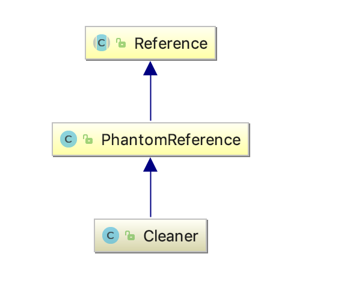
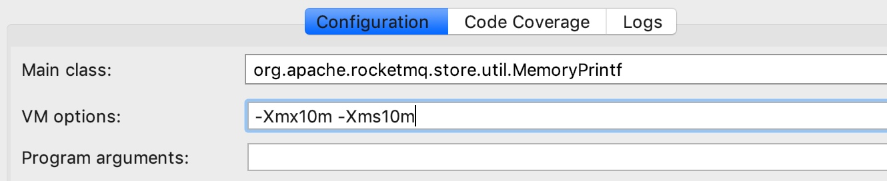

# 第05节 堆外内存源码剖析（下）

## 堆外内存回收

续接上一篇，我们今天来讲一下堆外内存的回收原理。



*Cleaner* 是 *PhantomReference* 的子类，并通过自身的 *next* 和 *prev* 字段维护一个双向链表。*PhantomReference* 的作用在于跟踪垃圾回收过程，并不会对对象的垃圾回收过程造成任何的影响。

所以`cleaner = Cleaner.create(this, new Deallocator(base, size, cap));`用于对当前构造的 *DirectByteBuffer* 对象的垃圾回收过程进行跟踪。

```java
// Cleaner.java
// 用于保存非Cleaner类型的引用
// “Cleaner如何与GC相关联？”小节会详细讲解
private static final ReferenceQueue<Object> dummyQueue = new ReferenceQueue();
// 双向链表
private static Cleaner first = null;
private Cleaner next = null;
private Cleaner prev = null;
private final Runnable thunk;

/**
 * @param var0 堆外内存DirectByteBuffer对象
 * @param var1 清理堆外内存的Runnable对象
 * @return
 */
private Cleaner(Object var1, Runnable var2) {
    super(var1, dummyQueue);
    this.thunk = var2;
}

/**
 * @param var0 堆外内存DirectByteBuffer对象
 * @param var1 清理堆外内存的Runnable对象
 * @return
 */
public static Cleaner create(Object var0, Runnable var1) {
    // 创建一个新的Cleaner对象，添加到双向链表的头部
    return var1 == null ? null : add(new Cleaner(var0, var1));
}

private static synchronized Cleaner add(Cleaner var0) {
    if (first != null) {
        var0.next = first;
        first.prev = var0;
    }

    first = var0;
    return var0;
}

// PhantomReference.java
/**
 * @param referent the object the new phantom reference will refer to
 *        // 虚引用所指向的对象
 * @param q the queue with which the reference is to be registered,
 *          or <tt>null</tt> if registration is not required
 *        // 要在其中注册引用的队列，如果不需要注册，则为null
 */
public PhantomReference(T referent, ReferenceQueue<? super T> q) {
    super(referent, q);
}

// Reference.java
Reference(T referent, ReferenceQueue<? super T> queue) {
    this.referent = referent;
    this.queue = (queue == null) ? ReferenceQueue.NULL : queue;
}
```

通过上面的代码我们知道，对于堆外内存，`Reference#referent` 就是当前堆外内存对象，`Reference#queue` 此时是一个虚设的队列，并不会使用，就如同其命名 `dummyQueue`，*dummy* 即意为虚设的意思。

当 *DirectByteBuffer* 对象从 *pending* 状态转换为 *enqueue* 状态的同时会触发调用 *Cleaner* 的`clean()`方法（参见`Reference#tryHandlePending(boolean waitForNotify)`方法），而 *Cleaner* 的 `clean()` 的方法会实现通过 *unsafe* 对堆外内存的释放。

```java
// Cleaner.java
public void clean() {
    if(remove(this)) { // 从链表中移除当前Cleaner对象
        try {
            this.thunk.run(); // 执行真正的堆外内存的回收
        } catch (final Throwable var2) {
            AccessController.doPrivileged(new PrivilegedAction<Void>() {
                public Void run() {
                    if(System.err != null) {
                        (new Error("Cleaner terminated abnormally", var2)).printStackTrace();
                    }

                    System.exit(1);
                    return null;
                }
            });
        }

    }
}
```

*thunk* 执行真正的堆外内存的回收。

这里的 *thunk* 也就是 *DirectByteBuffer* 的静态内部类 *Deallocator* 对象，

```java
private static class Deallocator
        implements Runnable
{

    private static Unsafe unsafe = Unsafe.getUnsafe();

    private long address;
    private long size;
    private int capacity;

    // cleaner = Cleaner.create(this, new Deallocator(base, size, cap));
    // 注意这里的address不是上面提到的address，而是base
    private Deallocator(long address, long size, int capacity) {
        assert (address != 0);
        this.address = address;
        this.size = size;
        this.capacity = capacity;
    }

    public void run() {
        if (address == 0) {
            // Paranoia
            return;
        }
        unsafe.freeMemory(address);
        address = 0;
        Bits.unreserveMemory(size, capacity);
    }

}
```

虽然 *Cleaner* 不会调用到 `Reference#clear()`，但 *Cleaner* 的 `clean()` 方法调用了 `remove(this)`，即将当前 *Cleaner* 从 *Cleaner* 链表中移除，这样当 `clean()` 执行完后，*Cleaner* 就是一个无引用指向的对象了，也就是可被 *GC* 回收的对象。

> 有 `cleaner = Cleaner.create(this, new Deallocator(base, size, cap));` 可知，*Deallocator* 类成员变量 `address` 不是上面提到的 *Buffer* 类成员变量 `address`，而是 `base`。

## Cleaner如何与GC相关联？

你可能会问，上面我们提到的“垃圾收集器将引用添加到挂起引用链表。”这句话如何理解？*ReferenceQueue* 又是用来作甚的？

*Cleaner* 是 *PhantomReference* 的子类。*Cleaner* 对象关联了一个*PhantomReference* 引用，如果 *GC* 过程中某个对象除了只有 *PhantomReference* 引用它之外，并没有其他地方引用它了，那将会把这个引用放到 *java.lang.ref.Reference.pending* 队列里，在 *GC* 完毕的时候通知 *ReferenceHandler* 这个守护线程去执行一些后置处理，该守护线程如果发现有对象类型是 *Cleaner*，就会执行它的`clean()`方法，进而调用`unsafe.freeMemory(address)`来释放 *DirectByteBuffer* 对应的堆外内存块。其他类型就放入应用构造 *Reference* 时传入的 *ReferenceQueue* 中，这样应用的代码可以从 *Queue* 里拖出这些理论上已死的对象，做爱做的事情 —— 这是一种比 *finalizer* 更轻量更好的机制。

```java
// Reference.java
private static class ReferenceHandler extends Thread {

    private static void ensureClassInitialized(Class<?> clazz) {
        try {
            Class.forName(clazz.getName(), true, clazz.getClassLoader());
        } catch (ClassNotFoundException e) {
            throw (Error) new NoClassDefFoundError(e.getMessage()).initCause(e);
        }
    }

    static {
        // pre-load and initialize InterruptedException and Cleaner classes
        // so that we don't get into trouble later in the run loop if there's
        // memory shortage while loading/initializing them lazily.
        ensureClassInitialized(InterruptedException.class);
        ensureClassInitialized(Cleaner.class);
    }

    ReferenceHandler(ThreadGroup g, String name) {
        super(g, name);
    }

    public void run() {
        while (true) {
            tryHandlePending(true);
        }
    }
}
```

而这个守护线程的初始化是在 *Reference* 静态代码块中完成的，

```java
// Reference.java
static {
    ThreadGroup tg = Thread.currentThread().getThreadGroup();
    for (ThreadGroup tgn = tg;
         tgn != null;
         tg = tgn, tgn = tg.getParent());
    Thread handler = new ReferenceHandler(tg, "Reference Handler");
    /* If there were a special system-only priority greater than
     * MAX_PRIORITY, it would be used here
     */
    handler.setPriority(Thread.MAX_PRIORITY);
    handler.setDaemon(true);
    handler.start();

    // provide access in SharedSecrets
    SharedSecrets.setJavaLangRefAccess(new JavaLangRefAccess() {
        @Override
        public boolean tryHandlePendingReference() {
            return tryHandlePending(false);
        }
    });
}
```

## 堆外内存默认大小

上一节中我们提到：堆外内存默认值： (*-Xmx* 值) - (1个 *survivor* 大小)。为什么呢？`Runtime.getRunTime.maxMemory`为啥比`Xmx`指定的内存小呢？

下面我们通过代码实测一下：

```java
public class MemoryPrintf {

    private static String fm(long l) {
        return String.format("%d/%.3fM", l, 1.0 * l / (1024 * 1024));
    }

    public static void main(String[] args) {
        System.out.println("Runtime maxMemory: " + fm(Runtime.getRuntime().maxMemory()));

        MemoryMXBean memoryMXBean = ManagementFactory.getMemoryMXBean();

        System.out.println("Non-heap maxMemory: " + fm(memoryMXBean.getNonHeapMemoryUsage().getMax()));
        System.out.println("heap maxMemory: " + fm(memoryMXBean.getHeapMemoryUsage().getMax()));

        for (MemoryPoolMXBean memoryPoolMXBean : ManagementFactory.getMemoryPoolMXBeans()) {
            System.out.println("Pool Name: " + memoryPoolMXBean.getName() + " (Type " + memoryPoolMXBean.getType() + ")" + ", maxMemory: " + fm(memoryPoolMXBean.getUsage().getMax()));
        }
    }
}
```

并设置最大堆内内存，



运行结果如下：

```text
Runtime maxMemory: 9961472/9.500M
Non-heap maxMemory: -1/-0.000M
heap maxMemory: 9961472/9.500M
Pool Name: Code Cache (Type Non-heap memory), maxMemory: 251658240/240.000M
Pool Name: Metaspace (Type Non-heap memory), maxMemory: -1/-0.000M
Pool Name: Compressed Class Space (Type Non-heap memory), maxMemory: 1073741824/1024.000M
Pool Name: PS Eden Space (Type Heap memory), maxMemory: 2097152/2.000M
Pool Name: PS Survivor Space (Type Heap memory), maxMemory: 524288/0.500M
Pool Name: PS Old Gen (Type Heap memory), maxMemory: 7340032/7.000M
```

很显然，通过`Runtime.getRunTime.maxMemory`获取的内存比设置的 *10M* 内存要小，只有 *9.5M*，为什么？

其实原因很简单，`maxMemory`获取的是程序最大可以使用的内存，我们知道，*Survivor* 有两个，但只有一个会用到，另一个一直闲置。所以这个值`maxMemory`是去掉一个`Survivor`空间的值。 即：*maxMemory = Eden + Survivor + Old Gen（9.5M = 2.000M + 0.500M + 7.000M）*。