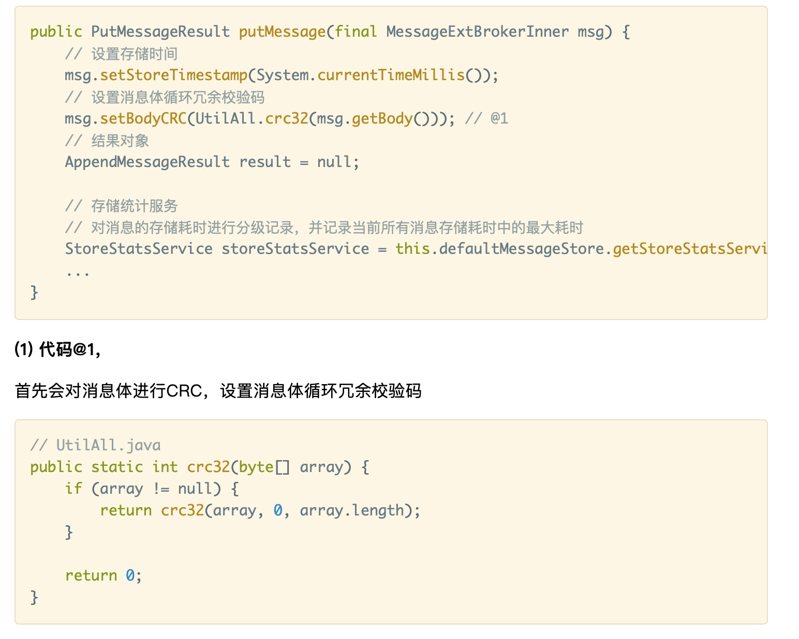

# 开篇词 消息中间件的灵魂

## 为什么写本课程

*Apache RocketMQ* 作为 *Apache* 社区顶级项目，也是目前使用较为广泛的消息中间件，但是绝大多数开发者对它的了解并不深入，还只是停留在使用层面。

值得一提的是，相信很多小伙伴都知道阿里中间件性能挑战赛。已经过去的中间件性能挑战赛（*http://t.cn/EUAENDo*），和正在进行中的**第一届 *POLARDB* 数据库性能大赛**（*http://t.cn/EUAnoaf*）都涉及到了文件操作，合理的设计存储架构以及最大限度的利用机器的读写性能成为决胜的关键。我们会发现，参赛队伍并不是很多，相信很多开发者可能都会有这样的疑问，“对比赛很感兴趣，但不知道怎么入门”，“能跑出成绩，但相比前排的选手，成绩相差10倍有余”......希望通过本课程的学习，能够让你轻松的参与到之后类似的性能挑战赛中来。

一些小伙伴可能会有类似的疑问，“对比赛很感兴趣，但不知道怎么入门”，“能跑出成绩，但相比前排的选手，成绩相差 10 倍有余”，希望通过本课程的学习，能够让你轻松的参与到之后类似的性能挑战赛中来。

## 课程内容

本课程旨在让大家能够对 *RocketMQ* 底层存储的设计和实现有一个透彻的理解。它深入剖析了 *RocketMQ* 底层存储的核心代码，在阅读代码中遇到的每一个问题，相信你都能在本课程中找到答案。课程采用渐进式学习方式，以代码为主线，一步一步去了解和学习 *RocketMQ* 的底层存储设计的全貌。

课程主要包含以下几大模块：

一、基础理论
    
主要讲解文件IO操作的基础理论知识，包括 *FileChannel*、*MMAP*（内存映射）、*Page Cache*、*DirectByteBuffer*（堆外内存）等基础知识。

二、消息存储设计

主要讲解如何写入消息。对 *CommitLog* 消息存储、*MappedFile* 内存映射等源码实现进行深度解析，并带你领略在“基本理论”模块中提及的 *FileChannel* 和 *MappedByteBuffer* 两种不同的策略在 *RocketMQ* 中的最佳实践。

三、消息刷盘机制

详细讲解了 *RocketMQ* 的两种不同的刷盘策略（同步刷盘、异步刷盘）的实现。

四、消费队列与索引文件设计

主要讲解 *ConsumeQueue* 消费队列文件、*Index* 索引文件的构建原理。

五、文件恢复及过期文件删除机制

> 本课程基于 *rocketmq-all-4.3.2 release* 源码版本。

## 如何学习本课程

对课程内容体系大家有一个初步的了解了，下面我来简单讲解下如何学习本课程。

本课程主要从源码的角度带着大家学习 *RocketMQ* 的存储架构设计，为了降低大家的学习成本，避免大家在课程和 *RocketMQ* 代码之间来回切换，所以课程采用渐进式学习方式，以代码为主线，一步一步去了解和学习 *RocketMQ* 的底层存储设计的全貌。

相信大家也都或多或少的看过“源码解析”类的书籍或者技术博客，说是源码解析，结果通篇的贴代码，没有几行注释，又或者只讲理论，不结合代码，看起来也是很费劲。

而本课程就是想突破这一点。我会带着大家跟随着 *RocketMQ* 代码，一行一行分析其实现，尽量做到对于每一行代码都有详尽的注释，解释这行代码是做什么的？为什么要这么写？对于中间涉及到的知识点，也都会进行讲解和扩充，尽量让大家有更少的疑惑。当然啦，有些简单的代码是必然要略过的。

下面我讲解一下如何学习本课程吧。

读者只需要跟着课程内容一步一步学习即可。如遇到代码部分，可以按照如下方式来阅读代码，

上图是我列举的一个例子。很容易发现有两种形式的注释。

1. 行注释
    对于大部分的代码我都会通过**行注释**的形式对其进行解读。读者只需要对照着代码注释逐行阅读代码即可。
2. 符号注释
    有些代码的逻辑比较复杂，特别是一些方法，在**行注释**中解读影响阅读体验，还会使代码变得很乱，所以我会通过**符号注释**的方式来对该行代码进行阐述。比如上述例子中的 *@1*，它是符号注释。对于这种注释，我会紧跟该部分代码的下面对其进行解读，读者只需要向下翻阅即可。
    
    此外，符号注释还有层级关系，*@* 代表一级，*@@* 代表二级，以此类推。
    
    *@1^*、*@1$* 则表示代码段的开始和结束。

还有一点值得注意，有些代码逻辑过于复杂，我会专门另写一节来对其进行讲解，这个时候在文章中注明详见 *《XXX》* 。

**值得一提的是，读者只需要跟着课程学习即可，所有的核心代码都会在课程中讲解，那么你完全可以抛弃使用IDE工具下载阅读源码这一做法，即使你在地铁上也能完全沉浸在课程的学习中。** 当然啦，我还是推荐大家使用IDE来阅读源码的，这样才能对源码有一个更清晰和直观的认识

## 名词解释

最后，我们还需要对文章中用到的一些名词做一些说明。现在你可能看不太明白，没关系，希望在后面学习的过程中当你遇到这些词汇时能够对其有一个清晰的认识。

- 映射文件：也即 *MappedFile*。
- 物理偏移量：每个 *CommitLog* 文件的大小为 *1G*，一般情况下第一个 *CommitLog* 的**起始偏移量**为 0，第二个 *CommitLog* 的**起始偏移量**为 1073741824 （*1G = 1073741824byte*）。假设 1073742827 为**物理偏移量**（物理偏移量也即全局偏移量），则其对应的**相对偏移量**为 1003（1003 = 1073742827 - 1073741824），并且该偏移量位于第二个 *CommitLog*。**这是一个在所有 *CommitLog* 文件中的全局属性。**
- 逻辑偏移量：消息存储在 *ConsumeQueue* 文件中的偏移量。**这是一个在同一 *topic*、同一 *queueId* 下的所有 *ConsumeQueue* 文件中的全局属性。**
- 位置：也即偏移量。

最后，感觉大家能够支持我，有不好的地方，还请批评指正。

大家也可以关注我的公众号《架构随笔》，后期关于 *RocketMQ* 的其它技术文章也会在公众号里分享给大家。

    