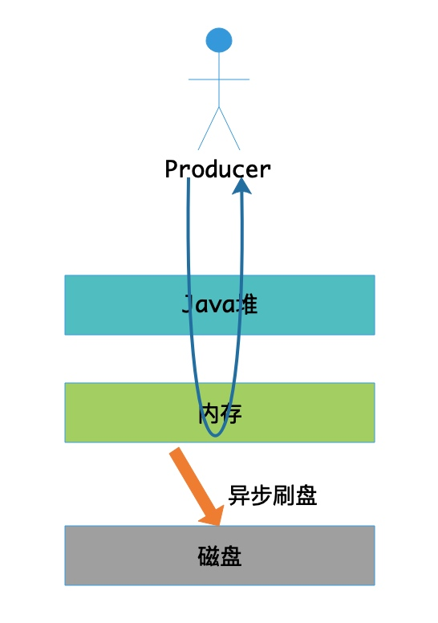

# 第18节 异步刷盘策略

[TOC]

## 概述

*RocketMQ* 的所有消息都是持久化到磁盘的，写入消息时，会先写入系统 *Page Cache*，然后刷盘，可以保证内存与磁盘都有一份数据。读取消息时，直接从内存读取。

刷盘有同步刷盘和异步刷盘两种方式，本节主要讲解**异步刷盘策略**。

其实所谓的异步刷盘，就是消息写入内存后就返回，而不用等待消息刷盘。刷盘则由刷盘服务线程异步执行，如下图所示。



在有 *RAID* 卡，*SAS* 15000 转磁盘上测试顺序写文件，速度可以达到 *300M* 每秒左右，而线上的网卡一般都为千兆网卡，写磁盘速度明显快于数据网络入口速度，那么是否可以做到写完内存就向用户返回，由后台线程刷盘呢?
1. 由于磁盘速度大于网卡速度，那么刷盘的速度肯定可以跟上消息的写入速度。
2. 万一由于此时系统压力过大，可能堆积消息，除了写入IO，还有读取IO，万一出现磁盘读取落后情况（即来不及刷盘），会不会导致系统内存溢出，答案是否定的，原因如下:
    
    a) 写入消息到 *Page Cache* 时，如果内存不足，则尝试丢弃干净的 *PAGE*（即没有脏页），腾出内存供新消息使用，策略是 *LRU* 方式。
    
    b) 如果干净页不足，此时写入 *Page Cache* 会被阻塞，系统尝试刷盘部分数据，大约每次尝试 32 个 *PAGE*。
    
    综上，内存溢出的情况不会出现。    
    
## 源码深入剖析

### 服务初始化

在 *CommitLog* 构造函数中根据刷盘策略创建不同的刷盘服务，

```java
public CommitLog(final DefaultMessageStore defaultMessageStore) {
        ...
        
        // 消息刷盘服务，分为同步刷盘和异步刷盘
        if (FlushDiskType.SYNC_FLUSH == defaultMessageStore.getMessageStoreConfig().getFlushDiskType()) {
            this.flushCommitLogService = new GroupCommitService();
        } else {
            this.flushCommitLogService = new FlushRealTimeService();
        }
        
        // 如果启用了transientStorePool，该服务用于将消息从writeBuffer（堆外内存）提交到fileChannel
        this.commitLogService = new CommitRealTimeService();

        ...
    }
```

启动刷盘服务线程调用的流程如下，

```text
BrokerStartup#main -> BrokerStartup#start -> BrokerController#start -> DefaultMessageStore#start -> CommitLog#start
```

```java
// CommitLog.java
public void start() {
    this.flushCommitLogService.start();

    // 如果启用了transientStorePool，我们必须在固定的时间段内将消息刷新到fileChannel
    if (defaultMessageStore.getMessageStoreConfig().isTransientStorePoolEnable()) {
        this.commitLogService.start();
    }
}
```

### 消息刷盘

在 `CommitLog#handleDiskFlush(AppendMessageResult result, PutMessageResult putMessageResult, MessageExt messageExt)` 方法中使用相应的刷盘策略来执行消息刷盘，在讲解该方法之前，我们先来了解下方法的入参 `result`，因为在下面刷盘时会用到这些参数。

*AppendMessageResult* 相关字段如下表所示，

| 字段 | 类型 | 说明 |
| --- | --- | --- |
| status | AppendMessageStatus | 响应状态码，有以下取值：*PUT_OK*、*END_OF_FILE*、*MESSAGE_SIZE_EXCEEDED*、*PROPERTIES_SIZE_EXCEEDED*、*UNKNOWN_ERROR*。 |
| wroteOffset | long | 消息写入的物理偏移量（*CommitLog* 文件（对应一个 *MappedFile*）对应的起始偏移量 + 当前消息写入时的写位置）。注意，是当前消息写入时的写位置，当前消息写入后会更新该 *wroteOffset* 为 *wrotePosition + wroteBytes*。 |
| wroteBytes | int | 消息写入总字节数。注意，有可能会同时写入多条消息（批量消息），所以这里是写入的总字节数。 |
| msgId | String | 消息ID，前 4 字节为 *broker* 存储地址的 *host*，5 ～ 8字节为 *broker* 存储地址的 *port*，最后 8 字节为 *wroteOffset*。 |
| storeTimestamp | long | 消息存储时间戳 |
| logicsOffset | long | 逻辑偏移量，即消息保存到 *ConsumeQueue* 的 *offset* |
| pagecacheRT | long | 消息写入 *Page Cache* 花费的时间 |

下面我们再来看一下 `CommitLog#handleDiskFlush` 方法的代码，

```java
public void handleDiskFlush(AppendMessageResult result, PutMessageResult putMessageResult, MessageExt messageExt) {
    // 同步刷盘
    if (FlushDiskType.SYNC_FLUSH == this.defaultMessageStore.getMessageStoreConfig().getFlushDiskType()) {
        ...
    }
    // 异步刷盘
    else {
        // 仅当transientStorePoolEnable为true，FlushDiskType为异步刷盘（ASYNC_FLUSH），并且broker为主节点时，才启用writeBuffer。
        if (!this.defaultMessageStore.getMessageStoreConfig().isTransientStorePoolEnable()) {
            // 1.未启用transientStorePool
            // 异步刷盘策略在初始化时，初始化的是FlushRealTimeService实例
            flushCommitLogService.wakeup(); // @1
        } else {
            // 2.启用transientStorePool
            // 启用writeBuffer时，需要提交数据到fileChannel，然后再刷盘
            commitLogService.wakeup(); // @2
        }
    }
}
```

在异步刷盘时，会存在两种情况。我们在《MappedFile》一节中已经讲过了，*MappedFile* 提供了两种消息写入的方式：`writeBuffer`、`mappedByteBuffer`。同样的，消息异步刷盘也相对应的有两种方式，

1. 启用 `transientStorePool` 时，写入到 `writeBuffer` 的消息会先通过 *CommitRealTimeService* 服务线程 *commit* 到 `fileChannel`，然后再通过 *FlushRealTimeService* 刷盘线程执行刷盘。
2. 未启用 `transientStorePool` 时，写入到 `mappedByteBuffer` 的消息直接通过 *FlushRealTimeService* 刷盘线程执行刷盘。

*FlushRealTimeService* 刷盘线程根据是否启用 `transientStorePool` ，从而对 `fileChannel` 或者 `mappedByteBuffer` 执行刷盘。

```java MappedFile.java
// MappedFile.java
if (writeBuffer != null || this.fileChannel.position() != 0) {
    this.fileChannel.force(false);
} else {
    this.mappedByteBuffer.force();
}
```

下面我们分别来看一下这两种不同的实现。

#### 方式一 Commit & flush

启用 `transientStorePool` 时，写入到 `writeBuffer` 的消息会先通过 *CommitRealTimeService* 服务线程 *commit* 到 `fileChannel`，然后再通过 *FlushRealTimeService* 刷盘线程执行刷盘。

##### CommitRealTimeService

```java
class CommitRealTimeService extends FlushCommitLogService {

    private long lastCommitTimestamp = 0;

    @Override
    public String getServiceName() {
        return CommitRealTimeService.class.getSimpleName();
    }

    @Override
    public void run() {
        CommitLog.log.info(this.getServiceName() + " service started");
        while (!this.isStopped()) {
            // 提交数据到fileChannel的超时等待时间，默认200毫秒
            int interval = CommitLog.this.defaultMessageStore.getMessageStoreConfig().getCommitIntervalCommitLog();
            // 提交数据到fileChannel时所提交的最少内存页数，默认4
            int commitDataLeastPages = CommitLog.this.defaultMessageStore.getMessageStoreConfig().getCommitCommitLogLeastPages();

            int commitDataThoroughInterval =
                    CommitLog.this.defaultMessageStore.getMessageStoreConfig().getCommitCommitLogThoroughInterval();

            // @1^
            long begin = System.currentTimeMillis();
            if (begin >= (this.lastCommitTimestamp + commitDataThoroughInterval)) {
                this.lastCommitTimestamp = begin;
                commitDataLeastPages = 0;
            }
            // @1$

            try {
                boolean result = CommitLog.this.mappedFileQueue.commit(commitDataLeastPages);
                long end = System.currentTimeMillis();
                if (!result) { // result为false，意味着有新的数据提交，则需要刷盘
                    this.lastCommitTimestamp = end; // result = false means some data committed.
                    // now wake up flush thread.
                    // 唤醒刷盘线程
                    flushCommitLogService.wakeup(); // @2
                }

                if (end - begin > 500) {
                    log.info("Commit data to file costs {} ms", end - begin);
                }

                this.waitForRunning(interval); // @3
            } catch (Throwable e) {
                CommitLog.log.error(this.getServiceName() + " service has exception. ", e);
            }
        }

        // @4
        boolean result = false;
        for (int i = 0; i < RETRY_TIMES_OVER && !result; i++) {
            result = CommitLog.this.mappedFileQueue.commit(0);
            CommitLog.log.info(this.getServiceName() + " service shutdown, retry " + (i + 1) + " times " + (result ? "OK" : "Not OK"));
        }
        CommitLog.log.info(this.getServiceName() + " service end");
    }
}
```

**(1) 代码@1**

如果每次都要等到至少写够 `commitDataLeastPages` 个内存页的数据再提交，那么消息刷盘肯定不够及时。

考虑到消息量很少的情况下，为了使消息能够及时提交并刷盘，将 `commitDataLeastPages` 设置为 0，只要有数据就执行提交。

**(2) 代码@2**

有新的数据提交到 `fileChannel`，唤醒刷盘线程执行刷盘。

关于服务线程的等待通知模式，我们在《ServiceThread设计模式》一节已经讲过了，没有印象的同学可以回顾下这一小节的内容。

**(3) 代码@3**

如果有新的消息写入，当前 *CommitRealTimeService* 服务线程会被唤醒，执行 `onWaitEnd()` 方法并返回；否则，超时等待。

无论是等待超时、被中断还是被唤醒，都将**通知状态**标记为未通知，然后执行 `onWaitEnd()` 方法并返回。

**(4) 代码@4**

服务关闭时才会走此逻辑，将还未提交的数据执行提交。`commit(0)` 表示只要有未提交的数据而无论是否满足 `commitDataLeastPages` 个内存页大小，都会执行刷盘。总共尝试`RETRY_TIMES_OVER` 次，直至无数据提交。

---

*CommitRealTimeService* 调用 *MappedFileQueue* 的 `commit(final int commitLeastPages)` 方法执行提交。因为在 *MappedFileQueue* 中维护了一个全局的已提交位置 `committedWhere`。

该方法的主要逻辑是根据当前已提交位置查找 *MappedFile*，然后调用它的 `commit(final int commitLeastPages)` 方法执行真正的提交操作。

```java
/**
 * @param commitLeastPages 执行提交的最少内存页数
 * @return 是否有新的数据提交。注意，false意味着有新的数据提交。
 */
public boolean commit(final int commitLeastPages) {
    boolean result = true;
    // 根据当前已提交物理位置查找映射文件。如果找不到，且当前已提交物理位置为0，则返回第一个映射文件
    // 因为committedWhere的初始值为0，当第一个映射文件的起始偏移量不为0（当然，默认为0）时，此时根据committedWhere是查找不到映射文件的，所以就需要返回第一个映射文件
    MappedFile mappedFile = this.findMappedFileByOffset(this.committedWhere, this.committedWhere == 0);
    if (mappedFile != null) {
        int offset = mappedFile.commit(commitLeastPages); // 执行真正的提交，并返回当前已提交的位置（针对每一个映射文件，offset从0开始）
        long where = mappedFile.getFileFromOffset() + offset;
        result = where == this.committedWhere; // 判断是否有新的数据提交
        this.committedWhere = where;// 保存当前已提交的位置（全局）
    }

    return result;
}
```

---

*MappedFile* 将 `writeBuffer` 的脏数据数据写到 `fileChannel`。
 
如果资源被关闭，还会回收 `mappedByteBuffer` 堆外内存。

```java
/**
 * @param commitLeastPages 执行提交的最少内存页数
 * @return 当前已提交的位置（针对每一个MappedFile，offset从0开始）
 */
public int commit(final int commitLeastPages) {
    if (writeBuffer == null) {
        // no need to commit data to file channel, so just regard wrotePosition as committedPosition.
        // 无需将数据提交到fileChannel，因此只需将writePosition视为committedPosition。
        return this.wrotePosition.get();
    }
    if (this.isAbleToCommit(commitLeastPages)) { // @1
        if (this.hold()) { // @2
            commit0(commitLeastPages); // @3
            this.release();
        } else {
            log.warn("in commit, hold failed, commit offset = " + this.committedPosition.get());
        }
    }

    // All dirty data has been committed to FileChannel.
    // 如果所有脏数据都已提交给FileChannel，则归还buffer
    if (writeBuffer != null && this.transientStorePool != null && this.fileSize == this.committedPosition.get()) {
        this.transientStorePool.returnBuffer(writeBuffer);
        this.writeBuffer = null;
    }

    return this.committedPosition.get();
}
```

**(1) 代码@1**

校验是否有足够的可提交的数据。

- 只要该 *MappedFile* 已经被写满，即 `wrotePosition`等于 `fileSize`，则可执行提交；
- 检查尚未提交的消息内存页数是否大于最小提交页数，页数不够暂时不提交；

```java
/**
 * @param commitLeastPages 执行提交的最少内存页数
 * @return
 */
protected boolean isAbleToCommit(final int commitLeastPages) {
    int flush = this.committedPosition.get(); // 获取当前已提交的位置
    int write = this.wrotePosition.get(); // 获取当前具有可提交数据的最大位置

    if (this.isFull()) { // 只要该映射文件已经被写满，即wrotePosition等于fileSize，则可执行提交；
        return true;
    }

    if (commitLeastPages > 0) { // 检查尚未提交的消息内存页数是否大于等于最小提交页数，页数不够暂时不提交；
        return ((write / OS_PAGE_SIZE) - (flush / OS_PAGE_SIZE)) >= commitLeastPages;
    }

    return write > flush;
}
```

**(2) 代码@2**

关于资源的占用和释放，我们已经在前面的《ReferenceResource设计模式》一节详细讨论过啦，此处就不再赘述。

**(3) 代码@3**

执行提交操作，将 `writeBuffer` 偏移量在 *committedPosition ～ wrotePosition* 之间的消息字节数据写入 `fileChannel`。

```java
protected void commit0(final int commitLeastPages) {
    int writePos = this.wrotePosition.get(); // 当前写入的位置
    int lastCommittedPosition = this.committedPosition.get(); // 当前提交的位置

    if (writePos - this.committedPosition.get() > 0) { // 有待提交的数据
        try {
            // 设置提交的范围：lastCommittedPosition ～ writePos
            ByteBuffer byteBuffer = writeBuffer.slice();
            byteBuffer.position(lastCommittedPosition);
            byteBuffer.limit(writePos);

            this.fileChannel.position(lastCommittedPosition); // 设置写入的起始偏移量
            this.fileChannel.write(byteBuffer); // 将writeBuffer偏移量在lastCommittedPosition ～ writePos之间的字节写入fileChannel
            this.committedPosition.set(writePos); // 更新提交的位置
        } catch (Throwable e) {
            log.error("Error occurred when commit data to FileChannel.", e);
        }
    }
}
```

##### FlushRealTimeService

上面我们提到了，当有新的数据提交到 `fileChannel`，则会唤醒刷盘线程执行刷盘。*FlushRealTimeService* 就是用来执行异步刷盘的。有实时刷盘和定时刷盘两种策略，默认为实时刷盘。

```java
class FlushRealTimeService extends FlushCommitLogService {
    private long lastFlushTimestamp = 0; // 最后一次刷盘的时间
    private long printTimes = 0;

    public void run() {
        CommitLog.log.info(this.getServiceName() + " service started");

        while (!this.isStopped()) {
            // 是否是定时刷盘。默认是实时刷盘
            boolean flushCommitLogTimed = CommitLog.this.defaultMessageStore.getMessageStoreConfig().isFlushCommitLogTimed();

            // 1. 实时刷盘的超时等待时间;
            // 2. 定时刷盘的间隔时间；
            // 默认500毫秒
            int interval = CommitLog.this.defaultMessageStore.getMessageStoreConfig().getFlushIntervalCommitLog();

            // 刷盘的最少内存页数，默认4
            int flushPhysicQueueLeastPages = CommitLog.this.defaultMessageStore.getMessageStoreConfig().getFlushCommitLogLeastPages();

            int flushPhysicQueueThoroughInterval =
                    CommitLog.this.defaultMessageStore.getMessageStoreConfig().getFlushCommitLogThoroughInterval();

            boolean printFlushProgress = false;

            // Print flush progress
            // @1^
            long currentTimeMillis = System.currentTimeMillis();
            if (currentTimeMillis >= (this.lastFlushTimestamp + flushPhysicQueueThoroughInterval)) {
                this.lastFlushTimestamp = currentTimeMillis;
                flushPhysicQueueLeastPages = 0;
                printFlushProgress = (printTimes++ % 10) == 0;
            }
            // @1$

            try {
                if (flushCommitLogTimed) { // 定时刷盘
                    Thread.sleep(interval);
                } else { // 实时刷盘，依赖CommitRealTimeService唤醒、等待超时或者中断
                    this.waitForRunning(interval);
                }

                if (printFlushProgress) {
                    this.printFlushProgress();
                }

                long begin = System.currentTimeMillis();
                CommitLog.this.mappedFileQueue.flush(flushPhysicQueueLeastPages);

                long storeTimestamp = CommitLog.this.mappedFileQueue.getStoreTimestamp(); // 当前已刷盘的最后一条消息存储的时间戳
                if (storeTimestamp > 0) {
                    CommitLog.this.defaultMessageStore.getStoreCheckpoint().setPhysicMsgTimestamp(storeTimestamp);
                }

                long past = System.currentTimeMillis() - begin;
                if (past > 500) {
                    log.info("Flush data to disk costs {} ms", past);
                }
            } catch (Throwable e) {
                CommitLog.log.warn(this.getServiceName() + " service has exception. ", e);
                this.printFlushProgress();
            }
        }

        // Normal shutdown, to ensure that all the flush before exit
        // 正常关闭服务，确保退出前全部刷盘
        boolean result = false;
        for (int i = 0; i < RETRY_TIMES_OVER && !result; i++) {
            result = CommitLog.this.mappedFileQueue.flush(0);
            CommitLog.log.info(this.getServiceName() + " service shutdown, retry " + (i + 1) + " times " + (result ? "OK" : "Not OK"));
        }

        this.printFlushProgress();

        CommitLog.log.info(this.getServiceName() + " service end");
    }

    @Override
    public String getServiceName() {
        return FlushRealTimeService.class.getSimpleName();
    }

    private void printFlushProgress() {
        // CommitLog.log.info("how much disk fall behind memory, "
        // + CommitLog.this.mappedFileQueue.howMuchFallBehind());
    }

    @Override
    public long getJointime() {
        return 1000 * 60 * 5;
    }
}
```

**(1) 代码@1**

与 *CommitRealTimeService* 的实现逻辑是类似的，如果每次都要等到至少写够 `flushPhysicQueueLeastPages` 个内存页的数据再刷盘，那么消息刷盘肯定不够及时。

考虑到消息量很少的情况下，为了使消息能够及时刷盘，将 `flushPhysicQueueLeastPages` 设置为 0，只要有数据提交就执行刷盘。

---

*FlushRealTimeService* 调用 *MappedFileQueue* 的 `flush(final int flushLeastPages)` 方法执行刷盘。因为在 *MappedFileQueue* 中维护了一个全局的已刷盘位置 `flushedWhere`。

该方法的主要逻辑是根据当前已刷盘位置查找 *MappedFile*，然后调用它的 `flush(final int flushLeastPages)` 方法执行真正的刷盘操作。

```java
/**
 * 根据当前刷盘位置查找MappedFile，然后对其执行刷盘操作
 *
 * @param flushLeastPages 执行刷盘的最少内存页数
 * @return 是否有新的数据刷盘。注意，false意味着有新的数据刷盘。
 */
public boolean flush(final int flushLeastPages) {
    boolean result = true;
    // 根据当前已刷盘物理位置查找映射文件。如果找不到，且当前已刷盘物理位置为0，则返回第一个映射文件。
    // 因为flushedWhere的初始值为0，当第一个映射文件的起始偏移量不为0（当然，默认为0）时，此时根据flushedWhere是查找不到映射文件的，所以就需要返回第一个映射文件。
    MappedFile mappedFile = this.findMappedFileByOffset(this.flushedWhere, this.flushedWhere == 0);
    if (mappedFile != null) {
        long tmpTimeStamp = mappedFile.getStoreTimestamp(); // 最后一次写入消息（写入buffer）的时间戳
        int offset = mappedFile.flush(flushLeastPages); // 执行真正的刷盘，并返回当前已刷盘的位置（针对每一个MappedFile，offset从0开始）

        long where = mappedFile.getFileFromOffset() + offset;
        result = where == this.flushedWhere; // 判断是否有新的数据刷盘
        this.flushedWhere = where; // 保存当前已刷盘的位置（全局）

        if (0 == flushLeastPages) {
            this.storeTimestamp = tmpTimeStamp;
        }
    }

    return result;
}
```

---

*MappedFile* 将 `fileChannel` 或者 `mappedByteBuffer` 的脏数据刷入磁盘。

注意，其实际是写入到 *Page Cache*，然后由操作系统将 *Page Cache* 的脏页写入磁盘。
 
如果资源被关闭，还会回收 `mappedByteBuffer` 堆外内存。

```java
/**
 * @param flushLeastPages 执行刷盘的最少内存页数
 * @return 当前已刷盘的位置（针对每一个MappedFile，offset从0开始）
 */
public int flush(final int flushLeastPages) {
    if (this.isAbleToFlush(flushLeastPages)) { // 校验是否有可刷盘的数据 @1
        if (this.hold()) {

            int value = getReadPosition(); // 当前具有可刷盘数据的最大偏移量 @2

            try {
                // We only append data to fileChannel or mappedByteBuffer, never both.
                // 我们将消息要么写入fileChannel，要么写入mappedByteBuffer，而不是同时写入两者

                // 只有仅当transientStorePoolEnable为true，刷盘策略为异步刷盘（ASYNC_FLUSH），并且broker为主节点时，才启用transientStorePool。
                // 然后从transientStorePool中获取writeBuffer，消息先写入该buffer，然后再写入到fileChannel
                if (writeBuffer != null || this.fileChannel.position() != 0) {
                    this.fileChannel.force(false);
                } else {
                    this.mappedByteBuffer.force();
                }
            } catch (Throwable e) {
                log.error("Error occurred when force data to disk.", e);
            }

            this.flushedPosition.set(value); // 设置当前刷盘的位置

            // 每次刷盘后，如果资源（MappedFile）被关闭，还会回收mappedByteBuffer堆外内存。
            this.release();
        } else {
            // @3
            log.warn("in flush, hold failed, flush offset = " + this.flushedPosition.get());
            this.flushedPosition.set(getReadPosition()); // 设置当前刷盘的位置
        }
    }
    return this.getFlushedPosition();
}
```

**(1) 代码@1**

检查是否有足够的可刷盘的数据。

- 只要该映射文件已经被写满，即 `wrotePosition` 等于 `fileSize`，则可执行刷盘；
- 检查尚未刷盘的消息内存页数是否大于等于最小刷盘页数，页数不够暂时不刷盘；

```java
/**
 * @param flushLeastPages 执行刷盘的最少内存页数
 * @return
 */
private boolean isAbleToFlush(final int flushLeastPages) {
    int flush = this.flushedPosition.get(); // 获取当前已刷盘的位置
    int write = getReadPosition(); // 获取当前具有可刷盘数据的最大偏移量

    if (this.isFull()) { // 只要该映射文件已经被写满，即wrotePosition等于fileSize，则可执行刷盘；
        return true;
    }

    if (flushLeastPages > 0) { // 检查尚未刷盘的消息内存页数是否大于等于最小刷盘页数，页数不够暂时不刷盘；
        return ((write / OS_PAGE_SIZE) - (flush / OS_PAGE_SIZE)) >= flushLeastPages;
    }

    return write > flush;
}
```

**(2) 代码@2**

获取当前具有可刷盘数据的最大位置。

只有仅当 `transientStorePoolEnable` 为 *true*，刷盘策略为异步刷盘（*ASYNC_FLUSH*），并且 *broker* 为主节点时，才启用 `transientStorePool`。

- 未启用 `transientStorePool` 时，则返回当前写入的位置 `wrotePosition`；
    
    > 刷盘时将 `mappedByteBuffer` 中的脏数据刷盘。
    
- 启用 `transientStorePool` 时，则返回当前提交的位置 `committedPosition`；
    
    > 所谓提交就是将 `writeBuffer` 中的脏数据写到 `fileChannel`。刷盘时将 `fileChannel` 中的脏数据刷盘。

```java
public int getReadPosition() {
    return this.writeBuffer == null ? this.wrotePosition.get() : this.committedPosition.get();
}
```

#### 方式二 Only flush

未启用 `transientStorePool` 时，写入到 `mappedByteBuffer` 的消息直接通过 *FlushRealTimeService* 刷盘线程执行刷盘。在前面关于 *FlushRealTimeService* 的刷盘逻辑我们已经讲过了，这里就不再重复讲述。