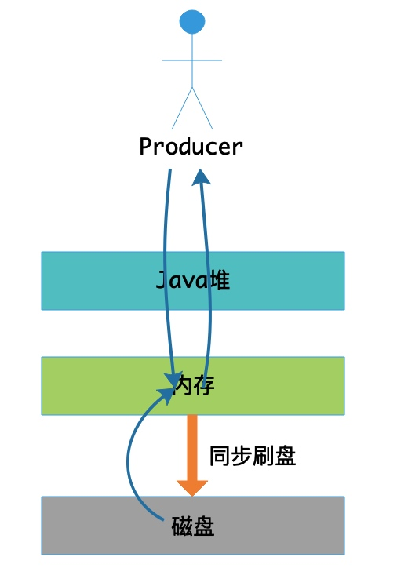

# 第19节 同步刷盘策略

## 概述



同步刷盘与异步刷盘的唯一区别是异步刷盘写完 *Page Cache* 直接返回，而同步刷盘需要等待刷盘完成才返回，同步刷盘流程如下:
1. 写入 *Page Cache* 后，线程等待，通知刷盘线程刷盘； 
2. 刷盘线程刷盘后，唤醒前端等待线程，可能是一批线程；
3. 前端等待线程向用户返回成功。

## 源码深入剖析

关于**刷盘服务的初始化**以及 ***AppendMessageResult***，我们在上一节《异步刷盘策略》中已经详细的讲解过了，同学们在学习本节之前建议先回顾一下上一节的这些内容。

### 消息刷盘

在 `CommitLog#handleDiskFlush(AppendMessageResult result, PutMessageResult putMessageResult, MessageExt messageExt)` 方法中使用相应的刷盘策略来执行消息刷盘，下面我们再来看一下 `CommitLog#handleDiskFlush` 方法的代码，

```java
// CommitLog.java
public void handleDiskFlush(AppendMessageResult result, PutMessageResult putMessageResult, MessageExt messageExt) {
    // 同步刷盘
    if (FlushDiskType.SYNC_FLUSH == this.defaultMessageStore.getMessageStoreConfig().getFlushDiskType()) {

        // 同步刷盘策略在初始化时，初始化的是GroupCommitService实例
        final GroupCommitService service = (GroupCommitService) this.flushCommitLogService;

        if (messageExt.isWaitStoreMsgOK()) { // 1.「同步阻塞」等待消息刷盘完成。线程会阻塞，直至收到消息刷盘完成的通知；@1

            // 创建同步阻塞刷盘请求
            GroupCommitRequest request = new GroupCommitRequest(result.getWroteOffset() + result.getWroteBytes());  // @2
            // 添加刷盘请求，并唤醒刷盘服务线程
            service.putRequest(request); // @3

            // 因为是同步阻塞刷盘，所以需要等待完成刷盘的通知
            boolean flushOK = request.waitForFlush(this.defaultMessageStore.getMessageStoreConfig().getSyncFlushTimeout()); // @4
            if (!flushOK) {
                log.error("do groupcommit, wait for flush failed, topic: " + messageExt.getTopic() + " tags: " + messageExt.getTags()
                        + " client address: " + messageExt.getBornHostString());
                putMessageResult.setPutMessageStatus(PutMessageStatus.FLUSH_DISK_TIMEOUT);
            }
        } else { // 2.「同步非阻塞」不等待消息刷盘完成。线程会继续执行；
            service.wakeup(); // 唤醒刷盘服务线程
        }
    }
    // 异步刷盘
    else {
        ...
    }
}
```

**(1) 代码@1**，同步刷盘分两种方式：

1. **同步阻塞**：等待消息刷盘完成。线程会阻塞，直至收到消息刷盘完成的通知；

    我们通常说的同步刷盘指的就是这个。

2. **同步非阻塞**：不等待消息刷盘完成。线程会继续执行；

```java
public boolean isWaitStoreMsgOK() {
    String result = this.getProperty(MessageConst.PROPERTY_WAIT_STORE_MSG_OK);
    if (null == result)
        return true;

    return Boolean.parseBoolean(result);
}
```

从上面的方法可以看出，如果消息中设置了 `MessageConst.PROPERTY_WAIT_STORE_MSG_OK` 属性，并且为 *false* 时，线程就不会阻塞。

**(2) 代码@2**，这里有必要先说一下 *GroupCommitRequest* 的构造入参 `nextOffset`。

**nextOffset = wroteOffset + wroteBytes**

- **wroteOffset**：消息写入的物理偏移量（*CommitLog* 文件（对应一个 *MappedFile*）对应的起始偏移量 + 当前消息写入时的写位置）。注意，是当前消息写入时的写位置，当前消息写入后会更新该 *wroteOffset* 为 *wrotePosition + wroteBytes*。
- **wroteBytes**：消息写入总字节数。注意，有可能会同时写入多条消息（批量消息），所以这里是写入的总字节数。

**(3) 代码@3**，`putRequest(final GroupCommitRequest request)` 方法添加刷盘请求，并唤醒刷盘服务线程。

**(4) 代码@4**，因为是同步阻塞刷盘，所以需要调用 `waitForFlush(long timeout)` 方法等待刷盘完成的通知。

#### GroupCommitRequest

在讲解同步刷盘策略之前，我觉得有必要先了解一下 *GroupCommitRequest* 刷盘请求。同步刷盘的等待通知模型就是依赖于刷盘请求来实现的。

| 字段 | 类型 | 说明 |
| --- | --- | --- |
| nextOffset | long | 可刷盘数据的最大位置 |
| countDownLatch | CountDownLatch | 用于实现创建刷盘请求的线程的等待通知，初始值为 1。这不同于刷盘服务线程的等待通知，刷盘服务线程的等待通知是由 *ServiceThread* 提供支持的 |
| flushOK | volatile boolean | 标记刷盘是否成功 |

*GroupCommitRequest* 提供了两个方法，如下所示：

```java
// GroupCommitRequest.java
public void wakeupCustomer(final boolean flushOK) {
    this.flushOK = flushOK;
    // 刷盘完成，唤醒当前等待的线程
    this.countDownLatch.countDown();
}
```

刷盘服务线程在完成刷盘后会调用该方法唤醒当前等待的线程。

```java
// GroupCommitRequest.java
public boolean waitForFlush(long timeout) {
    try {
        // 等待异步线程刷盘完成的通知
        this.countDownLatch.await(timeout, TimeUnit.MILLISECONDS);
        return this.flushOK;
    } catch (InterruptedException e) {
        log.error("Interrupted", e);
        return false;
    }
}
```

该方法用于等待刷盘服务线程完成刷盘。

下面我们就来看一下刷盘服务线程的实现。

#### GroupCommitService

*GroupCommitService* 为**同步刷盘服务线程**。

##### 成员变量

| 字段 | 类型 | 说明 |
| --- | --- | --- |
| requestsWrite | volatile List<GroupCommitRequest> | 写请求队列 |
| requestsRead | volatile List<GroupCommitRequest> | 读请求队列 |

可能你会问，这两者有什么区别呢？其实是 *RocketMQ* 的一个优化点，用于实现读写分离。

##### 执行刷盘

线程一直处理同步刷盘请求，每处理一次会等待 10 毫秒，一旦有新请求到达，会被立即唤醒执行刷盘。

```java
public void run() {
    CommitLog.log.info(this.getServiceName() + " service started");

    while (!this.isStopped()) {
        try {
            this.waitForRunning(10); // @1
            this.doCommit(); // @2
        } catch (Exception e) {
            CommitLog.log.warn(this.getServiceName() + " service has exception. ", e);
        }
    }

    // Under normal circumstances shutdown, wait for the arrival of the
    // request, and then flush
    // 在正常情况下停止服务，会等待请求到达，然后刷盘

    try {
        Thread.sleep(10);
    } catch (InterruptedException e) {
        CommitLog.log.warn("GroupCommitService Exception, ", e);
    }

    synchronized (this) {
        this.swapRequests();
    }

    this.doCommit();

    CommitLog.log.info(this.getServiceName() + " service end");
}
```

**(1) 代码@1**

如果刷盘服务线程收到通知（被唤醒），则将当前所有刷盘请求添加到**读请求队列**中并返回；否则，超时等待。

无论是等待超时、被中断还是被唤醒，都将**通知状态**标记为未通知，然后将当前所有刷盘请求添加到**读请求队列**中。

```java
protected void waitForRunning(long interval) {
    // 收到通知，则执行onWaitEnd方法并返回
    if (hasNotified.compareAndSet(true, false)) {
        this.onWaitEnd();
        return;
    }

    // 没有收到通知，进入等待

    // entry to wait
    waitPoint.reset(); // 重置使其可复用

    // 无论是等待超时、被中断还是被唤醒，都将通知状态标记为未通知，然后执行onWaitEnd方法并返回。
    try {
        waitPoint.await(interval, TimeUnit.MILLISECONDS); // 超时等待
    } catch (InterruptedException e) {
        log.error("Interrupted", e);
    } finally {
        hasNotified.set(false);
        this.onWaitEnd();
    }
}
```

关于 `waitForRunning(long interval)` 方法的实现，我们在《ServiceThread设计模式》一节中已经讲解过了，大家可以再回顾一下该节的内容。

`onWaitEnd()` 方法由 *GroupCommitService* 实现，用于交换读写请求队列。

```java
// GroupCommitService.java
@Override
protected void onWaitEnd() {
    this.swapRequests();
}

private void swapRequests() {
    List<GroupCommitRequest> tmp = this.requestsWrite;
    this.requestsWrite = this.requestsRead;
    this.requestsRead = tmp;
}
```

**(2) 代码@2**

```java
private void doCommit() {
    synchronized (this.requestsRead) {
        if (!this.requestsRead.isEmpty()) { // 同步阻塞刷盘
            for (GroupCommitRequest req : this.requestsRead) {
                // There may be a message in the next file, so a maximum of
                // two times the flush
                // 执行两次刷盘，可能因为当前待刷盘的CommitLog空间不足，当前待刷盘的消息被写到了下一个MappedFile
                boolean flushOK = false;
                for (int i = 0; i < 2 && !flushOK; i++) {
                    flushOK = CommitLog.this.mappedFileQueue.getFlushedWhere() >= req.getNextOffset(); // @@1

                    if (!flushOK) {
                        CommitLog.this.mappedFileQueue.flush(0); // @@2
                    }
                }

                req.wakeupCustomer(flushOK); // @@3
            }

            // 采用完全刷盘方式（flushLeastPages为0）时，所刷盘的最后一条消息存储的时间戳
            long storeTimestamp = CommitLog.this.mappedFileQueue.getStoreTimestamp();
            if (storeTimestamp > 0) {
                CommitLog.this.defaultMessageStore.getStoreCheckpoint().setPhysicMsgTimestamp(storeTimestamp);
            }

            this.requestsRead.clear(); // 清空读请求队列
        } else { // 同步非阻塞刷盘
            // Because of individual messages is set to not sync flush, it
            // will come to this process
            CommitLog.this.mappedFileQueue.flush(0); // @@4
        }
    }
}
```

**代码@@1**

其实我们可以注意到，在消息写入到 *buffer* 时，是通过 `putMessageLock` 加锁来保证消息写入的顺序，之后会释放锁。而刷盘通知则没有锁，不能保证顺序性。

举个简单的例子，

*A*、*B* 消息的顺序是 *A B*。消息 *A* 的写入先获取锁并写入 *buffer*，之后释放锁。接着消息 *B* 的写入也先获取锁并写入 *buffer*，之后释放锁。随后的刷盘通知因为 *A B* 消息不存在锁的竞争，顺序性不能保证。*B* 消息的刷盘通知先触发了刷盘，刷盘时会将 *MappedFile* 中所有待刷盘的消息全部刷盘，即 *A B* 消息都会被刷入磁盘。之后 *A* 消息的刷盘通知会通过**代码@@1**发现已经刷盘，不会再次执行刷盘。

> 有一点需要注意，刷盘通知顺序的不确定性，并不会影响详细的顺序性。

**代码@@2**

根据当前刷盘位置查找 *MappedFile*，然后对其执行刷盘操作。参见《异步刷盘策略》一节关于 `flush(final int flushLeastPages)` 方法的讲解。

**代码@@3**

刷盘完成，唤醒阻塞的线程。

##### 添加刷盘请求

向 `requestsWrite` 中添加刷盘请求，并且如果当前没有其它的刷盘请求通知刷盘服务线程，则通知该刷盘服务线程（即将其唤醒执行刷盘）。

```java
// GroupCommitService.java
public synchronized void putRequest(final GroupCommitRequest request) {
    synchronized (this.requestsWrite) {
        this.requestsWrite.add(request); // 添加刷盘请求
    }
    // 有新的刷盘请求，如果当前没有其它的刷盘请求通知刷盘服务线程，则通知该刷盘服务线程（将其唤醒）；
    if (hasNotified.compareAndSet(false, true)) {
        waitPoint.countDown(); // 通知刷盘服务线程，将其唤醒
    }
}
```

> 注：这里使用到的 `waitPoint` 是由 *ServiceThread* 提供的，用于实现刷盘服务线程的等待通知线程模型。