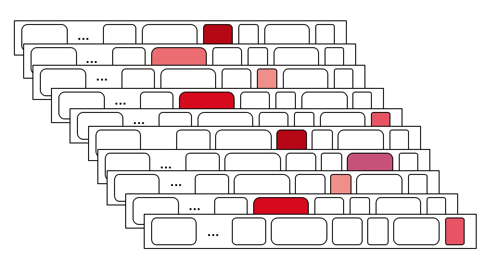

# 第06节 RocketMQ存储架构

TODO

## Kafka vs RocketMQ

### Kafka

在 *Kafka* 存储架构中，同一个 *topic* 下有多个不同 *Partition* （分区，一个 *topic* 下的分区数量是可以配置的，默认 1），每个 *Partition* 为一个文件目录，*Partition* 的命名规则为“*topic* 名称 + 有序序号”，即第一个 *Partition* 序号从 0 开始，第二个 *Partition* 序号从 1 开始，以此类推。

1. 每个 *Partition* 下会平均分配多个大小相等的 *Segment* 数据文件。但每个 *Segment* 文件消息数量不一定相等，这种特性方便 *Old Segment* 文件快速被删除。

    - *Segment* 文件组成：有两种类型的文件，分别为**索引文件**和**数据文件**，此 2 种文件一一对应，成对出现，分别对应后缀为 *.index* 和 *.log* 的文件。
    - *Segment* 文件命名规则：*Partition* 全局的第一个 *Segment* 从 0 开始，后续每个 *Segment* 文件名为上一个 *Segment* 文件最后一条消息的 *offset* 值。

        > ⚠️ 注意，在 *Partition* 内的每条消息都有一个有序的 *id* ，这个 *id* 被称为 *offset* ，它可以唯一确定每条消息在 *Partition* 内的位置。即 *offset* 表示 *Partition* 的第多少个消息。

- 每个 *Partiton* 只需要支持顺序读写就行了，*Segment* 文件生命周期由服务端配置参数决定。

由于笔者电脑上没有 *Kafka* 环境，临时搭建了一个单机环境。每个 *topic* 下的 *Partition* 个数修改为 3（默认值为 1），同时，每个 *Segment* 的文件大小使用默认值 *1G*，然后通过脚本创建两个 *topic demoTopic、demo2Topic*。

目录结构如下：

然后在 *topic demoTopic* 下通过脚本写入大量的数据：

下面简单介绍下**索引文件**和**数据文件**的关系，

- **索引文件**中存储元数据，而**数据文件**中存储消息；

- **索引文件**中的元数据指向对应的**数据文件**中消息的物理偏移地址；

如上图，索引文件里面存储的是 *key-value* 对，其中 *key* 是消息在数据文件中的编号。比如“1,3,6,8......”分别表示在数据文件中的第 1 条、第 3 条、第 6 条，以及第 8 条消息。

**仔细的同学可能会发现，索引文件中的编号为什么不连续？**

这是因为索引文件并没有为数据文件中的每条消息都建立索引，而是采用了稀疏索引的方式，每隔一定字节的数据建立一条索引。这样避免了索引文件占用过多的空间，从而可以将索引文件保留在内存中，而不会被 *Swap* 到磁盘上。但缺点是没有建立索引的消息不能一次定位到其在数据文件的位置，需要再次做顺序查找，但是这次查找被限制在了很小的范围。

以索引文件中元数据 *3,539* 为例，其中 3 代表在数据文件中的第 3 个消息，539 表示该消息的物理偏移地址。

**在 Partition 中如何通过 offset 查找消息？**

假设我们读取 *offset=1057555* 的消息，需要通过如下两步查找，

1. 首先查找 *Segment* 文件。

    我们以上面的 *Kafka* 数据文件为例，*00000000000000000000.index* 索引文件的消息起始 *offset* 为 0，*00000000000001057550.log* 索引文件的消息起始 *offset* 为 1057550，以此类推。只需要根据索引文件的名称排序，然后根据 *offset* 执行 **二分查找**文件列表，就可以快速定位到具体文件。很显然，*offset* 1057555 定位到了 *00000000000001057550.index/log* 文件。

2. 通过计算 *1057555 - 1057550 = 5* 可以定位到 *offset* 为 1057553 的消息，然后再通过顺序查找直到 *offset* 1057555 为止。

不管对于 *Producer* 还是 *Consumer* ，单个 *Partition* 文件在正常的发送和消费逻辑中都是顺序IO，充分利用 *Page Cache* 带来的巨大性能提升，但是，**万一 *topic* 很多，每个 *topic* 下又有 N 个 *Partition*，这时对于操作系统来说，这么多文件的顺序读写在并发时变成了随机读写。**

### RocketMQ

*ReputMessageService* 为消费队列分发（ *Dispatch* ）服务线程，会将写入 *CommitLog* 的消息的位置（*offset*）、消息大小、*tag hashcode* 信息写入 *ComsumeQueue*中。如下图所示，

1. 所有数据单独存储到一个 *CommitLog* （实际是多个 *CommitLog* 文件，且所有 *topic* 都写在同一个 *CommitLog* 文件里，每个文件 *1G* 大小，这里为了方便理解，抽象为一个）中，完全顺序写，随机读。
2. 对最终用户展现的队列（ *ConsumeQueue* ）实际只存储消息在 *CommitLog* 的位置信息，并且串行方式刷盘。

这样做的好处如下:
1. 队列轻量化，单个队列数据量非常少。
2. 对磁盘的访问串行化，避免磁盘竟争，不会因为队列增加导致 *IOWAIT* 增高。

每个方案都有缺点，它的缺点如下:
1. 写虽然完全是顺序写，但是读却变成了完全的随机读。
2. 读一条消息，会先读 *ConsumeQueue*，再读 *CommitLog*，增加了开销。
3. 要保证 *CommitLog* 与 *ConsumeQueue* 完全的一致，增加了编程的复杂度。

以上缺点如何克服:
1. 随机读，尽可能让读命中 *Page Cache* ，减少 *IO* 读操作，所以内存越大越好。如果系统中堆积的消息过多，读数据要访问磁盘会不会由于随机读导致系统性能急剧下降，答案是否定的。

    a) 访问 *Page Cache* 时，即使只访问 *1k* 的消息，系统也会提前预读出更多数据，在下次读时，就可能命中内存。

    b) 随机访问 *CommitLog* 磁盘数据，系统 *IO* 调度算法设置为 *NOOP* 方式，会在一定程度上将完全的随机读变成顺序跳跃方式，而顺序跳跃方式读较完全的随机读性能会高 5 倍以上。

    另外 *4k* 的消息在完全随机访问情况下，仍然可以达到 *8K* 次每秒以上的读性能。
2. 由于 *ConsumeQueue* 存储数据量极少，而且是顺序读，在 *Page Cache* 预读作用下，*ConsumeQueue* 的读性能几乎与内存一致，即使堆积情况下。所以可认为 *ConsumeQueue* 完全不会阻碍读性能。
3. *CommitLog* 中存储了所有的元信息，包含消息体，类似于 *Mysql*、*Oracle* 的 *redolog* ，所以只要有 *CommitLog* 在，*ConsumeQueue* 即使数据丢失，仍然可以恢复出来。

此外，在 *RocketMQ* 中 *CommitLog* 、*ConsumeQueue* 类似于 *Kafka* 中的数据文件和索引文件。*RocketMQ* 的存储机制是所有的 *topic* 消息都顺序写入同一 *CommitLog* 文件中，每一个 *topic* 在 *broker* 上又单独对应多个 *ConsumeQueue* ，*topic* 的增加并不会影响 *CommitLog* 文件的数量，只会增加 *ConsumeQueue* ，而 *RocketMQ* 的 *ConsumeQueue* 是不会存储消息的内容，任何一个消息也就占用 *20 Byte* ，所以文件可以控制得非常小，绝大部分的访问还是 *Page Cache* 的访问，而不是磁盘访问。所以 *RocketMQ* 在 *topic* 很多时，会更有优势。
