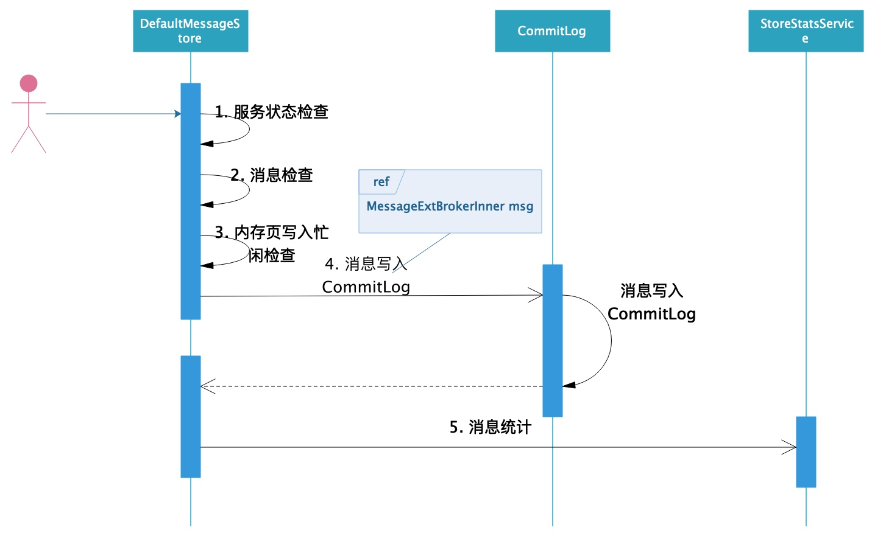
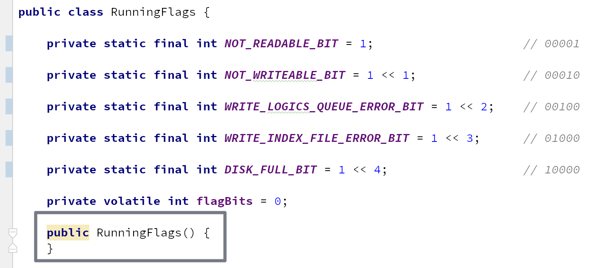

# 第07节 DefaultMessageStore

*DefaultMessageStore* 作为 *RocketMQ* 消息存储的 *Manager*，是消息存储中最为重要的类。本节就以该类为出发点，带领读者一起从源码角度去领略 *RocketMQ* 消息存储的架构设计。

## 消息写入流程



消息写入前会做一系列的检查，

（1）首先会检查消息存储服务的状态，以下三种情况消息的写入会被禁止：

1. 消息存储服务已关闭；
2. *broker* 为从节点；
3. 消息存储服务不可写；

（2）检查消息的 *topic* 长度和属性长度。

（3）检查操作系统内存页写入是否繁忙。

一系列检查通过后，调用 `commitLog.putMessage(msg)` 向 *CommitLog* 文件中写入消息。

最后做一些消息统计工作：

1. 对消息的存储耗时进行分级记录，并记录当前所有消息存储耗时中的最大耗时；
2. 记录写 *CommitLog* 失败次数；

## 源码深入剖析

### 成员变量

*DefaultMessageStore* 作为 *RocketMQ* 消息存储的 *Manager*，其成员变量是相当多的，我们在这里先简单描述下这些变量的含义，以便在后面的代码阅读中对这些变量有一个清晰的认识。

| 字段 | 类型 | 说明 |
| --- | --- | --- |
| messageStoreConfig | MessageStoreConfig | 消息存储相关的配置，例如存储路径、*CommitLog* 文件大小，刷盘频次等 |
| commitLog | CommitLog | *CommitLog* 的核心处理类，消息存储在 *CommitLog* 文件中 |
| consumeQueueTable | ConcurrentMap\<String/\* topic \*/, ConcurrentMap\<Integer/\* queueId \*/, ConsumeQueue\>\> | *topic* 的消费队列 |
| flushConsumeQueueService | FlushConsumeQueueService | *ConsumeQueue* 的刷盘服务 |
| cleanCommitLogService | CleanCommitLogService | *CommitLog* 定时清除服务 |
| cleanConsumeQueueService | CleanConsumeQueueService | *ConsumeQueue* 定时清除服务 |
| indexService | IndexService | 索引服务 |
| allocateMappedFileService | AllocateMappedFileService | *MappedFile* 分配服务，*RocketMQ* 使用内存映射处理 *CommitLog*，*ConsumeQueue*文件 |
| reputMessageService | ReputMessageService | 消息转发服务，它会将消息的位置信息和索引信息转发到消费队列和索引文件 |
| haService | HAService | 主从同步服务 |
| scheduleMessageService | ScheduleMessageService | 定时任务调度器，执行定时任务，主要是处理定时任务。 |
| storeStatsService | StoreStatsService | 存储统计服务。存储消息存储耗时相关的 *Metric*。比如，对消息的存储耗时进行分级记录，并记录当前所有消息存储的最大耗时；记录写 *CommitLog* 失败次数；等。可以收集这些监控数据，上报给监控系统。 |
| transientStorePool | TransientStorePool | 堆外内存池 |
| runningFlags | RunningFlags | 存储服务运行状态 |
| systemClock | SystemClock | 只提供了一个方法，用于获取系统当前时间 |
| scheduledExecutorService | ScheduledExecutorService | 线程池，执行一些延迟任务，比如延迟 *mlock* 内存映射。 |
| brokerStatsManager | BrokerStatsManager | *broker* 统计服务 |
| messageArrivingListener | MessageArrivingListener | 消息达到监听器，用于长轮询 |
| brokerConfig | BrokerConfig | *broker* 相关的配置 |
| shutdown | boolean | 消息存储服务是否已关闭 |
| storeCheckpoint | StoreCheckpoint | 存储检查点 |
| printTimes | AtomicLong | 计数器，初始值为 0 |
| dispatcherList | LinkedList<commitlogdispatcher></commitlogdispatcher> | 服务列表，这些服务用于将写入 *MappedFile* 的消息转发到*ConsumeQueue*、*IndexFile*，即将这些消息加入到消费队列和索引文件中。 |
| lockFile | RandomAccessFile |  |
| lock | FileLock |  |
| shutDownNormal | boolean |  |

### 消息写入

接下来，我们从 `putMessage(MessageExtBrokerInner msg)` 方法为出发点，一起探究整个消息存储全过程。

```java
public PutMessageResult putMessage(MessageExtBrokerInner msg) {
    // 如果消息存储服务已关闭，则消息写入会被拒绝
    if (this.shutdown) {
        log.warn("message store has shutdown, so putMessage is forbidden");
        return new PutMessageResult(PutMessageStatus.SERVICE_NOT_AVAILABLE, null);
    }

    // 如果角色为从节点，则消息写入会被拒绝
    if (BrokerRole.SLAVE == this.messageStoreConfig.getBrokerRole()) {
        long value = this.printTimes.getAndIncrement();
        if ((value % 50000) == 0) {
            log.warn("message store is slave mode, so putMessage is forbidden ");
        }

        return new PutMessageResult(PutMessageStatus.SERVICE_NOT_AVAILABLE, null);
    }

    // 如果消息存储服务不可写，则消息写入会被拒绝
    if (!this.runningFlags.isWriteable()) { // @1
        long value = this.printTimes.getAndIncrement();
        if ((value % 50000) == 0) {
            log.warn("message store is not writeable, so putMessage is forbidden " + this.runningFlags.getFlagBits());
        }

        return new PutMessageResult(PutMessageStatus.SERVICE_NOT_AVAILABLE, null);
    } else {
        this.printTimes.set(0);
    }

    // 消息topic长度检查
    if (msg.getTopic().length() > Byte.MAX_VALUE) {
        log.warn("putMessage message topic length too long " + msg.getTopic().length());
        return new PutMessageResult(PutMessageStatus.MESSAGE_ILLEGAL, null);
    }

    // 消息属性长度检查
    if (msg.getPropertiesString() != null && msg.getPropertiesString().length() > Short.MAX_VALUE) {
        log.warn("putMessage message properties length too long " + msg.getPropertiesString().length());
        return new PutMessageResult(PutMessageStatus.PROPERTIES_SIZE_EXCEEDED, null);
    }

    // 检查操作系统内存页写入是否繁忙
    // 如果返回true，意味着此时有消息在写入CommitLog，且那条消息写入的时间超过了1s，则本条消息不再写入，返回内存页写入忙响应。
    if (this.isOSPageCacheBusy()) { // @2
        return new PutMessageResult(PutMessageStatus.OS_PAGECACHE_BUSY, null);
    }

    long beginTime = this.getSystemClock().now();
    // 将消息写入CommitLog文件
    PutMessageResult result = this.commitLog.putMessage(msg); // @3

    // 消息写入时间过长，发出警告
    long eclipseTime = this.getSystemClock().now() - beginTime;
    if (eclipseTime > 500) {
        log.warn("putMessage not in lock eclipse time(ms)={}, bodyLength={}", eclipseTime, msg.getBody().length);
    }

    // 对消息的存储耗时进行分级记录，并记录当前所有消息存储耗时中的最大耗时
    this.storeStatsService.setPutMessageEntireTimeMax(eclipseTime); // @4

    // 记录写CommitLog失败次数
    if (null == result || !result.isOk()) {
        this.storeStatsService.getPutMessageFailedTimes().incrementAndGet();
    }

    return result;
}
```

#### (1) 服务可用性检查

**代码@1，检查服务是否可写。**

如果服务不可写，则消息写入会被拒绝。

```java
private final RunningFlags runningFlags = new RunningFlags();
```

`runningFlags` 对象是通过上述方式构造的。

在看下 *RunningFlags* 类：



只有在 `flagBits` 的二进制形式除最低位外的其它位都为 0 时，才可写。

```java
public boolean isWriteable() {
    if ((this.flagBits & (NOT_WRITEABLE_BIT | WRITE_LOGICS_QUEUE_ERROR_BIT | DISK_FULL_BIT | WRITE_INDEX_FILE_ERROR_BIT)) == 0) {
        return true;
    }

    return false;
}
```

`NOT_WRITEABLE_BIT | WRITE_LOGICS_QUEUE_ERROR_BIT | DISK_FULL_BIT | WRITE_INDEX_FILE_ERROR_BIT` 运算的结果会保证最低位为 0，其它位都为 1，即 11110。然后与 `this.flagBits` 与运算，只要 `flagBits` 的二进制形式除最低位外的其它位都为 0 时才可写。

**代码@2，检查操作系统内存页写入是否繁忙。**

如果返回 *true*，意味着此时有消息在写入 *CommitLog*，且那条消息的写入耗时较长（超过了 *1s*），则本条消息不再写入，返回内存页写入忙响应，从而对 *broker* 进行服务降级。

```java
@Override
public boolean isOSPageCacheBusy() {
    // 当有消息写入CommitLog时，会先加锁，然后将beginTimeInLock设置为当前时间。
    // 消息写入完成后，先将beginTimeInLock设置为0，然后释放锁。
    // 也就是说没有消息写入时，beginTimeInLock为0。
    long begin = this.getCommitLog().getBeginTimeInLock();
    long diff = this.systemClock.now() - begin;

    return diff < 10000000 // 这里就是为了考虑到没有消息写入时的情况
            && diff > this.messageStoreConfig.getOsPageCacheBusyTimeOutMills(); // 意味着此时有消息在写入CommitLog，且那条消息的写入耗时较长（超过了1s）
}
```

#### (2) 消息写入

代码@3，调用 *CommitLog* 类来执行消息写入。

关于此类的讲解，我们会在下一节对其进行深入的探讨。

#### (3) 存储统计

代码@4，*StoreStatsService* 为存储统计服务，对消息的存储耗时进行分级记录，记录每个耗时级别的消息数，并记录当前所有消息存储耗时中的最大耗时。在其构造方法中执行初始化，代码如下：

```java
// DefaultMessageStore.java
this.storeStatsService = new StoreStatsService();

// StoreStatsService.java
private volatile AtomicLong[] putMessageDistributeTime;

public StoreStatsService() {
    this.initPutMessageDistributeTime();
}

private AtomicLong[] initPutMessageDistributeTime() {
    // 构造长度为13的long数组，并初始化元素为0
    AtomicLong[] next = new AtomicLong[13];
    for (int i = 0; i < next.length; i++) {
        next[i] = new AtomicLong(0);
    }

    AtomicLong[] old = this.putMessageDistributeTime;

    this.putMessageDistributeTime = next;

    return old;
}
```

`storeStatsService` 的 `setPutMessageEntireTimeMax(long value)` 方法主要是对消息的存储耗时进行分级记录，记录每个耗时级别的消息数，并记录当前所有消息存储耗时中的最大耗时。

```java
// for putMessageEntireTimeMax
private ReentrantLock lockPut = new ReentrantLock();

public void setPutMessageEntireTimeMax(long value) {
    // 对消息的存储耗时进行分级记录，记录每个耗时级别的消息数
    final AtomicLong[] times = this.putMessageDistributeTime;

    if (null == times)
        return;

    // us
    if (value <= 0) {
        times[0].incrementAndGet();
    } else if (value < 10) {
        times[1].incrementAndGet();
    } else if (value < 50) {
        times[2].incrementAndGet();
    } else if (value < 100) {
        times[3].incrementAndGet();
    } else if (value < 200) {
        times[4].incrementAndGet();
    } else if (value < 500) {
        times[5].incrementAndGet();
    } else if (value < 1000) {
        times[6].incrementAndGet();
    }
    // 2s
    else if (value < 2000) {
        times[7].incrementAndGet();
    }
    // 3s
    else if (value < 3000) {
        times[8].incrementAndGet();
    }
    // 4s
    else if (value < 4000) {
        times[9].incrementAndGet();
    }
    // 5s
    else if (value < 5000) {
        times[10].incrementAndGet();
    }
    // 10s
    else if (value < 10000) {
        times[11].incrementAndGet();
    } else {
        times[12].incrementAndGet();
    }

    // 记录当前所有消息存储耗时中的最大耗时
    if (value > this.putMessageEntireTimeMax) {
        this.lockPut.lock();
        this.putMessageEntireTimeMax =
            value > this.putMessageEntireTimeMax ? value : this.putMessageEntireTimeMax;
        this.lockPut.unlock();
    }
}
```