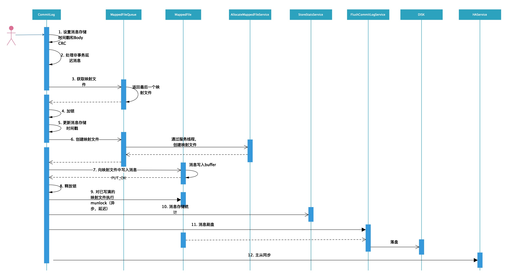

# 第08节 CommitLog

在上一节我们提到了消息写入是通过 `CommitLog#putMessage(final MessageExtBrokerInner msg)` 方法来实现的，作为 *CommitLog* 消息写入的入口方法，我们就从该方法展开对源码的分析。

## 消息写入流程

首先通过序列图对其实现有个大致的了解，



在 *CommitLog* 中消息写入的流程大致如下：

1. 设置消息存储时间、消息体循环冗余校验码；
2. 处理非事务延迟消息；
    对于延迟消息，将其 *topic* 更改为新的 *topic SCHEDULE_TOPIC_XXXX*，同时根据延迟级别设置延时消息的新队列 *ID*（ *queueId* 等于延迟级别减去 1）。
3. 获取映射文件；
    从 *MappedFileQueue* 中获取最后一个 *MappedFile*。
4. 在执行消息写入前先获取锁，保证消息写入的顺序性；
5. 再次更新消息存储时间戳，保证全局顺序消息；
6. 如果前面获取的映射文件为 *null* 或者已写满，则创建一个新的映射文件；
7. 向映射文件中写入消息;
8. 完成映射文件的消息写入，释放锁；
9. 对已写满的映射文件执行 *munlock*；
    采用线程池异步执行，并且为了尽可能保证当前已写满的 `mappedByteBuffer` 中未刷盘的数据执行刷盘。
10. 消息存储统计；
    1. 指定 *topic* 下写入消息数加 1；
    2. 指定 *topic* 下写入消息的总字节数加上当前写入的字节数；
11. 消息刷盘；
    有两种刷盘策略，分为同步刷盘和异步刷盘。
12. 主从同步；

## 源码深入剖析

### 成员变量

按照惯例，我们先来了解一下 *CommitLog* 的成员变量，以便在后面的代码阅读中对这些变量有一个清晰的认识。

| 字段 | 类型 | 说明 |
| --- | --- | --- |
| MESSAGE_MAGIC_CODE | int | *final* 类型，值为 -626843481，*MAGIC CODE*，表示消息 |
| BLANK_MAGIC_CODE | int | *final* 类型，值为 -875286124，*MAGIC CODE*，表示到达映射文件末尾 |
| mappedFileQueue | MappedFileQueue | 映射文件队列，用于管理和维护映射文件 |
| defaultMessageStore | DefaultMessageStore | 消息存储模块 *Manager* |
| flushCommitLogService | FlushCommitLogService | 消息刷盘服务，分为同步刷盘和异步刷盘 |
| commitLogService | FlushCommitLogService | 消息提交服务，如果启用了 *TransientStorePool*，该服务用于将消息从 *writeBuffer*（堆外内存）提交到 *fileChannel* |
| appendMessageCallback | AppendMessageCallback | 追加消息回调，在获取到映射文件后，根据消息格式向映射文件的 *buffer* 中写入消息内容 |
| batchEncoderThreadLocal | ThreadLocal<messageextbatchencoder> </messageextbatchencoder> | 追加批量消息时使用，用于根据消息格式将批量消息封装为 *ByteBuffer* |
| topicQueueTable | HashMap\<String/\* topic-queueid \*/, Long/\* offset \*/\> | *ConsumeQueue topic-queueid offset table*，*“topic-queueid”* 格式为 *key*，*offset* 为 *value* |
| confirmOffset | volatile long | 开源版本暂未实现 |
| beginTimeInLock | volatile long | 消息写入时，会先加锁，然后将其设置为当前时间。 消息写入完成后，先将 *beginTimeInLock* 设置为 0，然后释放锁。 该值用来计算消息写入耗时。 写入新消息前，会根据该值来检查操作系统内存页写入是否忙，如果上一消息在1s内没有成功写入，则本次消息不再写入，返回页写入忙响应。 |
| putMessageLock | PutMessageLock | 写入消息时的锁。有互斥锁 *ReentrantLock* 和自旋锁两种锁，默认情况下，使用自旋锁。 |

### 消息写入

回顾一下前一节的内容，我们讲到 *DefaultMessageStore* 通过 `PutMessageResult result = this.commitLog.putMessage(msg);` 将消息写入 *CommitLog* 文件。

我们首先来看一下 *CommitLog* 是如何构造的。

```java
// DefaultMessageStore.java
this.commitLog = new CommitLog(this);

// CommitLog.java
public CommitLog(final DefaultMessageStore defaultMessageStore) {
    // 构造mappedFileQueue对象，并指定如下入参:
    //      1. CommitLog文件的存储路径;
    //      2. CommitLog文件大小，默认1G;
    //      3. 映射文件分配线程，RocketMQ使用内存映射处理CommitLog，ConsumeQueue文件
    this.mappedFileQueue = new MappedFileQueue(defaultMessageStore.getMessageStoreConfig().getStorePathCommitLog(),
            defaultMessageStore.getMessageStoreConfig().getMapedFileSizeCommitLog(), defaultMessageStore.getAllocateMappedFileService());

    this.defaultMessageStore = defaultMessageStore;

    // 消息刷盘服务，分为同步刷盘和异步刷盘
    if (FlushDiskType.SYNC_FLUSH == defaultMessageStore.getMessageStoreConfig().getFlushDiskType()) {
        this.flushCommitLogService = new GroupCommitService();
    } else {
        this.flushCommitLogService = new FlushRealTimeService();
    }

    // 如果启用了TransientStorePool，该服务用于将消息从writeBuffer（堆外内存）提交到fileChannel
    this.commitLogService = new CommitRealTimeService();

    // 追加消息回调，
    // 在获取到映射文件后，根据消息格式向映射文件的buffer中写入消息内容
    this.appendMessageCallback = new DefaultAppendMessageCallback(defaultMessageStore.getMessageStoreConfig().getMaxMessageSize());
    
    // 追加批量消息时使用，
    // 用于根据消息格式将批量消息封装为ByteBuffer
    batchEncoderThreadLocal = new ThreadLocal<MessageExtBatchEncoder>() {
        @Override
        protected MessageExtBatchEncoder initialValue() {
            return new MessageExtBatchEncoder(defaultMessageStore.getMessageStoreConfig().getMaxMessageSize());
        }
    };

    // 确定在存储消息时是否使用互斥锁ReentrantLock。默认情况下，它设置为false，表示在存储消息时使用自旋锁。
    this.putMessageLock = defaultMessageStore.getMessageStoreConfig().isUseReentrantLockWhenPutMessage() ? new PutMessageReentrantLock() : new PutMessageSpinLock();

}
```

在上面的构造函数中创建并初始化了消息写入所必需的组件，对于上面的代码可以不用完全理解，先有个大概的印象即可，后面我们会做详细介绍。

*CommitLog* 写入消息实现如下：

```java
public PutMessageResult putMessage(final MessageExtBrokerInner msg) {
    // 设置消息存储时间
    msg.setStoreTimestamp(System.currentTimeMillis());
    // 设置消息体循环冗余校验码
    msg.setBodyCRC(UtilAll.crc32(msg.getBody())); // @1
    // 返回结果对象
    AppendMessageResult result = null;

    // 消息存储统计服务
    StoreStatsService storeStatsService = this.defaultMessageStore.getStoreStatsService();

    String topic = msg.getTopic(); // topic
    int queueId = msg.getQueueId(); // queue id

    // @2^
    // 获取消息类型
    final int tranType = MessageSysFlag.getTransactionValue(msg.getSysFlag());
    if (tranType == MessageSysFlag.TRANSACTION_NOT_TYPE
            || tranType == MessageSysFlag.TRANSACTION_COMMIT_TYPE) { // @@1
        // Delay Delivery
        if (msg.getDelayTimeLevel() > 0) { // 获取消息延时投递时间级别
            if (msg.getDelayTimeLevel() > this.defaultMessageStore.getScheduleMessageService().getMaxDelayLevel()) { // @@2
                msg.setDelayTimeLevel(this.defaultMessageStore.getScheduleMessageService().getMaxDelayLevel());
            }

            // topic更改为新的topic SCHEDULE_TOPIC_XXXX
            topic = ScheduleMessageService.SCHEDULE_TOPIC;
            // 根据延迟级别获取延时消息的新队列ID（queueId等于延迟级别减去1）
            queueId = ScheduleMessageService.delayLevel2QueueId(msg.getDelayTimeLevel());

            // Backup real topic, queueId
            // 将消息中原 topic 和 queueId 存入消息属性中；
            // @@3
            MessageAccessor.putProperty(msg, MessageConst.PROPERTY_REAL_TOPIC, msg.getTopic());
            MessageAccessor.putProperty(msg, MessageConst.PROPERTY_REAL_QUEUE_ID, String.valueOf(msg.getQueueId()));
            msg.setPropertiesString(MessageDecoder.messageProperties2String(msg.getProperties()));

            msg.setTopic(topic);
            msg.setQueueId(queueId);
        }
    }
    // @2$

    long eclipseTimeInLock = 0;
    MappedFile unlockMappedFile = null;
    MappedFile mappedFile = this.mappedFileQueue.getLastMappedFile(); // @3

    // 加锁，默认使用自旋锁。
    // 依赖于messageStoreConfig#useReentrantLockWhenPutMessage配置
    putMessageLock.lock(); // spin or ReentrantLock ,depending on store config // @4
    try {
        long beginLockTimestamp = this.defaultMessageStore.getSystemClock().now();
        this.beginTimeInLock = beginLockTimestamp;

        // Here settings are stored timestamp, in order to ensure an orderly
        // global
        msg.setStoreTimestamp(beginLockTimestamp);

        // 调用MappedFileQueue#getLastMapedFile()方法获取最后一个映射文件，
        // 若还没有映射文件或者已有的最后一个映射文件已经写满则创建一个新的映射文件返回
        if (null == mappedFile || mappedFile.isFull()) {
            mappedFile = this.mappedFileQueue.getLastMappedFile(0); // Mark: NewFile may be cause noise // @5
        }
        if (null == mappedFile) { // 创建映射文件失败
            log.error("create mapped file1 error, topic: " + msg.getTopic() + " clientAddr: " + msg.getBornHostString());
            // 消息写入完成后，先将beginTimeInLock设置为0，然后释放锁。
            // 该值用来计算消息写入耗时。写入新消息前，会根据该值来检查操作系统内存页写入是否繁忙，如果上一消息在1s内没有成功写入，则本次消息不再写入，返回页写入忙响应。
            beginTimeInLock = 0;
            return new PutMessageResult(PutMessageStatus.CREATE_MAPEDFILE_FAILED, null);
        }

        // 向映射文件中写入消息
        // 注意，这只是将消息写入映射文件中的writeBuffer/mappedByteBuffer，并没有刷盘
        result = mappedFile.appendMessage(msg, this.appendMessageCallback); // @6
        switch (result.getStatus()) {
            case PUT_OK: // 消息成功写入
                break;
            case END_OF_FILE: // 当前CommitLog可用空间不足
                unlockMappedFile = mappedFile;
                // 创建新的CommitLog，重新写入消息
                mappedFile = this.mappedFileQueue.getLastMappedFile(0);
                if (null == mappedFile) {
                    // XXX: warn and notify me
                    log.error("create mapped file2 error, topic: " + msg.getTopic() + " clientAddr: " + msg.getBornHostString());
                    beginTimeInLock = 0;
                    return new PutMessageResult(PutMessageStatus.CREATE_MAPEDFILE_FAILED, result);
                }
                result = mappedFile.appendMessage(msg, this.appendMessageCallback);
                break;
            case MESSAGE_SIZE_EXCEEDED: // 消息长度超过了最大阈值
            case PROPERTIES_SIZE_EXCEEDED: // 消息属性长度超过了最大阈值
                beginTimeInLock = 0;
                return new PutMessageResult(PutMessageStatus.MESSAGE_ILLEGAL, result);
            case UNKNOWN_ERROR: // 未知错误
                beginTimeInLock = 0;
                return new PutMessageResult(PutMessageStatus.UNKNOWN_ERROR, result);
            default:
                beginTimeInLock = 0;
                return new PutMessageResult(PutMessageStatus.UNKNOWN_ERROR, result);
        }

        eclipseTimeInLock = this.defaultMessageStore.getSystemClock().now() - beginLockTimestamp;
        beginTimeInLock = 0;
    } finally {
        putMessageLock.unlock(); // 释放锁
    }

    if (eclipseTimeInLock > 500) {
        log.warn("[NOTIFYME]putMessage in lock cost time(ms)={}, bodyLength={} AppendMessageResult={}", eclipseTimeInLock, msg.getBody().length, result);
    }

    // @7
    if (null != unlockMappedFile && this.defaultMessageStore.getMessageStoreConfig().isWarmMapedFileEnable()) {
        this.defaultMessageStore.unlockMappedFile(unlockMappedFile);
    }

    PutMessageResult putMessageResult = new PutMessageResult(PutMessageStatus.PUT_OK, result);

    // 消息统计:
    //      1. 指定topic下写入消息数加1
    storeStatsService.getSinglePutMessageTopicTimesTotal(msg.getTopic()).incrementAndGet();
    //      2. 指定topic下写入消息的总字节数加上当前写入的字节数
    storeStatsService.getSinglePutMessageTopicSizeTotal(topic).addAndGet(result.getWroteBytes());

    // 至此，消息并没有真正的写入 CommitLog 文件中，而是在 MappedFile#mappedByteBuffer 或者 MappedFile#writeBuffer 缓存中。
    // 其中，MappedFile#writeBuffer 只有仅当 transientStorePoolEnable 为 true，FlushDiskType 为异步刷盘（ASYNC_FLUSH），并且 broker 为主节点时才启用。

    handleDiskFlush(result, putMessageResult, msg); // @8
    handleHA(result, putMessageResult, msg); // @9

    return putMessageResult;
}
```

#### (1) 循环冗余校验码

代码@1，对消息体进行CRC，设置消息体循环冗余校验码。

```java
// UtilAll.java
public static int crc32(byte[] array) {
    if (array != null) {
        return crc32(array, 0, array.length);
    }

    return 0;
}

public static int crc32(byte[] array, int offset, int length) {
    CRC32 crc32 = new CRC32();
    crc32.update(array, offset, length);
    // 01111111 11111111 11111111 11111111
    // 0x7FFFFFFF 即为32位有符号整数最大值
    return (int) (crc32.getValue() & 0x7FFFFFFF);
}
```

#### (2) 延迟消息

代码@2，对于延迟消息，将其 *topic* 更改为新的 *topic SCHEDULE_TOPIC_XXXX*，同时根据延迟级别设置延时消息的新队列 *ID*（ *queueId* 等于延迟级别减去 1）。同时将消息的原 *topic* 和 *queueId* 保存到消息的 *REAL_TOPIC*、*REAL_QID* 属性中。

**代码@@1，获取消息类型，并判断是否是非事务消息 或 事务提交消息。**

```java
public class MessageSysFlag {
    public final static int COMPRESSED_FLAG = 0x1;                   // 0001
    public final static int MULTI_TAGS_FLAG = 0x1 << 1;              // 0010
    public final static int TRANSACTION_NOT_TYPE = 0;                // 0000
    public final static int TRANSACTION_PREPARED_TYPE = 0x1 << 2;    // 0100
    public final static int TRANSACTION_COMMIT_TYPE = 0x2 << 2;      // 1000
    public final static int TRANSACTION_ROLLBACK_TYPE = 0x3 << 2;    // 1100

    public static int getTransactionValue(final int flag) {
        return flag & TRANSACTION_ROLLBACK_TYPE;
    }

    public static int resetTransactionValue(final int flag, final int type) {
        return (flag & (~TRANSACTION_ROLLBACK_TYPE)) | type;
    }

    public static int clearCompressedFlag(final int flag) {
        return flag & (~COMPRESSED_FLAG);
    }

    public static void main(String[] args) {
        System.out.println(0x3 << 2);
    }
}
```

这里我们只看 `getTransactionValue(final int flag)` 方法，

`flag & TRANSACTION_ROLLBACK_TYPE` => `flag & 0x3 << 2` => `flag & 1100`，由此可以得知，当满足 `tranType == MessageSysFlag.TRANSACTION_NOT_TYPE || tranType == MessageSysFlag.TRANSACTION_COMMIT_TYPE` 时，即满足 `flag & 1100` 等于  `0000` 或者 `1000`，所以 `flag` 必须要保证低 3 位必须为 0。所以消息的类型可以为 `COMPRESSED_FLAG`、`MULTI_TAGS_FLAG`、`TRANSACTION_NOT_TYPE`、`TRANSACTION_COMMIT_TYPE`。

说了这么多，总结一点就是非事务消息 或 事务提交消息。

---

**代码@@2，这里用于处理消息延时投递。**

`this.defaultMessageStore.getScheduleMessageService().getMaxDelayLevel()` 用于获取最大延迟级别。

如果你跟踪代码到 *ScheduleMessageService* 类，你会发现：

```java
// ScheduleMessageService.java
private int maxDelayLevel;

public int getMaxDelayLevel() {
    return maxDelayLevel;
}
```

很遗憾，`maxDelayLevel` 没有你意想中的是一个已被初始化的静态变量。

我们再来看看 `scheduleMessageService` 对象是如何构造的，是不是在其构造函数中传入的 `maxDelayLevel` ？

继续跟踪代码，会发现 `scheduleMessageService` 对象是在 *DefaultMessageStore* 类的构造方法中创建的，

```java
// DefaultMessageStore.java
this.scheduleMessageService = new ScheduleMessageService(this);

// ScheduleMessageService.java
public ScheduleMessageService(final DefaultMessageStore defaultMessageStore) {
    this.defaultMessageStore = defaultMessageStore;
}
```

居然也不是构造函数，那 `maxDelayLevel` 到底是什么时候被初始化的呢？其实，它是在 *ScheduleMessageService#parseDelayLevel* 方法中初始化的。

调用流程大致是这样：

```text
BrokerStartup#main -> BrokerStartup#createBrokerController -> BrokerController#initialize -> DefaultMessageStore#load -> ScheduleMessageService#load -> ScheduleMessageService#parseDelayLevel
```

```java
/**
 * 初始化maxDelayLevel，delayLevelTable
 * 
 * @return
 */
public boolean parseDelayLevel() {
    HashMap<String, Long> timeUnitTable = new HashMap<String, Long>();
    timeUnitTable.put("s", 1000L);
    timeUnitTable.put("m", 1000L * 60);
    timeUnitTable.put("h", 1000L * 60 * 60);
    timeUnitTable.put("d", 1000L * 60 * 60 * 24);

    // 1s 5s 10s 30s 1m 2m 3m 4m 5m 6m 7m 8m 9m 10m 20m 30m 1h 2h
    String levelString = this.defaultMessageStore.getMessageStoreConfig().getMessageDelayLevel();
    try {
        String[] levelArray = levelString.split(" ");
        for (int i = 0; i < levelArray.length; i++) {
            String value = levelArray[i];
            String ch = value.substring(value.length() - 1); // 获取时间单位
            Long tu = timeUnitTable.get(ch);

            int level = i + 1;
            if (level > this.maxDelayLevel) { // 更新maxDelayLevel
                this.maxDelayLevel = level;
            }
            long num = Long.parseLong(value.substring(0, value.length() - 1));
            long delayTimeMillis = tu * num;
            this.delayLevelTable.put(level, delayTimeMillis);
        }
    } catch (Exception e) {
        log.error("parseDelayLevel exception", e);
        log.info("levelString String = {}", levelString);
        return false;
    }

    return true;
}
```

---

**代码@@3，备份延迟消息的原 *Topic* 和 *queueId*，将消息的原 *topic* 和 *queueId* 保存到消息的 *REAL_TOPIC*、*REAL_QID* 属性中。**

```java
public static void putProperty(final Message msg, final String name, final String value) {
    msg.putProperty(name, value);
}
```

同时设置消息的 `propertiesString` 属性，

```java
public static String messageProperties2String(Map<String, String> properties) {
    StringBuilder sb = new StringBuilder();
    if (properties != null) {
        for (final Map.Entry<String, String> entry : properties.entrySet()) {
            final String name = entry.getKey();
            final String value = entry.getValue();

            sb.append(name);
            sb.append(NAME_VALUE_SEPARATOR);
            sb.append(value);
            sb.append(PROPERTY_SEPARATOR);
        }
    }
    return sb.toString();
}
```

#### (3) 获取映射文件

代码@3，获取最后一个大小为 `mappedFileSize` 的 *MappedFile* 对象（内存映射的具体实现）。

> `mappedFileQueue` 是在 *CommitLog* 的构造函数里进行初始化。

```java
// MappedFileQueue.java
public MappedFile getLastMappedFile() {
    MappedFile mappedFileLast = null;

    while (!this.mappedFiles.isEmpty()) {
        try {
            mappedFileLast = this.mappedFiles.get(this.mappedFiles.size() - 1);
            break;
        } catch (IndexOutOfBoundsException e) {
            //continue;
        } catch (Exception e) {
            log.error("getLastMappedFile has exception.", e);
            break;
        }
    }

    return mappedFileLast;
}
```

> 🙋‍♂️ 那么问题来了，`MappedFileQueue#mappedFiles` 是如何被初始化的呢？

#### (4) 加锁

代码@4，加锁，默认使用自旋锁。依赖于 `MessageStoreConfig#useReentrantLockWhenPutMessage`配置。

在 *CommitLog* 的构造函数中，可以看到，`putMessageLock` 通过以下方式创建，

```java
// 确定在存储消息时是否使用互斥锁ReentrantLock。默认情况下，它设置为false，表示在存储消息时使用自旋锁。
this.putMessageLock = defaultMessageStore.getMessageStoreConfig().isUseReentrantLockWhenPutMessage() ? new PutMessageReentrantLock() : new PutMessageSpinLock();
```

*PutMessageReentrantLock* 互斥锁是基于 *ReentrantLock* 来实现的非公平锁。

```java
public class PutMessageReentrantLock implements PutMessageLock {
    private ReentrantLock putMessageNormalLock = new ReentrantLock(); // NonfairSync

    @Override
    public void lock() {
        putMessageNormalLock.lock();
    }

    @Override
    public void unlock() {
        putMessageNormalLock.unlock();
    }
}
```

在 *PutMessageSpinLock* 中 `putMessageSpinLock`为 true 时，表示可以加锁。为 false，表示锁已被获取。加锁时是采用循环 *CAS* 的方式来实现的。

```java
public class PutMessageSpinLock implements PutMessageLock {
    // true: Can lock, false : in lock.
    private AtomicBoolean putMessageSpinLock = new AtomicBoolean(true);

    @Override
    public void lock() {
        boolean flag;
        do {
            flag = this.putMessageSpinLock.compareAndSet(true, false);
        }
        while (!flag);
    }

    @Override
    public void unlock() {
        this.putMessageSpinLock.compareAndSet(false, true);
    }
}
```

#### (5) 创建映射文件

代码@5，调用 *MappedFileQueue#getLastMappedFile(final long startOffset)* 方法获取最后一个映射文件，若还没有映射文件或者已有的最后一个映射文件已经写满则创建一个新的映射文件返回。

> 🙋‍♂️ 关于如何创建新的映射文件，我们把它放到后面几节来讲解。

#### (6) 消息写入

代码@6，既然获取到了 `mappedFile`，这里就该执行消息的写入逻辑了。

> 🙋‍♂️ 关于 *MappedFile* 的消息写入逻辑，我们会在讲解 *MappedFile* 时详细讲解。

此外，这里简单提一下，`appendMessageCallback` 是在CommitLog的构造函数中初始化的，

```java
public CommitLog(final DefaultMessageStore defaultMessageStore) {
    ...

    this.appendMessageCallback = new DefaultAppendMessageCallback(defaultMessageStore.getMessageStoreConfig().getMaxMessageSize());

    ...
}
```

*MappedFile* 在通过 `appendMessage(final MessageExtBrokerInner msg, final AppendMessageCallback cb)` 方法写入消息时，通过回调`appendMessageCallback` 对象的 `doAppend(final long fileFromOffset, final ByteBuffer byteBuffer,
        final int maxBlank, final MessageExtBrokerInner msg)` 方法执行真正的消息写入逻辑。

#### (7) munlock

代码@7，

> 在后面对**内存映射文件**的讲解中，我们会讲到如果启用预热，*MappedFile* 中的 `mappedByteBuffer` 会被 *mlock*，这会将 `mappedByteBuffer` 数据锁在内存中，不会被 *OS* 通过 *swap* 置换到磁盘上，这也就保证了消息写入的性能。

由于当前 *CommitLog* 可用空间不足，则会创建新的 *CommitLog*，而当前的 *CommitLog* 所对应的 *MappedFile* 中的 `mappedByteBuffer` 需要执行 *munlock*，使其可以被 *OS swap* 到磁盘。

> 很容易发现，只有当前写入消息的 *CommitLog* 才会被 *mlock*。
> 
> 此外，这里使用的是异步延迟方式，在 6 秒后才会执行 *munlock*，这给了足够的时间来将当前已写满的 `mappedByteBuffer` 中未刷盘的数据执行刷盘。

初始化线程池：

```java
// DefaultMessageStore.java
private final ScheduledExecutorService scheduledExecutorService =
        Executors.newSingleThreadScheduledExecutor(new ThreadFactoryImpl("StoreScheduledThread"));
```

延迟执行 *munlock*:

```java
// DefaultMessageStore.java
public void unlockMappedFile(final MappedFile mappedFile) {
    this.scheduledExecutorService.schedule(new Runnable() {
        @Override
        public void run() {
            mappedFile.munlock();
        }
    }, 6, TimeUnit.SECONDS);
}

// MappedFile.java
public void munlock() {
    final long beginTime = System.currentTimeMillis();
    final long address = ((DirectBuffer) (this.mappedByteBuffer)).address();
    Pointer pointer = new Pointer(address);
    int ret = LibC.INSTANCE.munlock(pointer, new NativeLong(this.fileSize));
    log.info("munlock {} {} {} ret = {} time consuming = {}", address, this.fileName, this.fileSize, ret, System.currentTimeMillis() - beginTime);
}
```

#### (8) 执行刷盘

代码@8，至此，消息并没有真正的写入 *CommitLog* 文件中，而是在 `MappedFile#mappedByteBuffer` 或者 `MappedFile#writeBuffer` 缓存中。其中，`writeBuffer` 只有仅当 `transientStorePoolEnable` 为 *true*，*FlushDiskType* 为异步刷盘（*ASYNC_FLUSH*），并且 *broker* 为主节点时才启用。

> 🙋‍♂️ 关于 `mappedByteBuffer` 与 `writeBuffer` 缓存，我们会在讲解 *MappedFile* 时详细讲解。

针对不同的刷盘策略，在 *CommitLog* 构造函数中通过如下方式初始化，

```java
// 刷盘策略
if (FlushDiskType.SYNC_FLUSH == defaultMessageStore.getMessageStoreConfig().getFlushDiskType()) {
    this.flushCommitLogService = new GroupCommitService();
} else {
    this.flushCommitLogService = new FlushRealTimeService();
}
```

如果为同步刷盘策略，则初始化为 *GroupCommitService* 实例，否则为异步刷盘策略，初始化为 *FlushRealTimeService* 实例。

而对于 *GroupCommitService*、*FlushRealTimeService* 实例，他们自身就是一个线程，并通过该线程来执行相关的刷盘逻辑。

> 🙋‍♂️ 关于这类服务线程的设计模式，详见《服务线程设计模式》。

`handleDiskFlush(AppendMessageResult result, PutMessageResult putMessageResult, MessageExt messageExt)` 方法用来对前面写入 *buffer* 的消息（写入到 *writeBuffer* 或 *mappedByteBuffer* 中的消息）进行刷盘。

> 🙋‍♂️ 关于刷盘机制的实现，详见“消息刷盘机制”模块。

#### (9) 主从同步

代码@9，

TODO

## 总结

本小节讲述了 *CommitLog* 消息写入的流程，同时也留下了几个问题，我们在这里整理一下。

- 问题一、`MappedFileQueue#mappedFiles` 是如何被初始化的呢？
- 问题二、如何创建新的映射文件？
- 问题三、*MappedFile* 的消息写入逻辑。
- 问题四、关于 `mappedByteBuffer` 与 `writeBuffer` 缓存，*RocketMQ* 是如何使用它们的？
- 问题五、服务线程的设计模式。
- 问题六、消息刷盘机制的实现。

让我们带着这六个问题，继续后面的章节学习，相信我，你会一一找到答案的。
