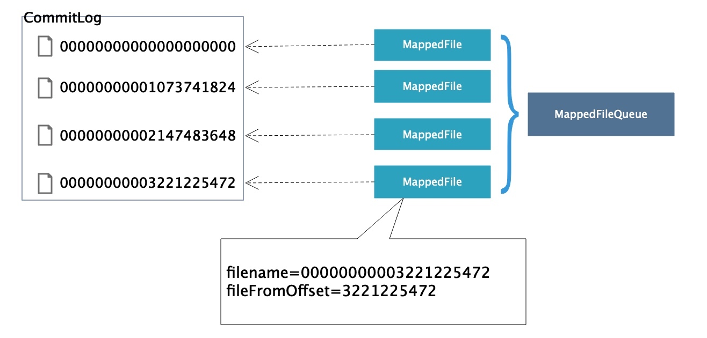

# 第10节 MappedFileQueue

## 初识MappedFileQueue

我们在业务层中访问 *CommitLog* 和 *ConsumeQueue* 是通过 *MappFileQueue* 来操作 *MappedFile* 类的，从而间接操作磁盘上面的文件，*MappFileQueue* 是多个 *MappedFile* 组成的队列，与 *MappedFile* 是 *1:n* 的关系。



它提供了一系列根据 *offset* 或者 *timestamp* 来查找、定位、删除 *MappedFile* 的逻辑，提供 *flushedWhere*，*committedWhere* 标记整个队列中 *flush* 以及 *commit* 的 *offset*。

前面我们提到，在消息写入时需要先通过 *MappFileQueue* 来获取映射文件（*MappedFile*），然后再向映射文件里写入消息。本节就详细讲解 *MappFileQueue* 的实现原理，如何通过它来获取 *MappedFile*。

## 源码深入剖析

### 成员变量

按照惯例，我们先来了解一下 *MappedFileQueue* 的成员变量，以便在后面的代码阅读中对这些变量有一个清晰的认识。

| 字段 | 类型 | 说明 |
| --- | --- | --- |
| DELETE_FILES_BATCH_MAX | int | 每次触发删除过期文件，最多删除多少个文件  |
| storePath | String | *CommitLog* 文件的存储路径 |
| mappedFileSize | int | 一个映射文件的大小 对于 *CommitLog* 文件，见 *org.apache.rocketmq.store.config.MessageStoreConfig.mapedFileSizeCommitLog*，默认 *1G*。 对于 *ConsumeQueue* 文件，见 *org.apache.rocketmq.store.config.MessageStoreConfig.mapedFileSizeConsumeQueue*，默认 *30W \* 20* 字节。 |
| mappedFiles | CopyOnWriteArrayList\<MappedFile\> | *MappedFileQueue* 所维护的所有映射文件集合 |
| allocateMappedFileService | AllocateMappedFileService | 预分配映射文件的服务线程，*RocketMQ* 使用内存映射处理 *CommitLog*，*ConsumeQueue* 文件 |
| flushedWhere | long | 当前已刷盘的物理位置（全局） |
| committedWhere | long | 当前已提交的物理位置（全局） 所谓提交就是将 *MappedFile.writeBuffer* 的脏数据写到 *MappedFile.fileChannel* |
| storeTimestamp | long | 采用完全刷盘方式（*flushLeastPages* 为 0）时，所刷盘的最后一条消息存储的时间戳 |

### 映射文件加载

我们首先来看一下在 *broker* 启动时是如何加载本地已存在的 *CommitLog* 文件的。

调用流程如下，

```text
BrokerStartup#main -> BrokerStartup#createBrokerController -> BrokerController#initialize -> DefaultMessageStore#load -> CommitLog#load -> MappedFileQueue#load
```

这是在 *broker* 启动的时候来完成的，`MappedFileQueue#load()` 对 *MappedFileQueue* 中的 `mappedFiles` 进行初始化，`load()` 方法首先会根据文件名称对 *CommitLog* 文件进行升序排序，然后丢弃大小不为 `mappedFileSize` 的文件及其后续文件。

> 👨‍🎓 其实这里就解答了我们之前在讲解 *CommitLog* 时留下的问题一，“`MappedFileQueue#mappedFiles` 是如何被初始化的呢？”

```java
public boolean load() {
    File dir = new File(this.storePath); // CommitLog文件的存储目录
    File[] files = dir.listFiles(); // 目录下所有CommitLog文件
    if (files != null) {
        // ascending order
        Arrays.sort(files);
        for (File file : files) {

            if (file.length() != this.mappedFileSize) {
                log.warn(file + "\t" + file.length()
                        + " length not matched message store config value, ignore it");
                return true;
            }

            try {
                MappedFile mappedFile = new MappedFile(file.getPath(), mappedFileSize); // @1

                // @2^
                mappedFile.setWrotePosition(this.mappedFileSize);
                mappedFile.setFlushedPosition(this.mappedFileSize);
                mappedFile.setCommittedPosition(this.mappedFileSize);
                // @2$
                this.mappedFiles.add(mappedFile);
                log.info("load " + file.getPath() + " OK");
            } catch (IOException e) {
                log.error("load file " + file + " error", e);
                return false;
            }
        }
    }

    return true;
}
```

#### (1) 构造映射文件

代码@1，该构造方法先通过 *RandomAccessFile* 对 *file* 进行包装，以支持其随机读写。然后通过 *fileChannel* 将文件直接映射到内存中，对应的内存映射为 *mappedByteBuffer*，并关闭 *fileChannel*，以后可以直接通过 *mappedByteBuffer* 操作 *CommitLog* 来读取消息。

#### (2) 设置写入位置

代码@2，这里将映射文件的 `wrotePosition`、`committedPosition`、`flushedPosition` 设置为映射文件的末尾，其实这也就意味着加载的这些映射文件不会再写入新的消息。

### 创建映射文件

我们知道，消息写入时，如果当前映射文件已经写满，或者当前 *broker* 是第一次启动，没有加载任何映射文件，那么就需要创建一个新的映射文件用于当前以及后续消息的写入。

我们再来回顾一下在 *CommitLog* 中是如何创建映射文件的。

```java
// CommitLog.java
if (null == mappedFile || mappedFile.isFull()) {
    mappedFile = this.mappedFileQueue.getLastMappedFile(0); // Mark: NewFile may be cause noise
}
```

```java
// MappedFileQueue.java
public MappedFile getLastMappedFile(final long startOffset) {
    return getLastMappedFile(startOffset, true);
}
```

上述代码很容易发现，最终调用的是 `getLastMappedFile(final long startOffset, boolean needCreate)` 方法，并且 `needCreate` 参数传入 *true*。

该方法的实现逻辑是这样的，首先是获取 *MappedFileQueue* 维护的最后一个映射文件，如果 `needCreate` 为 *true*，当映射文件不存在或者获取的映射文件已写满，会计算新的映射文件的起始物理偏移量（该偏移量会用作映射文件所对应的 *CommitLog* 文件的文件名），然后通过 *AllocateMappedFileService* 预分配映射文件服务线程来获取新的映射文件。否则直接返回所获取的最后一个映射文件。

优先通过 *AllocateMappedFileService* 创建映射文件，因为是预分配方式，性能很高。如果上述方式分配失败，再通过 *new* 创建映射文件。

> 👨‍🎓 其实这里就解答了我们之前在讲解 *CommitLog* 时留下的问题二，“如何创建新的映射文件？”

```java
public MappedFile getLastMappedFile(final long startOffset, boolean needCreate) {
    long createOffset = -1;
    // 获取最后一个映射文件，如果其为null或者已写满，会走创建逻辑
    MappedFile mappedFileLast = getLastMappedFile();

    // 最后一个映射文件为null，也即mappedFiles为空，创建一个新的映射文件（这也是第一个映射文件）
    if (mappedFileLast == null) {
        // 计算将要创建的映射文件的物理偏移量
        // 如果指定的startOffset不足mappedFileSize，则从offset 0开始；
        // 否则，从为mappedFileSize整数倍的offset开始；
        createOffset = startOffset - (startOffset % this.mappedFileSize);
    }

    // 最后一个映射文件已经写满了，创建一个新的映射文件
    if (mappedFileLast != null && mappedFileLast.isFull()) {
        // 计算将要创建的映射文件的物理偏移量
        // 该映射文件的物理偏移量等于上一CommitLog文件的起始偏移量加上CommitLog文件大小
        createOffset = mappedFileLast.getFileFromOffset() + this.mappedFileSize;
    }

    // 创建新的映射文件
    if (createOffset != -1 && needCreate) {
        // 构造CommitLog文件名称
        String nextFilePath = this.storePath + File.separator + UtilAll.offset2FileName(createOffset); // @1
        String nextNextFilePath = this.storePath + File.separator
                + UtilAll.offset2FileName(createOffset + this.mappedFileSize);
        MappedFile mappedFile = null;

        // 优先通过AllocateMappedFileService创建映射文件，因为是预分配方式，性能很高。
        // 如果上述方式分配失败，再通过new创建映射文件。
        if (this.allocateMappedFileService != null) { // @2
            mappedFile = this.allocateMappedFileService.putRequestAndReturnMappedFile(nextFilePath,
                    nextNextFilePath, this.mappedFileSize);
        } else {
            try {
                mappedFile = new MappedFile(nextFilePath, this.mappedFileSize);
            } catch (IOException e) {
                log.error("create mappedFile exception", e);
            }
        }

        if (mappedFile != null) {
            if (this.mappedFiles.isEmpty()) {
                mappedFile.setFirstCreateInQueue(true);
            }
            this.mappedFiles.add(mappedFile);
        }

        return mappedFile;
    }

    return mappedFileLast;
}
```

#### (1) 格式化文件名

代码@1，根据传入的 *offset* 格式化为 *CommitLog* 文件名。

```java
public static String offset2FileName(final long offset) {
    final NumberFormat nf = NumberFormat.getInstance(); // 返回当前默认语言环境的通用数值格式
    nf.setMinimumIntegerDigits(20); // 设置数值的整数部分所允许的最小位数。
    nf.setMaximumFractionDigits(0); // 设置数值的小数部分所允许的最大位数。
    // 设置此格式中是否使用分组。如果此格式中使用了分组，则为 true。
    // 例如，在 English 语言环境中，如果使用了分组，则数 1234567 将被格式化为 "1,234,567"。
    // 组分隔符以及每个组的大小是与语言环境相关的，由 NumberFormat 的子类确定。
    nf.setGroupingUsed(false);
    return nf.format(offset);
}
```

#### (2) 预分配映射文件

代码@2，*MappedFileQueue* 通过 *AllocateMappedFileService* 预分配映射文件的服务线程来创建映射文件。

*allocateMappedFileService* 在 *MappedFileQueue* 类的构造函数中通过如下方式传入，

```java
// CommitLog.java
public CommitLog(final DefaultMessageStore defaultMessageStore) {
    // 构造mappedFileQueue对象，并指定如下入参:
    //      1. CommitLog文件的存储路径;
    //      2. CommitLog文件大小，默认1G;
    //      3. 映射文件分配线程，RocketMQ使用内存映射处理CommitLog，ConsumeQueue文件
    this.mappedFileQueue = new MappedFileQueue(defaultMessageStore.getMessageStoreConfig().getStorePathCommitLog(),
            defaultMessageStore.getMessageStoreConfig().getMapedFileSizeCommitLog(), defaultMessageStore.getAllocateMappedFileService());

    ...
}
```

```java
// MappedFileQueue.java
/**
 * @param storePath                 文件的存储路径
 * @param mappedFileSize            文件大小，默认1G
 * @param allocateMappedFileService MappedFile分配线程，RocketMQ使用内存映射处理commitLog，consumeQueue文件
 */
public MappedFileQueue(final String storePath, int mappedFileSize,
                       AllocateMappedFileService allocateMappedFileService) {
    this.storePath = storePath;
    this.mappedFileSize = mappedFileSize;
    this.allocateMappedFileService = allocateMappedFileService;
}
```

继续向上跟踪代码，在 *DefaultMessageStore* 构造函数中对 `allocateMappedFileService` 进行了创建。*allocateMappedFileService* 是一个线程，其也是在 *DefaultMessageStore* 构造函数中启动的。

```java
// DefaultMessageStore.java
public DefaultMessageStore(final MessageStoreConfig messageStoreConfig, final BrokerStatsManager brokerStatsManager,
    ...
    this.allocateMappedFileService = new AllocateMappedFileService(this);
    this.commitLog = new CommitLog(this);
    ...

    this.allocateMappedFileService.start();
    ...
```

在这里，我**简单总结**下，**AllocateMappedFileService处理分配映射文件请求的模型：**

- `putRequestAndReturnMappedFile(String nextFilePath, String nextNextFilePath, int fileSize)` 方法负责创建分配映射文件的请求，然后阻塞等待，直到收到该请求被处理的通知获取映射文件并返回，或者等待超时。

- `run()` 以及 `mmapOperation()` 方法执行异步处理，完成分配请求的消费，分配好 *MappedFile* 然后唤醒对应请求的线程。


> 关于 *AllocateMappedFileService* 的设计与实现，我们在下一节中详细讲解。
