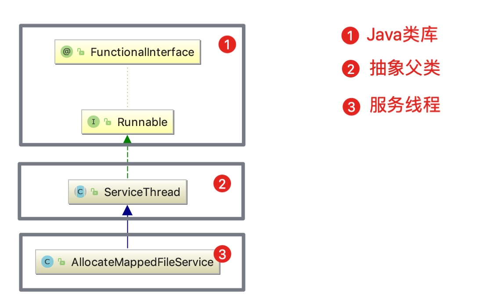

# 第11节 ServiceThread设计模式

思索再三，在讲解 *AllocateMappedFileService* 之前，我们先来讲解一下 *RocketMQ* 服务线程的抽象父类 *ServiceThread*。

*ServiceThread* 是 *RocketMQ* 所有服务线程的抽象父类。该父类**主要为子类提供等待通知线程模型的实现。**

该类的代码很简单，我们就直接来看一下吧。

## 继承结构

```java
public abstract class ServiceThread implements Runnable {
```

这里，我们拿其中的一个服务线程子类 *AllocateMappedFileService* 来做说明，使大家更容易理解。

```java
public class AllocateMappedFileService extends ServiceThread {
```

更直观的继承结构图，



## 成员变量


| 字段 | 类型 | 说明 |
| --- | --- | --- |
| thread | Thread | 当前的服务线程 |
| waitPoint  | CountDownLatch2  | 用于实现等待通知，CountDownLatch2是RocketMQ基于AQS实现的CountDownLatch。  |
| hasNotified  | volatile AtomicBoolean | 通知状态，默认值为false，标记是否已通知当前阻塞的服务线程  |
| stopped  | volatile boolean  | 默认值为false，标记服务是否停止  |

## 初始化

看完了类的继承结构，下面看一下如何使用这些服务线程。

首先从构造服务线程对象开始。*AllocateMappedFileService* 实例是在 *DefaultMessageStore* 构造函数中初始化并启动的。

```java
// DefaultMessageStore.java
public DefaultMessageStore(final MessageStoreConfig messageStoreConfig, final BrokerStatsManager brokerStatsManager,
    ...
    this.allocateMappedFileService = new AllocateMappedFileService(this);
    this.commitLog = new CommitLog(this);
    ...

    this.allocateMappedFileService.start();
    ...
```

调用 *AllocateMappedFileService* 构造函数时，也会调用父类 *ServiceThread* 的无参构造函数。

```java
// AllocateMappedFileService.java
public AllocateMappedFileService(DefaultMessageStore messageStore) {
    this.messageStore = messageStore;
}

// ServiceThread.java
public ServiceThread() {
    this.thread = new Thread(this, this.getServiceName());
}
```

由此可见，这会创建一个新的线程，并将其保存在 `thread` 成员变量中。

创建线程时，`runnable` 参数则传入的是当前 *AllocateMappedFileService* 对象，因为 *ServiceThread* 实现了 *Runnable* 接口，而真正的实现者是其子类 *AllocateMappedFileService*。

至于线程的名称，则是 *AllocateMappedFileService* 子类来指定。

```java
// ServiceThread.java
public abstract String getServiceName();

// AllocateMappedFileService.class.getSimpleName.java
@Override
public String getServiceName() {
    return AllocateMappedFileService.class.getSimpleName();
}
```

## 启动服务线程

调用的流程如下，

```java
BrokerStartup#main -> BrokerStartup#createBrokerController -> BrokerController#initialize -> new DefaultMessageStore -> AllocateMappedFileService#start -> Thread#start
```

## 核心方法

*ServiceThread* **主要为子类提供等待通知线程模型的实现。**

主要的思路就是，当前线程通过 `waitForRunning(long interval)` 方法超时等待，而其他线程通过 `wakeup()` 方法唤醒当前的线程。

主要是通过如下两个方法来实现的。

### waitForRunning

如果当前线程收到通知（被唤醒），则执行 `onWaitEnd()` 方法并返回；否则，超时等待。

无论是等待超时、被中断还是被唤醒，都将**通知状态**标记为未通知，然后执行 `onWaitEnd()` 方法并返回。

> `onWaitEnd()` 方法由子类实现。

```java
/**
 * @param interval 超时等待时间
 */
protected void waitForRunning(long interval) {
    // 收到通知，则执行onWaitEnd方法并返回
    if (hasNotified.compareAndSet(true, false)) {
        this.onWaitEnd();
        return;
    }

    // 没有收到通知，进入等待

    // entry to wait
    waitPoint.reset(); // 重置使其可复用

    // 无论是等待超时、被中断还是被唤醒，都将通知状态标记为未通知，然后执行onWaitEnd方法并返回。
    try {
        waitPoint.await(interval, TimeUnit.MILLISECONDS); // 超时等待
    } catch (InterruptedException e) {
        log.error("Interrupted", e);
    } finally {
        hasNotified.set(false);
        this.onWaitEnd();
    }
}
```

### wakeup

如果该阻塞的服务线程没有收到其它通知（没有被唤醒），则将该阻塞的服务线程的**通知状态**标记为已通知状态，并通知该阻塞的服务线程，将其唤醒。

```java
public void wakeup() {
    if (hasNotified.compareAndSet(false, true)) {
        waitPoint.countDown(); // notify
    }
}
```