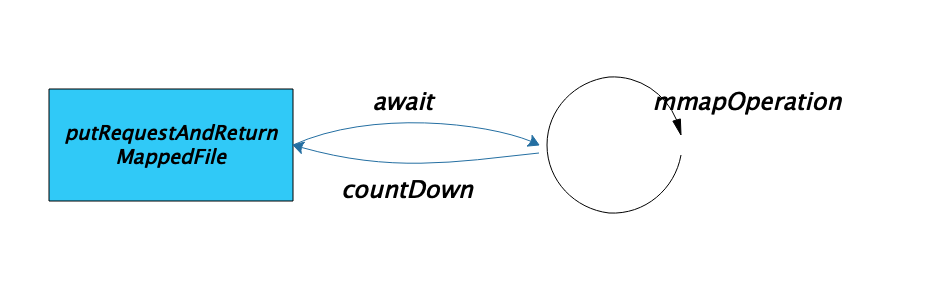

# 第12节 AllocateMappedFileService

## 初识AllocateMappedFileService

在前面我们已经介绍过 *AllocateMappedFileService* 是如何启动，以及处理分配映射文件请求的模型。

*AllocateMappedFileService* 类是提前创建 *MappedFile* 的服务线程类，继承 *ServiceThread* 类。

**简单介绍：**

- **AllocateRequest**：内部类，代表分配请求；
- **`putRequestAndReturnMappedFile(String nextFilePath, String nextNextFilePath, int fileSize)` 方法**：负责创建分配映射文件的请求，然后阻塞等待，直到收到该请求被处理的通知获取映射文件并返回，或者等待超时。
- **`run()` 以及 `mmapOperation()` 方法**：执行异步处理，完成分配请求的消费，分配好 *MappedFile* 然后唤醒对应请求的线程。



正常情况下，`putRequestAndReturnMappedFile(String nextFilePath, String nextNextFilePath, int fileSize)` 方法能够获取 *MappedFile* 并返回，但以下情况会返回 *null*，

1. `isTransientStorePoolEnable()` 方法返回 *true*（*transientStorePoolEnable* 为 *true*（默认为 *false*），*FlushDiskType* 为 *ASYNC_FLUSH*，并且为 **_Master*），也就是说 *transientStorePoolEnable* 为 *true*，刷盘策略为异步刷盘，并且 *broker* 为主节点时，会启用 *transientStorePool*。在启用 *transientStorePool* 的情况下，如果 `fastFailIfNoBufferInStorePool` 为 *true*（默认为 *false*），则会执行快速失败策略，如果 `transientStorePool` 中 *buffer* 不够用的话，获取映射文件失败，会返回 *null*。
2. `mmapOperation()` 方法可能会遇到异常，标记 `hashException` 为 *true*，只要没有设置为 *false*，`putRequestAndReturnMappedFile(String nextFilePath, String nextNextFilePath, int fileSize)` 方法就只是将分配请求加入队列，并直接返回 *null*，表示当前请求的映射文件创建失败，不用等待映射文件真正创建。
3. 最后就是在等待分配请求被处理时等待超时或者被中断，返回 *null*。

## AllocateRequest

**AllocateRequest** 是内部类，代表分配请求。它实现了 *Comparable* 接口的 `compareTo(AllocateRequest other)` 方法，用于自定义分配请求在优先级队列的优先级。

### 成员变量

| 字段 | 类型 | 说明 |
| --- | --- | --- |
| filePath | String | 文件路径 |
| fileSize | int | 文件大小 |
| countDownLatch | CountDownLatch | 用于实现分配映射文件的等待通知线程模型。初始值为 1，0 代表完成映射文件的创建。 |
| mappedFile | volatile MappedFile | 根据路径以及文件大小创建的映射文件 |

### 优先级

`compareTo(AllocateRequest other)` 方法用于自定义分配请求在优先级队列的优先级。

- `fileSize` 小的 *AllocateRequest* 对象反而大；
- `fileName` 对应的 *long* 类型大的，*AllocateRequest* 对象大；

将 *AllocateRequest* 对象放到优先级队列中，队列的头元素是按该排序方式确定的最小元素。且线程从队列的首节点获取元素。所以 `fileSize` 大的优先级高；否则，对应 `fileName` 对应的 *long* 类型小的，优先级高；

其实这就保证了在提供两个分配请求时，能够先处理 `fileName` 对应的 *long* 类型小的那个请求。后面我们还会讲。

```java
public int compareTo(AllocateRequest other) {
    if (this.fileSize < other.fileSize)
        return 1;
    else if (this.fileSize > other.fileSize) {
        return -1;
    } else {
        int mIndex = this.filePath.lastIndexOf(File.separator);
        long mName = Long.parseLong(this.filePath.substring(mIndex + 1));
        int oIndex = other.filePath.lastIndexOf(File.separator);
        long oName = Long.parseLong(other.filePath.substring(oIndex + 1));
        if (mName < oName) {
            return -1;
        } else if (mName > oName) {
            return 1;
        } else {
            return 0;
        }
    }
    // return this.fileSize < other.fileSize ? 1 : this.fileSize >
    // other.fileSize ? -1 : 0;
}
```

## 源码深入剖析

### 成员变量

按照惯例，我们先来了解一下 *AllocateMappedFileService* 的成员变量，以便在后面的代码阅读中对这些变量有一个清晰的认识。


|  字段 | 类型 | 说明 |
| --- | --- | --- |
| waitTimeOut | int | 等待创建映射文件的超时时间，默认5秒 |
| requestTable | ConcurrentMap\<String, AllocateRequest\>  | 用于保存当前所有待处理的分配请求，其中 *key* 是 *filePath*，*value* 是分配请求。如果分配请求被成功处理，即获取到映射文件，则该请求会从 *requestTable* 中移除。 |
| requestQueue | PriorityBlockingQueue\<AllocateRequest\>  | 分配请求队列，注意是优先级队列。从该队列中获取请求，进而根据请求创建映射文件。 |
| hasException | volatile boolean | 标记是否发生异常 |
| messageStore | DefaultMessageStore |  |

### 获取映射文件

提交两个创建映射文件的请求，路径分别为 `nextFilePath` 和 `nextNextFilePath`， 并等待路径为 `nextFilePath` 所对应的映射文件创建完成（`nextNextFilePath` 所对应的映射文件则由服务线程异步创建，并不用等待它创建完）。

你可能会问，**为什么 *putRequestAndReturnMappedFile* 方法要提交两个创建映射文件的请求？**

这么做的原因其实就是为了获取下一个映射文件快一点。当前 *MappedFile* 写满了，获取下一个 *MappedFile* 时，*AllocateMappedFileService* 已经将其创建好了，可以直接获取，无需再等待。

```java
public MappedFile putRequestAndReturnMappedFile(String nextFilePath, String nextNextFilePath, int fileSize) {
    int canSubmitRequests = 2; // 默认可以提交2个请求
    // 仅当transientStorePoolEnable为true，FlushDiskType为ASYNC_FLUSH，并且broker为主节点时，才启用transientStorePool。
    // 同时在启用快速失败策略时，计算transientStorePool中剩余的buffer数量减去requestQueue中待分配的数量后，剩余的buffer数量，如果数量小于等于0则快速失败。
    // @1^
    if (this.messageStore.getMessageStoreConfig().isTransientStorePoolEnable()) { // @@1
        if (this.messageStore.getMessageStoreConfig().isFastFailIfNoBufferInStorePool()
                && BrokerRole.SLAVE != this.messageStore.getMessageStoreConfig().getBrokerRole()) { // 如果broker为从节点，那么即使池中没有buffer，也不快速失败（PS：此处的判断是没有意义的，isTransientStorePoolEnable已经限制了broker不能为slave）
            canSubmitRequests = this.messageStore.getTransientStorePool().remainBufferNumbs() - this.requestQueue.size(); // @@2
        }
    }
    // @1$

    AllocateRequest nextReq = new AllocateRequest(nextFilePath, fileSize);
    boolean nextPutOK = this.requestTable.putIfAbsent(nextFilePath, nextReq) == null;
    // 如果requestTable中已存在该路径文件的分配请求，说明该请求已经在排队中，
    // 就不需要再次检查transientStorePool中的buffer是否够用，以及向requestQueue队列中添加分配请求
    // @2^
    if (nextPutOK) {
        if (canSubmitRequests <= 0) { // 如果transientStorePool中的buffer不够了，快速失败
            log.warn("[NOTIFYME]TransientStorePool is not enough, so create mapped file error, " +
                    "RequestQueueSize : {}, StorePoolSize: {}", this.requestQueue.size(), this.messageStore.getTransientStorePool().remainBufferNumbs());
            this.requestTable.remove(nextFilePath);
            return null;
        }
        boolean offerOK = this.requestQueue.offer(nextReq);
        if (!offerOK) {
            log.warn("never expected here, add a request to preallocate queue failed");
        }
        canSubmitRequests--;
    }
    // @2^

    AllocateRequest nextNextReq = new AllocateRequest(nextNextFilePath, fileSize);
    boolean nextNextPutOK = this.requestTable.putIfAbsent(nextNextFilePath, nextNextReq) == null;
    if (nextNextPutOK) {
        if (canSubmitRequests <= 0) {
            log.warn("[NOTIFYME]TransientStorePool is not enough, so skip preallocate mapped file, " +
                    "RequestQueueSize : {}, StorePoolSize: {}", this.requestQueue.size(), this.messageStore.getTransientStorePool().remainBufferNumbs());
            this.requestTable.remove(nextNextFilePath);
        } else {
            boolean offerOK = this.requestQueue.offer(nextNextReq);
            if (!offerOK) {
                log.warn("never expected here, add a request to preallocate queue failed");
            }
        }
    }

    // mmapOperation遇到了异常，先不创建映射文件了
    if (hasException) { // @3
        log.warn(this.getServiceName() + " service has exception. so return null");
        return null;
    }

    AllocateRequest result = this.requestTable.get(nextFilePath);
    try {
        if (result != null) {
            boolean waitOK = result.getCountDownLatch().await(waitTimeOut, TimeUnit.MILLISECONDS); // @4
            if (!waitOK) { // @3
                log.warn("create mmap timeout " + result.getFilePath() + " " + result.getFileSize());
                return null;
            } else {
                // 只负责删除requestTable中的分配请求
                this.requestTable.remove(nextFilePath); // @6
                return result.getMappedFile();
            }
        } else {
            log.error("find preallocate mmap failed, this never happen");
        }
    } catch (InterruptedException e) {
        log.warn(this.getServiceName() + " service has exception. ", e);
    }

    return null;
}
```

#### (1) 快速失败

代码@1，仅当启用 `transientStorePool`，同时还启用快速失败策略时，计算 `transientStorePool` 中剩余的 *buffer* 数量减去 `requestQueue` 中待分配的数量后，剩余的 *buffer* 数量，如果数量小于等于 0 则快速失败。

> 至于为什么要这么做，待会在讲解 *mmapOperation* 创建映射文件时会做详细的解释。

**代码@@1，是否启用堆外内存池。**

仅当 `transientStorePoolEnable` 为 *true*，刷盘策略为异步刷盘（*FlushDiskType* 为 *ASYNC_FLUSH*），并且 *broker* 为主节点时，才启用 `transientStorePool`。

> *TransientStorePool* 为堆外内存池的实现。

```java
public boolean isTransientStorePoolEnable() {
    return transientStorePoolEnable && FlushDiskType.ASYNC_FLUSH == getFlushDiskType()
        && BrokerRole.SLAVE != getBrokerRole();
}
```

*RocketMQ* 对于消息的写入提供了两种方式，

1. 基于堆外内存池的方式；
2. 基于 *mmap* 内存文件映射的方式；

> 🙋‍♂️ 这两种消息写入方式，我们会在讲解 *MappedFile* 时详细讲解。

**代码@@2，计算可用buffer数量。**

这里计算 `transientStorePool` 中剩余的 *buffer* 数量减去 `requestQueue` 中待分配的数量后，剩余的 *buffer* 数量，如果数量小于等于 0 则快速失败。

```java
// TransientStorePool.java
/**
 * 池中剩余可用的buffers数量
 *
 * @return
 */
public int remainBufferNumbs() {
    if (storeConfig.isTransientStorePoolEnable()) {
        return availableBuffers.size();
    }
    return Integer.MAX_VALUE;
}
```

`availableBuffers` 是通过 *TransientStorePool* 的 `init()` 方法初始化的，其是在 *DefaultMessageStore* 类的构造函数中调用的。

```java
public DefaultMessageStore(final MessageStoreConfig messageStoreConfig, final BrokerStatsManager brokerStatsManager,
        ...
        if (messageStoreConfig.isTransientStorePoolEnable()) {
            this.transientStorePool.init();
        }
        ...
```

> 🙋‍♂️ *TransientStorePool* 的初始化，我们会在讲解 *TransientStorePool* 时详细讲解。

#### (2) 添加请求

如果 `requestTable` 中已存在该路径文件的分配请求，就不需要再次检查 `transientStorePool` 中的 *buffer* 是否够用，以及向 `requestQueue` 预分配队列中添加分配请求。

#### (3) 异常处理

代码@3，`mmapOperation()` 方法可能会遇到异常，标记 `hashException` 为 *true*，只要没有设置为 *false*，`putRequestAndReturnMappedFile(String nextFilePath, String nextNextFilePath, int fileSize)` 方法就只是将分配请求加入队列，并直接返回 *null*，表示当前请求的映射文件创建失败，不用等待映射文件真正创建。

在发现 *mmapOperation* 操作遇到异常时，并不会清除现场（将当前加入到队列的分配请求移除），以便后面创建同一映射文件的分配请求到来时，直接获取 *AllocateMappedFileService* 在后台异步创建的映射文件（等待分配映射文件超时的处理与之类似）。

> ⚠️ *mmapOperation* 操作抛出异常，并不会使 *AllocateMappedFileService* 服务线程停止，而是会继续下一 *mmapOperation* 操作。

#### (4) 超时等待

代码@4，`mmapOperation()` 方法从 `requestQueue` 队列首节点获取分配请求，并根据请求创建映射文件，并调用 `countDown()` 唤醒等待的线程。

#### (5) 移除请求

**当获取到映射文件时，当前线程只负责删除 `requestTable` 中的分配请求。 `requestQueue` 中的分配请求则由 *mmapOperation* 操作在阻塞获取时删除。**

### 创建映射文件

调用 `mmapOperation()` 方法完成请求的处理，创建映射文件。

```java
public void run() {
    log.info(this.getServiceName() + " service started");

    while (!this.isStopped() && this.mmapOperation()) {

    }
    log.info(this.getServiceName() + " service end");
}
```

```java
/**
 * 方法只有被外部线程中断，才会返回false。
 */
private boolean mmapOperation() {
    boolean isSuccess = false;
    AllocateRequest req = null;
    try {
        // 检索并删除此队列的首节点，必要时等待，直到有元素可用。
        req = this.requestQueue.take();
        AllocateRequest expectedRequest = this.requestTable.get(req.getFilePath());
        if (null == expectedRequest) {
            log.warn("this mmap request expired, maybe cause timeout " + req.getFilePath() + " "
                    + req.getFileSize());
            return true;
        }
        if (expectedRequest != req) {
            log.warn("never expected here,  maybe cause timeout " + req.getFilePath() + " "
                    + req.getFileSize() + ", req:" + req + ", expectedRequest:" + expectedRequest);
            return true;
        }

        if (req.getMappedFile() == null) {
            long beginTime = System.currentTimeMillis();

            MappedFile mappedFile;
            // 仅当transientStorePoolEnable为true，FlushDiskType为ASYNC_FLUSH，并且broker为主节点时，才启用transientStorePool
            if (messageStore.getMessageStoreConfig().isTransientStorePoolEnable()) {
                try {
                    mappedFile = ServiceLoader.load(MappedFile.class).iterator().next(); // @1
                    mappedFile.init(req.getFilePath(), req.getFileSize(), messageStore.getTransientStorePool());
                } catch (RuntimeException e) { // 遇到运行异常时用默认配置
                    log.warn("Use default implementation.");
                    mappedFile = new MappedFile(req.getFilePath(), req.getFileSize(), messageStore.getTransientStorePool()); // @2
                }
            } else {
                mappedFile = new MappedFile(req.getFilePath(), req.getFileSize());
            }

            // 计算创建映射文件耗时
            long eclipseTime = UtilAll.computeEclipseTimeMilliseconds(beginTime);
            if (eclipseTime > 10) {
                int queueSize = this.requestQueue.size();
                log.warn("create mappedFile spent time(ms) " + eclipseTime + " queue size " + queueSize
                        + " " + req.getFilePath() + " " + req.getFileSize());
            }

            if (mappedFile.getFileSize() >= this.messageStore.getMessageStoreConfig()
                    .getMapedFileSizeCommitLog()
                    &&
                    this.messageStore.getMessageStoreConfig().isWarmMapedFileEnable()) {
                // 进行预热
                // @3
                mappedFile.warmMappedFile(this.messageStore.getMessageStoreConfig().getFlushDiskType(),
                        this.messageStore.getMessageStoreConfig().getFlushLeastPagesWhenWarmMapedFile());
            }

            req.setMappedFile(mappedFile);
            this.hasException = false;
            isSuccess = true;
        }
    } catch (InterruptedException e) {
        log.warn(this.getServiceName() + " interrupted, possibly by shutdown.");
        this.hasException = true; // 标记发生异常
        return false; // 被中断，结束服务线程
    } catch (IOException e) {
        log.warn(this.getServiceName() + " service has exception. ", e);
        this.hasException = true; // 标记发生异常，但并不会结束服务线程
        if (null != req) {
            requestQueue.offer(req); // 重新加入队列再试
            try {
                Thread.sleep(1);
            } catch (InterruptedException ignored) {
            }
        }
    } finally {
        if (req != null && isSuccess)
            req.getCountDownLatch().countDown(); // 唤醒等待获取映射文件的线程
    }
    return true;
}
```

#### (1) SPI

代码@1，这里，*RocketMQ* 这么写，应该是考虑到灵活切换 *MappedFile* 的不同实现。

*ServiceLoader* 需要扫描 `META-INF/services` 目录下 `org.apache.rocketmq.store.MappedFile` 文件，而开源版本并没有提供相关文件，所以这段逻辑会抛出运行时异常 `NoSuchElementException`。最终走默认的实例化逻辑。

#### (2) 创建映射文件

调用 *MappedFile* 的构造方法创建映射文件。

> 🙋‍♂️ 如何理解这段代码？*MappedFile* 是如何构造的呢？我们把它放到 *MappedFile* 一节来讲解。

#### (3) 缓存预热

代码@3，进行缓存预热。

`this.messageStore.getMessageStoreConfig().getFlushDiskType()` 返回刷盘策略。

`this.messageStore.getMessageStoreConfig().getFlushLeastPagesWhenWarmMapedFile()` 返回预热刷盘时，一次刷盘的分页数。

具体的，先对当前 *MappedFile* 的每个内存页存入一个字节 0，当刷盘策略为同步刷盘时，执行强制刷盘，并且是每修改 *pages* 个分页刷一次盘。然后将当前 *MappedFile* 全部的地址空间锁定在物理存储中，防止其被 *OS* 交换到 *swap* 空间。再调用 *madvise*，传入 *WILL_NEED* 策略，将刚刚锁住的内存预热，其实就是告诉内核，我马上就要用（*WILL_NEED*）这块内存，先做虚拟内存到物理内存的映射，防止正式使用时产生缺页中断。

> 🙋‍♂️ 关于缓存预热，我们会在讲解 *MappedFile* 时详细讲解。
