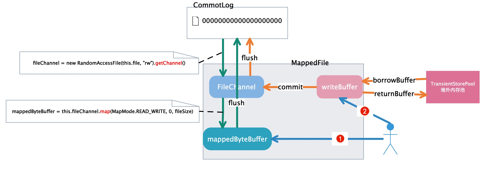

# 第13节 MappedFile

## 初识MappedFile

对于 *CommitLog*、 *ConsumeQueue*、 *IndexFile* 三类文件进行磁盘读写操作，均是通过 *MappedFile* 类来完成的。

*MappedFile* 提供了两种消息写入的方式：`writeBuffer`、`mappedByteBuffer`。我们首先通过一个图来看一下两者之间的关系：



从图中可以看出，

1. `writeBuffer` 是从 *TransientStorePool* 堆外内存池中获取的。
2. `mappedByteBuffer` 则是通过 *file channel map* 方式获取。
3. 消息可以写入 `mappedByteBuffer`，也可以写入 `writeBuffer`。需要注意的是，默认使用 `mappedByteBuffer` 写入消息，只有在启用 *transientStorePool* 时才会通过 `writeBuffer` 写入消息，而不再是 `mappedByteBuffer`。

    无论是否启用 *transientStorePool*，都会通过 *file channel map* 方式获取 `mappedByteBuffer`，用以消息消费时的随机读取。
    
    > 仅当 `transientStorePoolEnable` 为 *true*，刷盘策略为异步刷盘（*FlushDiskType* 为 *ASYNC_FLUSH*），并且 *broker* 为主节点时，才启用 `transientStorePool`。
    
> 👨‍🎓 其实这里就解答了我们之前在讲解 CommitLog 时留下的问题四，“关于 `mappedByteBuffer` 与 `writeBuffer` 缓存，*RocketMQ* 是如何使用它们的？”
    
## 源码深入剖析

### 成员变量

按照惯例，我们先来了解一下 *MappedFile* 的成员变量，以便在后面的代码阅读中对这些变量有一个清晰的认识。


| 字段 | 类型 | 说明 |
| --- | --- | --- |
| OS_PAGE_SIZE | int | 内存页大小，默认为 4k |
| TOTAL_MAPPED_VIRTUAL_MEMORY | AtomicLong | JVM中映射（*mmap*）的虚拟内存总大小，初始值为 0 |
| TOTAL_MAPPED_FILES | AtomicInteger | 映射文件的个数，初始值为 0 |
| wrotePosition | AtomicInteger | 当前写入的位置，当值等于 *fileSize* 时代表文件写满了。注意，这里记录的不是真正刷入磁盘的位置，而是写入到 *buffer* 的位置，初始值为 0 |
| committedPosition | AtomicInteger | 当前提交的位置 所谓提交就是将 *writeBuffer* 的脏数据写到 *fileChannel*，初始值为 0 |
| flushedPosition | AtomicInteger | 当前刷盘的位置，初始值为 0 |
| fileSize | int | 映射文件的大小，参照 *org.apache.rocketmq.store.config.MessageStoreConfig.mapedFileSizeCommitLog*，默认 1G |
| fileChannel | FileChannel | 文件通道，以支持文件的随机读写。 通过 *fileChannel* 将此通道的文件区域直接映射到内存中，对应的内存映射为 *mappedByteBuffer* ，可以直接通过 *mappedByteBuffer* 读写 *CommitLog*文件。 |
| writeBuffer | ByteBuffer | 从 *transientStorePool* 中获取，消息先写入该 *buffer*，然后再写入到 *fileChannel*。可能为 *null*。 只有仅当 *org.apache.rocketmq.store.config.MessageStoreConfig.transientStorePoolEnable* 为 *true*，刷盘策略为异步刷盘（*ASYNC_FLUSH*），并且 *broker* 为主节点时才启用。 |
| transientStorePool | TransientStorePool | 堆外线程池 |
| fileName | String | 文件全路径名 |
| fileFromOffset | long | *CommitLog* 文件起始偏移量。 其实就是文件名称，一般为 20 位数字，代表这个文件开始时的 *offset* |
| file | File | *CommitLog* 文件对象 |
| mappedByteBuffer | MappedByteBuffer | *fileChannel* 的内存映射对象 |
| storeTimestamp | volatile long | 最后一次写入消息（写入 *buffer*）的时间戳 |
| firstCreateInQueue | boolean | 标记该映射文件是不是队列中创建的第一个映射文件 |

### 创建映射文件

还记得我们在前面《AllocateMappedFileService》一节留下的一个问题么？“如何理解 `mappedFile = new MappedFile(req.getFilePath(), req.getFileSize(), messageStore.getTransientStorePool());` 这段代码？*MappedFile* 是如何构造的呢？”，下面我们一起来寻找答案吧。

*MappedFile* 总共提供了三种构造方法，

```java
public MappedFile() {
}

public MappedFile(final String fileName, final int fileSize) throws IOException {
    init(fileName, fileSize);
}

public MappedFile(final String fileName, final int fileSize,
    final TransientStorePool transientStorePool) throws IOException {
    init(fileName, fileSize, transientStorePool);
}
```

在未启用 *transientStorePool* 时调用 `MappedFile(final String fileName, final int fileSize)` 形式的构造函数，而在启用时则调用 `MappedFile(final String fileName, final int fileSize, final TransientStorePool transientStorePool)`。

接下来，继续分析 `init` 方法。该方法提供了两种重载形式，

```java
public void init(final String fileName, final int fileSize,
    final TransientStorePool transientStorePool) throws IOException {
    init(fileName, fileSize);
    this.writeBuffer = transientStorePool.borrowBuffer();
    this.transientStorePool = transientStorePool;
}

private void init(final String fileName, final int fileSize) throws IOException {
    this.fileName = fileName; // 设置文件全路径名
    this.fileSize = fileSize; // 设置文件大小
    this.file = new File(fileName);
    this.fileFromOffset = Long.parseLong(this.file.getName()); // 其实就是文件名称，一般为20位数字
    boolean ok = false;

    // 判断父目录是否存在，如果不存在则创建父目录
    ensureDirOK(this.file.getParent()); // @1

    try {
        // 对file进行包装，以支持其随机读写
        this.fileChannel = new RandomAccessFile(this.file, "rw").getChannel();
        // fileChannel的内存映射对象，将此通道的文件区域直接映射到内存中。
        this.mappedByteBuffer = this.fileChannel.map(MapMode.READ_WRITE, 0, fileSize);
        TOTAL_MAPPED_VIRTUAL_MEMORY.addAndGet(fileSize);
        TOTAL_MAPPED_FILES.incrementAndGet();
        ok = true;
    } catch (FileNotFoundException e) {
        log.error("create file channel " + this.fileName + " Failed. ", e);
        throw e;
    } catch (IOException e) {
        log.error("map file " + this.fileName + " Failed. ", e);
        throw e;
    } finally {
        if (!ok && this.fileChannel != null) {
            this.fileChannel.close();
        }
    }
}
```

`init(final String fileName, final int fileSize, final TransientStorePool transientStorePool)` 方法主要对 `mappedFile` 对象执行以下初始化工作，

1. 从 `transientStorePool` 中获取已经分配好的堆外内存 `writeBuffer`，后续消息会先写入该 *buffer*，然后再写入到 *fileChannel*；
2. 通过 `map` 映射磁盘文件，将文件映射为 `mappedByteBuffer`;

### 缓存预热

我们在前面《AllocateMappedFileService》一节留下了一个问题，“缓存预热是怎么实现的呢？”，我们带着这个问题一起来学习下面的内容。

在 *MappedFile* 中通过 `warmMappedFile(FlushDiskType type, int pages)` 方法对当前 *MappedFile* 进行预热。

具体的，先对当前 *MappedFile* 的每个内存页存入一个字节 0。特别的，当刷盘策略为同步刷盘时，执行强制刷盘，并且是每修改 *pages* 个分页刷一次盘。

然后将当前 *MappedFile* 全部的地址空间锁定在物理存储中，防止其被交换到 *swap* 空间。再调用 *madvise*，传入 *WILL_NEED* 策略，将刚刚锁住的内存预热，其实就是告诉内核，我马上就要用（*WILL_NEED*）这块内存，先做虚拟内存到物理内存的映射，防止正式使用时产生缺页中断。

> 注意，无论是同步刷盘还是异步刷盘（包括启用 `writeBuffer` ———— 只有仅当 `transientStorePoolEnable` 为 *true*，刷盘策略为异步刷盘（*ASYNC_FLUSH*），并且 *broker* 为主节点时，才启用 *writeBuffer*），只要**启用缓存预热**，都会通过 `mappedByteBuffer` 来写入假值，并且都会对 `mappedByteBuffer` 执行 *mlock* 和 *madvise*。

```java
/**
 * @param type  刷盘策略
 * @param pages 预热时一次刷盘的分页数
 */
public void warmMappedFile(FlushDiskType type, int pages) {
    long beginTime = System.currentTimeMillis();
    ByteBuffer byteBuffer = this.mappedByteBuffer.slice(); // @1
    int flush = 0; // 记录上一次刷盘的字节数
    long time = System.currentTimeMillis();
    for (int i = 0, j = 0; i < this.fileSize; i += MappedFile.OS_PAGE_SIZE, j++) {
        byteBuffer.put(i, (byte) 0);
        // force flush when flush disk type is sync
        // 当刷盘策略为同步刷盘时，执行强制刷盘
        // 每修改pages个分页刷一次盘
        if (type == FlushDiskType.SYNC_FLUSH) {
            if ((i / OS_PAGE_SIZE) - (flush / OS_PAGE_SIZE) >= pages) {
                flush = i;
                mappedByteBuffer.force(); // @2
            }
        }

        // prevent gc
        // @3
        if (j % 1000 == 0) {
            log.info("j={}, costTime={}", j, System.currentTimeMillis() - time);
            time = System.currentTimeMillis();
            try {
                Thread.sleep(0);
            } catch (InterruptedException e) {
                log.error("Interrupted", e);
            }
        }
    }

    // force flush when prepare load finished
    if (type == FlushDiskType.SYNC_FLUSH) {
        log.info("mapped file warm-up done, force to disk, mappedFile={}, costTime={}",
                this.getFileName(), System.currentTimeMillis() - beginTime);
        mappedByteBuffer.force();
    }
    log.info("mapped file warm-up done. mappedFile={}, costTime={}", this.getFileName(),
            System.currentTimeMillis() - beginTime);

    this.mlock();
}

public void mlock() {
    final long beginTime = System.currentTimeMillis();
    final long address = ((DirectBuffer) (this.mappedByteBuffer)).address();
    Pointer pointer = new Pointer(address);
    {
        int ret = LibC.INSTANCE.mlock(pointer, new NativeLong(this.fileSize));
        log.info("mlock {} {} {} ret = {} time consuming = {}", address, this.fileName, this.fileSize, ret, System.currentTimeMillis() - beginTime);
    }

    {
        int ret = LibC.INSTANCE.madvise(pointer, new NativeLong(this.fileSize), LibC.MADV_WILLNEED);
        log.info("madvise {} {} {} ret = {} time consuming = {}", address, this.fileName, this.fileSize, ret, System.currentTimeMillis() - beginTime);
    }
}
```

#### (1) 缓存分片

```java
public abstract ByteBuffer slice()
```

创建新的字节缓冲区，其内容是此缓冲区内容的共享子序列。

新缓冲区的内容将从此缓冲区的当前位置（`position`）开始。此缓冲区内容的更改在新缓冲区中是可见的，反之亦然；这两个缓冲区的 `position`、`limit` 和 `mark` 是相互独立的。

新缓冲区的 `position` 将为 0，其 `capacity` 和 `limit` 将为此缓冲区中所剩余的字节数量，其 `mark` 是不确定的。当且仅当此缓冲区为堆外内存时，新缓冲区才为堆外内存，当且仅当此缓冲区为只读时，新缓冲区才是只读的。

**缓冲区分片**

`slice()` 方法根据现有的缓冲区创建一个子缓冲区。也就是它创建一个新的缓冲区，新缓冲区与原来的缓冲区的一部分共享数据。

首先创建一个长度为 10 的 *ByteBuffer*：

```java
ByteBuffer buffer = ByteBuffer.allocate(10);
```

然后使用数据来填充这个缓冲区，在第 n 个位置中放入数字 n：

```java
for (int i = 0; i < buffer.capacity(); i++) {
     buffer.put((byte)i);
}
```

现在我们对这个缓冲区分片，以创建一个包含位置 3 ～ 6 的子缓冲区。

子缓冲区的起始和结束位置通过设置 `position` 和 `limit` 值来指定，然后调用 *Buffer* 的 `slice()` 方法：

```java
buffer.position(3);
buffer.limit(7);
ByteBuffer slice = buffer.slice();
```

`slice` 是 `buffer` 的子缓冲区。不过，`slice` 和 `buffer` 共享同一个底层数据数组。

#### (2) 强制刷盘

你可能会问，每次都强制刷盘，是不是太耗性能了？其实不然，每次刷盘只是刷入修改的内容。

```java
public final MappedByteBuffer force()
```

将此缓冲区所做的内容更改强制写入包含该映射文件的存储设备中。

如果映射到此缓冲区中的文件位于本地存储设备上，那么当此方法返回时，可以保证自此缓冲区创建以来，或自最后一次调用此方法以来，已经将对缓冲区所做的所有更改写入到该设备。

如果文件不在本地设备上，则无法作出这样的保证。

如果此缓冲区不是以读/写模式 (*FileChannel.MapMode.READ_WRITE*) 映射的，则调用此方法无效。

#### (3) 线程调度

操作系统中，*CPU* 竞争有很多种策略。*Unix* 系统使用的是时间片算法，而 *Windows* 则属于抢占式的。

在时间片算法中，所有的线程组成一个队列。操作系统按照他们的顺序，给每个线程分配一段时间，即该线程允许运行的时间。如果在时间片结束时线程还在运行，则 *CPU* 将被剥夺并分配给另一个线程。如果线程在时间片结束前阻塞或结束，则 *CPU* 当即进行切换。调度程序所要做的就是维护一张**就绪线程列表**，当线程用完它的时间片后，它被移到队列的末尾。

所谓抢占式操作系统，就是说如果一个线程得到了 *CPU* 时间，除非它自己放弃使用 *CPU*，否则将完全霸占 *CPU*。因此可以看出，在抢占式操作系统中，操作系统假设所有的进程都是“人品很好”的，会主动退出 *CPU*。

在线程没退出之前，线程有三个状态，就绪态，运行态，等待态。`sleep(n)` 之所以在 *n* 秒内不会参与 *CPU* 竞争，是因为当线程调用 `sleep(n)` 的时候，线程是由运行态转入等待态，线程被放入等待队列中，等待定时器 *n* 秒后的中断事件，当到达 *n* 秒计时后，线程才重新由等待态转入就绪态，被放入就绪队列中，等待队列中的线程是不参与 *CPU* 竞争的，只有就绪队列中的线程才会参与 *CPU* 竞争，所谓的 *CPU* 调度，就是根据一定的算法（优先级，*FIFO* 等。。。），从就绪队列中选择一个线程来分配 *CPU* 时间。

而 `sleep(0)` 之所以马上回去参与 *CPU* 竞争，是因为调用 `sleep(0)` 后，因为 0 的原因，线程直接回到就绪队列，而非进入等待队列，只要进入就绪队列，那么它就参与 *CPU* 竞争。

在线程中，调用 `sleep(0)` 可以**释放 *CPU* 时间，让线程马上重新回到就绪队列而非等待队列**，`sleep(0)` 释放当前线程所剩余的时间片（如果有剩余的话），这样可以让操作系统切换其他线程来执行，提升效率。

### 消息写入

回顾一下，我们在讲解 *CommitLog* 时留下了一个问题，“*MappedFile* 是如何实现消息写入的？”，下面我们一起来看一下这个问题。

*MappedFile* 在通过 `appendMessage(final MessageExtBrokerInner msg, final AppendMessageCallback cb)` 方法写入消息时，通过回调`appendMessageCallback` 对象的 `doAppend(final long fileFromOffset, final ByteBuffer byteBuffer,
        final int maxBlank, final MessageExtBrokerInner msg)` 方法执行真正的消息写入逻辑。

```java
/**
 * 追加MessageExtBrokerInner消息
 *
 * @param msg
 * @param cb
 * @return
 */
public AppendMessageResult appendMessage(final MessageExtBrokerInner msg, final AppendMessageCallback cb) {
    return appendMessagesInner(msg, cb);
}

/**
 * 追加MessageExtBatch消息
 *
 * @param messageExtBatch
 * @param cb
 * @return
 */
public AppendMessageResult appendMessages(final MessageExtBatch messageExtBatch, final AppendMessageCallback cb) {
    return appendMessagesInner(messageExtBatch, cb);
}

public AppendMessageResult appendMessagesInner(final MessageExt messageExt, final AppendMessageCallback cb) {
    // 参数非空校验
    assert messageExt != null;
    assert cb != null;

    int currentPos = this.wrotePosition.get(); // 获取当前写入的位置

    if (currentPos < this.fileSize) { // 文件还有剩余空间

        // 仅当 transientStorePoolEnable 为 true，刷盘策略为异步刷盘（FlushDiskType 为 ASYNC_FLUSH），并且 broker 为主节点时，才启用 transientStorePool。

        // writeBuffer/mappedByteBuffer的position始终为0，而limit则始终等于capacity。
        // slice是根据position和limit来生成byteBuffer。
        ByteBuffer byteBuffer = writeBuffer != null ? writeBuffer.slice() : this.mappedByteBuffer.slice(); // @1
        byteBuffer.position(currentPos); // 设置写的起始位置
        AppendMessageResult result = null;
        // 针对不同的消息类型，分别执行不同的追加消息逻辑
        // @2
        if (messageExt instanceof MessageExtBrokerInner) {
            result = cb.doAppend(this.getFileFromOffset(), byteBuffer, this.fileSize - currentPos, (MessageExtBrokerInner) messageExt);
        } else if (messageExt instanceof MessageExtBatch) {
            result = cb.doAppend(this.getFileFromOffset(), byteBuffer, this.fileSize - currentPos, (MessageExtBatch) messageExt);
        } else {
            return new AppendMessageResult(AppendMessageStatus.UNKNOWN_ERROR);
        }
        this.wrotePosition.addAndGet(result.getWroteBytes()); // 修改写位置
        this.storeTimestamp = result.getStoreTimestamp();
        return result;
    }
    log.error("MappedFile.appendMessage return null, wrotePosition: {} fileSize: {}", currentPos, this.fileSize);
    return new AppendMessageResult(AppendMessageStatus.UNKNOWN_ERROR);
}
```

#### (1) 获取缓冲区

代码@1，通过 `ByteBuffer#slice()` 获取一个用于写入消息的 *buffer*。

消息可以写入 `mappedByteBuffer`，也可以写入 `writeBuffer`。需要注意的是，默认使用 `mappedByteBuffer` 写入消息，只有在启用 *transientStorePool* 时才会通过 `writeBuffer` 写入消息，而不再是 `mappedByteBuffer`。

#### (2) 执行回调

代码@2，针对不同的消息类型，分别执行不同的追加消息逻辑。

此外，这里简单提一下，`appendMessageCallback` 是在 *CommitLog* 的构造函数中初始化的，

```java
public CommitLog(final DefaultMessageStore defaultMessageStore) {
    ...

    this.appendMessageCallback = new DefaultAppendMessageCallback(defaultMessageStore.getMessageStoreConfig().getMaxMessageSize());

    ...
}
```

*MappedFile* 在通过 `appendMessage` 方法追加消息时，通过回调 `appendMessageCallback` 对象的 `doAppend` 方法执行真正的追加消息逻辑。

> 具体消息是如何写入 *buffer*，以及消息写入的格式，我们在《DefaultAppendMessageCallback》一节详细讲解。