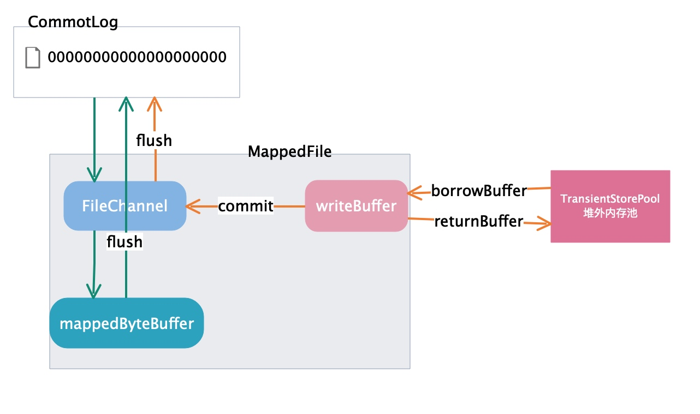

# 第14节 TransientStorePool

## 初识堆外内存池

*TransientStorePool* 用于池化管理多个 *ByteBuffer* 对象。

这里的 *ByteBuffer* 的实现是 *DirectByteBuffer*，分配的是堆外内存，由于堆外内存的分配要比 *JVM* 中堆内存的分配耗时很多，所以在这里池化管理。

如果你对堆外内存还不是很了解，可以回顾下我们在“基础理论”模块中讲的关于堆外内存的知识。



首先看下这个图，很容易发现，*TransientStorePool* 堆外内存池为 *MappedFile* 提供堆外内存供消息写入。

正如我们之前说的，仅当 `transientStorePoolEnable` 为 *true*，刷盘策略为异步刷盘（*FlushDiskType* 为 *ASYNC_FLUSH*），并且 *broker* 为主节点时，才启用 `transientStorePool`。

## 源码深入剖析

### 成员变量

| 字段 | 类型 | 说明 |
| --- | --- | --- |
| poolSize | int | 堆外内存池的大小，默认 5 |
| fileSize | int | 一个映射文件的大小，默认 1G |
| availableBuffers | Deque<ByteBuffer> | 双端队列，保存堆外内存池中的 *buffer* |
| storeConfig | MessageStoreConfig | 存储相关配置 |

### 构造函数

```java
public TransientStorePool(final MessageStoreConfig storeConfig) {
    this.storeConfig = storeConfig;
    this.poolSize = storeConfig.getTransientStorePoolSize();
    this.fileSize = storeConfig.getMapedFileSizeCommitLog();
    this.availableBuffers = new ConcurrentLinkedDeque<>();
}
```

### 初始化

`init()` 方法用于堆外内存池的初始化，分配 `poolSize` 个 `fileSize` 大小的堆外内存。

```java
public void init() {
    for (int i = 0; i < poolSize; i++) {
        // 分配堆外内存，位于JVM之外
        ByteBuffer byteBuffer = ByteBuffer.allocateDirect(fileSize);

        final long address = ((DirectBuffer) byteBuffer).address();
        Pointer pointer = new Pointer(address);
        // 指定一个基地址，和一个偏移长度，将指定的内存区间锁在物理内存中，不被交换到swap中。
        LibC.INSTANCE.mlock(pointer, new NativeLong(fileSize));

        availableBuffers.offer(byteBuffer);
    }
}
```

`mlock` 系统调用可以将进程使用的部分或者全部的地址空间锁定在物理存储中，防止其被交换到 *Swap* 空间。

对于 *RocketMQ* 这种的高吞吐量的分布式消息队列来说，追求的是消息读写低延迟，那么肯定希望尽可能的多使用物理内存，提高数据读写访问的效率。

### borrowBuffer

获取一个 *buffer*。

```java
public ByteBuffer borrowBuffer() {
    ByteBuffer buffer = availableBuffers.pollFirst();
    // 如果队列中的buffer低于阈值时，发出警告
    if (availableBuffers.size() < poolSize * 0.4) {
        log.warn("TransientStorePool only remain {} sheets.", availableBuffers.size());
    }
    return buffer;
}
```

### returnBuffer

用完一个 *buffer* 之后归还，并对 *buffer* 进行重置，使其可复用。

```java
public void returnBuffer(ByteBuffer byteBuffer) {
    byteBuffer.position(0);
    byteBuffer.limit(fileSize);
    this.availableBuffers.offerFirst(byteBuffer);
}
```

### destroy

将堆外内存池中所有锁定的 *buffer* 解锁。

```java
public void destroy() {
    for (ByteBuffer byteBuffer : availableBuffers) {
        final long address = ((DirectBuffer) byteBuffer).address();
        Pointer pointer = new Pointer(address);
        LibC.INSTANCE.munlock(pointer, new NativeLong(fileSize));
    }
}
```

### remainBufferNumbs

获取堆外内存池中剩余可用的 *buffers* 数量。

```java
public int remainBufferNumbs() {
    if (storeConfig.isTransientStorePoolEnable()) {
        return availableBuffers.size();
    }
    return Integer.MAX_VALUE;
}
```