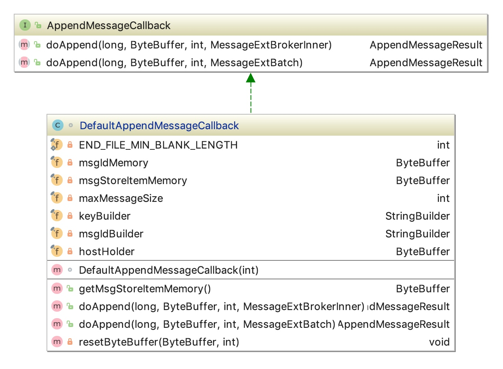
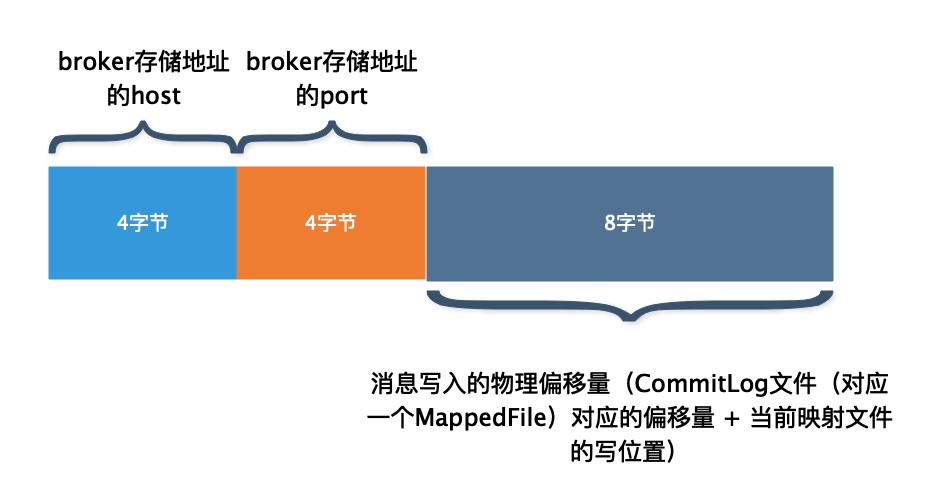

# 第15节 DefaultAppendMessageCallback

## 初识DefaultAppendMessageCallback

前面我们提到，*MappedFile* 在通过 `appendMessage` 方法追加消息时，通过回调 `appendMessageCallback` 对象的 `doAppend` 方法执行真正的追加消息逻辑。

在讲解消息追加的实现之前，我们先对 *DefaultAppendMessageCallback* 有一个初步的认识。

先看一下类的继承结构，



*DefaultAppendMessageCallback* 为 *AppendMessageCallback* 接口实现类。

用于处理追加消息记录（*MessageExtBrokerInner* 或者 *MessageExtBatch*）到映射文件中，返回 *AppendMessageResult* 类型的结果。其中，*MessageExtBrokerInner* 以及 *MessageExtBatch* 分别代表单条消息和批量消息。

*DefaultAppendMessageCallback* 提供了 `doAppend` 方法的两种重载形式，分别提供**追加单条消息**和**追加批量消息**两种消息追加方式。

## 源码深入剖析

### 成员变量

按照惯例，我们再来了解一下 *DefaultAppendMessageCallback* 的成员变量。

| 字段 | 类型 | 说明 |
| --- | --- | --- |
| END_FILE_MIN_BLANK_LENGTH | int | 至少预留 8 个字节，用以标记映射文件写满 |
| msgIdMemory | ByteBuffer | 临时保存消息ID的 *buffer*，默认 16 字节。前 4 字节为 *broker* 存储地址的host，5 ～ 8 字节为 *broker* 存储地址的 *port*，最后 8 字节为 *wroteOffset*。 |
| msgStoreItemMemory | ByteBuffer | 临时保存单条消息的 *buffer*，默认 4M。此外还会多分配 8 个字节，用于在映射文件写满时写入标记位。 |
| maxMessageSize | int | 消息长度的最大阈值，默认 4M。在批量插入时，还会用于限制批量消息的总大小。 |
| keyBuilder | StringBuilder | 构建消息 key，格式为 *“topic-queueId”* |
| msgIdBuilder | StringBuilder | 构建 *msgId*，用于处理批量消息时调用，以逗号作为分割符将批量消息中的所有消息ID拼接。 |
| hostHolder | ByteBuffer | 从消息的 *MessageExt.storeHost* 中获取 *host* 保存到 *hostHolder* 的前 4 个字节，*port* 保存到后 4 个字节 |

### 初始化

*DefaultAppendMessageCallback* 初始化很简单，它是在 *CommitLog* 的构造函数中初始化的，

```java
// CommitLog.java
public CommitLog(final DefaultMessageStore defaultMessageStore) {
    ...

    this.appendMessageCallback = new DefaultAppendMessageCallback(defaultMessageStore.getMessageStoreConfig().getMaxMessageSize());

    ...
}
```

```java
// DefaultAppendMessageCallback.java
/**
 * @param size 允许的最大消息长度，默认4M
 */
DefaultAppendMessageCallback(final int size) {
    // 分配临时保存消息ID的buffer，默认16字节，前4字节为host，5～8字节为port，最后8字节为wroteOffset
    this.msgIdMemory = ByteBuffer.allocate(MessageDecoder.MSG_ID_LENGTH);
    // 分配临时保存单条消息的buffer，默认4M。
    // 此外还会多分配 8 个字节，用于在映射文件写满时写入标记位。
    this.msgStoreItemMemory = ByteBuffer.allocate(size + END_FILE_MIN_BLANK_LENGTH);
    // 消息长度的最大阈值，默认4M。在批量插入时，还会用于限制批量消息的总大小。
    this.maxMessageSize = size;
}
```

本小节主要讲解追加单条消息的代码实现，追加批量消息在下一小节讲解。

### 追加单条消息

在看代码之前我们首先简要的概括下代码的整体逻辑，

1. 生成消息ID，前 4 字节为 *broker* 存储地址的 *host*，5 ～ 8 字节为 *broker* 存储地址的 *port*，最后 8 字节为 `wroteOffset`；
2. 生成 *key*（格式为 *“topic-queueid”*），并从 `topicQueueTable` 中获取该 *key* 对应的 *queueOffset*，如果不存在，则添加一个 *queueOffset* 的记录，其 *offset* 为 0；
3. 校验 `propertiesLength` 是否超过阈值，不满足则返回 *PROPERTIES_SIZE_EXCEEDED* 响应；
4. 计算 `msgLen`，并校验其是否超过阈值，不满足则返回 *MESSAGE_SIZE_EXCEEDED* 响应；
5. 确定是否有足够的可用空间。如果没有足够的可用空间，则将“剩余可用空间的总长度”和“BLANK_MAGIC_CODE”写入 *CommitLog* 末尾，并返回 *END_OF_FILE* 响应；
6. 有足够的可用空间，按照消息的数据结构，把消息各个属性写入到 `msgStoreItemMemory` 临时保存单个消息的 *buffer*；
7. 向 `byteBuffer`写入 `msgStoreItemMemory`；
8. 对于 *TRANSACTION_NOT_TYPE*、*TRANSACTION_COMMIT_TYPE* 类型的消息，设置其 *consumeQueue offset*；
9. 返回写入成功响应；

```java
/**
 * @param fileFromOffset CommitLog文件的起始偏移量。其实就是文件名称，一般为20位数字
 * @param byteBuffer     写消息缓冲区（{@link MappedFile#writeBuffer} 或者 {@link MappedFile#mappedByteBuffer}）
 * @param maxBlank       写消息缓冲区剩余可用空间大小
 * @param msgInner       单条消息
 * @return
 */
public AppendMessageResult doAppend(final long fileFromOffset, final ByteBuffer byteBuffer, final int maxBlank,
                                    final MessageExtBrokerInner msgInner) {

    // 消息写入的物理偏移量（CommitLog文件（对应一个MappedFile）对应的起始偏移量 + 当前映射文件的写位置）
    long wroteOffset = fileFromOffset + byteBuffer.position();

    // 将hostHolder重置，使其可以再次使用
    this.resetByteBuffer(hostHolder, 8); // @1
    // 生成消息ID，前4字节为broker存储地址的host，5～8字节为broker存储地址的port，最后8字节为wroteOffset
    String msgId = MessageDecoder.createMessageId(this.msgIdMemory, msgInner.getStoreHostBytes(hostHolder), wroteOffset); // @2

    // Record ConsumeQueue information
    keyBuilder.setLength(0); // @3
    keyBuilder.append(msgInner.getTopic());
    keyBuilder.append('-');
    keyBuilder.append(msgInner.getQueueId());
    String key = keyBuilder.toString();
    Long queueOffset = CommitLog.this.topicQueueTable.get(key);
    if (null == queueOffset) {
        queueOffset = 0L;
        CommitLog.this.topicQueueTable.put(key, queueOffset);
    }

    // Transaction messages that require special handling
    final int tranType = MessageSysFlag.getTransactionValue(msgInner.getSysFlag());
    switch (tranType) {
        // Prepared and Rollback message is not consumed, will not enter the
        // consumer queue
        case MessageSysFlag.TRANSACTION_PREPARED_TYPE:
        case MessageSysFlag.TRANSACTION_ROLLBACK_TYPE:
            queueOffset = 0L;
            break;
        case MessageSysFlag.TRANSACTION_NOT_TYPE:
        case MessageSysFlag.TRANSACTION_COMMIT_TYPE:
        default:
            break;
    }

    // propertiesString bytes
    final byte[] propertiesData =
            msgInner.getPropertiesString() == null ? null : msgInner.getPropertiesString().getBytes(MessageDecoder.CHARSET_UTF8);

    // propertiesString bytes length
    final int propertiesLength = propertiesData == null ? 0 : propertiesData.length;

    if (propertiesLength > Short.MAX_VALUE) {
        log.warn("putMessage message properties length too long. length={}", propertiesData.length);
        return new AppendMessageResult(AppendMessageStatus.PROPERTIES_SIZE_EXCEEDED);
    }

    // topic bytes
    final byte[] topicData = msgInner.getTopic().getBytes(MessageDecoder.CHARSET_UTF8);
    // topic bytes length
    final int topicLength = topicData.length;

    // body bytes length
    final int bodyLength = msgInner.getBody() == null ? 0 : msgInner.getBody().length;

    // 计算消息长度，即写入CommitLog占用的空间
    final int msgLen = calMsgLength(bodyLength, topicLength, propertiesLength); // @4

    // Exceeds the maximum message
    // 消息长度超过了最大阈值
    if (msgLen > this.maxMessageSize) {
        CommitLog.log.warn("message size exceeded, msg total size: " + msgLen + ", msg body size: " + bodyLength
                + ", maxMessageSize: " + this.maxMessageSize);
        return new AppendMessageResult(AppendMessageStatus.MESSAGE_SIZE_EXCEEDED);
    }

    // Determines whether there is sufficient free space
    // 确定是否有足够的可用空间
    // @5
    if ((msgLen + END_FILE_MIN_BLANK_LENGTH) > maxBlank) { // 没有足够的可用空间
        this.resetByteBuffer(this.msgStoreItemMemory, maxBlank);
        // 1 TOTALSIZE
        this.msgStoreItemMemory.putInt(maxBlank); // 剩余可用空间的总长度
        // 2 MAGICCODE
        this.msgStoreItemMemory.putInt(CommitLog.BLANK_MAGIC_CODE); // 标记CommitLog文件结尾
        // 3 The remaining space may be any value
        // Here the length of the specially set maxBlank
        final long beginTimeMills = CommitLog.this.defaultMessageStore.now();
        byteBuffer.put(this.msgStoreItemMemory.array(), 0, maxBlank);
        // 返回END_OF_FILE响应
        return new AppendMessageResult(AppendMessageStatus.END_OF_FILE, wroteOffset, maxBlank, msgId, msgInner.getStoreTimestamp(),
                queueOffset, CommitLog.this.defaultMessageStore.now() - beginTimeMills);
    }

    // Initialization of storage space
    this.resetByteBuffer(msgStoreItemMemory, msgLen);
    // 1 TOTALSIZE
    this.msgStoreItemMemory.putInt(msgLen); // 代表消息的大小
    // 2 MAGICCODE
    this.msgStoreItemMemory.putInt(CommitLog.MESSAGE_MAGIC_CODE); // 标记消息
    // 3 BODYCRC
    this.msgStoreItemMemory.putInt(msgInner.getBodyCRC()); // 消息体循环冗余校验码
    // 4 QUEUEID
    this.msgStoreItemMemory.putInt(msgInner.getQueueId()); // 消息队列ID
    // 5 FLAG
    this.msgStoreItemMemory.putInt(msgInner.getFlag()); //标记位
    // 6 QUEUEOFFSET
    this.msgStoreItemMemory.putLong(queueOffset); //这是个自增值，不是真正的 consumeQueue 的偏移量（真正的 consumeQueue 的偏移量为 queueOffset * CQ_STORE_UNIT_SIZE），可以代表这个 consumeQueue 或者 tranStateTable 队列中消息的个数。
    // 7 PHYSICALOFFSET
    this.msgStoreItemMemory.putLong(fileFromOffset + byteBuffer.position()); //消息写入的物理偏移量（CommitLog文件（对应一个MappedFile）对应的起始偏移量 + 当前映射文件的写位置）
    // 8 SYSFLAG
    this.msgStoreItemMemory.putInt(msgInner.getSysFlag()); // 指明消息是否是事务消息，以及事务状态等消息特征
    // 9 BORNTIMESTAMP
    this.msgStoreItemMemory.putLong(msgInner.getBornTimestamp()); // 客户端创建消息的时间戳
    // 10 BORNHOST
    this.resetByteBuffer(hostHolder, 8);
    this.msgStoreItemMemory.put(msgInner.getBornHostBytes(hostHolder)); // 客户端地址，前4字节为host，后4字节为port
    // 11 STORETIMESTAMP
    this.msgStoreItemMemory.putLong(msgInner.getStoreTimestamp()); //消息在broker存储的时间戳
    // 12 STOREHOSTADDRESS
    this.resetByteBuffer(hostHolder, 8);
    this.msgStoreItemMemory.put(msgInner.getStoreHostBytes(hostHolder)); //存储在broker的地址，前4字节为host，后4字节为port
    //this.msgBatchMemory.put(msgInner.getStoreHostBytes());
    // 13 RECONSUMETIMES
    this.msgStoreItemMemory.putInt(msgInner.getReconsumeTimes()); //消息被某个订阅组重新消费了几次（订阅组之间独立计数），因为重试消息发送到了topic为%retry%groupName、queueId=0的队列中去了，成功消费一次记录为0；
    // 14 Prepared Transaction Offset
    this.msgStoreItemMemory.putLong(msgInner.getPreparedTransactionOffset()); // 表示是prepared状态的事务消息
    // 15 BODY
    this.msgStoreItemMemory.putInt(bodyLength); //消息体大小
    if (bodyLength > 0)
        this.msgStoreItemMemory.put(msgInner.getBody()); // 消息体内容
    // 16 TOPIC
    this.msgStoreItemMemory.put((byte) topicLength); // topic大小
    this.msgStoreItemMemory.put(topicData); // topic内容
    // 17 PROPERTIES
    this.msgStoreItemMemory.putShort((short) propertiesLength); //消息属性大小
    if (propertiesLength > 0)
        this.msgStoreItemMemory.put(propertiesData); // 消息属性内容

    final long beginTimeMills = CommitLog.this.defaultMessageStore.now();
    // Write messages to the queue buffer
    byteBuffer.put(this.msgStoreItemMemory.array(), 0, msgLen);

    /*
        AppendMessageResult响应相关字段：
               AppendMessageStatus status   响应状态码,
               long wroteOffset             消息写入的物理偏移量（CommitLog文件（对应一个MappedFile）对应的起始偏移量 + 当前消息写入时的写位置）。注意，是当前消息写入时的写位置，当前消息写入后会更新，
               int wroteBytes               消息写入总字节数。注意，有可能会同时写入多条消息，所以这里是写入的总字节数,
               String msgId                 消息ID，前4字节为broker存储地址的host，5～8字节为broker存储地址的port，最后8字节为wroteOffset,
               long storeTimestamp          消息存储时间戳,
               long logicsOffset            这是个自增值，不是真正的 consumeQueue 的偏移量（真正的 consumeQueue 的偏移量为 queueOffset * CQ_STORE_UNIT_SIZE），可以代表这个 consumeQueue 或者 tranStateTable 队列中消息的个数,
               long pagecacheRT             消息写入Page Cache花费的时间
     */
    AppendMessageResult result = new AppendMessageResult(AppendMessageStatus.PUT_OK, wroteOffset, msgLen, msgId,
            msgInner.getStoreTimestamp(), queueOffset, CommitLog.this.defaultMessageStore.now() - beginTimeMills);

    // @6^
    switch (tranType) {
        case MessageSysFlag.TRANSACTION_PREPARED_TYPE:
        case MessageSysFlag.TRANSACTION_ROLLBACK_TYPE:
            break;
        case MessageSysFlag.TRANSACTION_NOT_TYPE:
        case MessageSysFlag.TRANSACTION_COMMIT_TYPE:
            // The next update ConsumeQueue information
            CommitLog.this.topicQueueTable.put(key, ++queueOffset);
            break;
        default:
            break;
    }
    // @6$
    
    return result;
}
```

#### (1) byteBuffer可复用

代码@1，对 *buffer* 进行重置，使其可复用。

先补充个知识点，

```java
ByteBuffer buffer = ByteBuffer.allocate(capacity);
```

如上方式创建 *ByteBuffer* 实际上是通过如下方式创建的，

```java
// ByteBuffer.java
public static ByteBuffer allocate(int capacity) {
    if (capacity < 0)
        throw new IllegalArgumentException();
    return new HeapByteBuffer(capacity, capacity);
}

// HeapByteBuffer.java
HeapByteBuffer(int cap, int lim) {            // package-private
    super(-1, 0, lim, cap, new byte[cap], 0);
    /*
    hb = new byte[cap];
    offset = 0;
    */
}
```

通过上面的代码可以看出，通过 `ByteBuffer.allocate(capacity)` 创建的 *HeapByteBuffer* 对象，它的 `position` 初始值为 0，`mark` 为 -1，`limit` 和 `capacity` 则都为传入的指定参数 **capacity**。

其实这里的 `resetByteBuffer(final ByteBuffer byteBuffer, final int limit)` 方法是为了将 *buffer* 重置，使其可以再次使用。

*ByteBuffer* 对象一旦创建，一般来说随着 *buffer* 的读写操作，*`capacity` 不会变化*；而 *`limit`、`position`、`mark` 则会发生相应的改变*。而 `hostHolder` 是需要被重复使用的，所以通过以下方式对其重置，将 `limit`、`position`、`mark` 设置为初始值。

```java
// DefaultAppendMessageCallback.java
private void resetByteBuffer(final ByteBuffer byteBuffer, final int limit) {
    byteBuffer.flip();
    byteBuffer.limit(limit);
}

// Buffer.java
public final Buffer flip() {
    limit = position;
    position = 0;
    mark = -1;
    return this;
}
```

#### (2) 消息ID

消息ID的格式是这样子的，



`getStoreHostBytes(ByteBuffer byteBuffer)` 方法用于从消息的 *storeHost* 中获取 *host*、*port* 保存到 *hostHolder buffer*。

其中，*host* 保存到 *buffer* 的前 4 个字节，*port* 保存到后 4 个字节。

```java
// MessageExt.java
public ByteBuffer getStoreHostBytes(ByteBuffer byteBuffer) {
    return socketAddress2ByteBuffer(this.storeHost, byteBuffer);
}

/**
 * 从消息的{@link MessageExt#storeHost}中获取host保存到byteBuffer的前4个字节，port保存到后4个字节
 *
 * @param socketAddress 消息的{@link MessageExt#storeHost}
 * @param byteBuffer hostHolder buffer，用来保存host、port
 * @return
 */
public static ByteBuffer socketAddress2ByteBuffer(final SocketAddress socketAddress, final ByteBuffer byteBuffer) {
    InetSocketAddress inetSocketAddress = (InetSocketAddress) socketAddress;
    byteBuffer.put(inetSocketAddress.getAddress().getAddress(), 0, 4);
    byteBuffer.putInt(inetSocketAddress.getPort());
    byteBuffer.flip(); // 由写状态变为读状态
    return byteBuffer;
}
```

`createMessageId(final ByteBuffer input, final ByteBuffer addr, final long offset)` 方法用于生成消息ID，前 4 字节为 *broker* 存储地址的 *host*，5 ～ 8 字节为 *broker* 存储地址的 *port*，最后 8 字节为 *wroteOffset*。

```java
// MessageDecoder.java
/**
 * @param input 用于保存消息ID的buffer，默认16字节
 * @param addr hostHolder buffer，用来保存host、port
 * @param offset wroteOffset，消息写入的物理偏移量
 * @return
 */
public static String createMessageId(final ByteBuffer input, final ByteBuffer addr, final long offset) {
    // see resetByteBuffer
    input.flip();
    input.limit(MessageDecoder.MSG_ID_LENGTH);

    input.put(addr);
    input.putLong(offset);

    return UtilAll.bytes2string(input.array());
}
```

#### (3) keyBuilder可复用

代码@3，`keyBuilder.setLength(0)` 的目的和上面讲的**代码@1**是一样的，这里是为了 `keyBuilder` 的可复用。

简单讲一下 *StringBuilder* 的源码吧，看一下为什么能够做到 `keyBuilder` 的复用。

```java
public final class StringBuilder
    extends AbstractStringBuilder
    implements java.io.Serializable, CharSequence
```

首先看一下 `setLength(int newLength)` 方法，当传参 `newLength` 为 0 时，`count` 会被赋值为 0。

```java
// AbstractStringBuilder.java
public void setLength(int newLength) {
    // 入参newLength小于0，抛出异常
    if (newLength < 0)
        throw new StringIndexOutOfBoundsException(newLength);
    // 扩容
    ensureCapacityInternal(newLength);

    // 如果入参newLength大于count，则将count与newLength之间的索引位置填充字符 '0'
    if (count < newLength) {
        Arrays.fill(value, count, newLength, '\0');
    }

    count = newLength;
}
```

接下来，再来看下 `append(String str)` 方法，每追加一个字符串，`count` 都会增加该字符串的长度（`int len = str.length();`，`count += len;`），而真正追加操作是通过`getChars`方法来实现的。

```java
// StringBuilder.java
@Override
public StringBuilder append(String str) {
    super.append(str);
    return this;
}

// AbstractStringBuilder.java
public AbstractStringBuilder append(String str) {
    if (str == null)
        return appendNull();
    int len = str.length();
    ensureCapacityInternal(count + len);
    str.getChars(0, len, value, count); // 将str中的所有字符写入value字符数组的count及以后的索引位置
    count += len;
    return this;
}
```

其实很容易发现 `getChars(int srcBegin, int srcEnd, char dst[], int dstBegin)` 方法将当前字符串的所有字符复制到 *StringBuilder* 的 `value` 字符数组的 `count` 及以后的索引位置。

**那么很明显，如果指定 `count` 为 0，`append` 方法会从 0 开始追加。**

还有一个方法值得关注，它就是 `toString()` 方法，

```java
@Override
public String toString() {
    // Create a copy, don't share the array
    return new String(value, 0, count);
}
```

也就是 **`toString()` 方法只取索引在 0 至 `count` 之间的所有字符。**即使 *StringBuilder* 在 `count` 索引位置之后还有其它字符，也会被忽略。

#### (4) 消息数据结构

代码@4，计算消息写入 *CommitLog* 占用的空间。

```java
private static int calMsgLength(int bodyLength, int topicLength, int propertiesLength) {
    final int msgLen = 4 //TOTALSIZE
            + 4 //MAGICCODE
            + 4 //BODYCRC
            + 4 //QUEUEID
            + 4 //FLAG
            + 8 //QUEUEOFFSET
            + 8 //PHYSICALOFFSET
            + 4 //SYSFLAG
            + 8 //BORNTIMESTAMP
            + 8 //BORNHOST
            + 8 //STORETIMESTAMP
            + 8 //STOREHOSTADDRESS
            + 4 //RECONSUMETIMES
            + 8 //Prepared Transaction Offset
            + 4 + (bodyLength > 0 ? bodyLength : 0) //BODY
            + 1 + topicLength //TOPIC
            + 2 + (propertiesLength > 0 ? propertiesLength : 0) //propertiesLength
            + 0;
    return msgLen;
}
```

关于上述字段的含义，如下表格所示，

| 字段 | 字段大小(byte) | 字段含义 |
| --- | --- | --- |
| TOTALSIZE | 4 | 代表消息的大小 |
| MAGICCODE | 4 | 标志位，*MESSAGE_MAGIC_CODE* 代表消息；*BLANK_MAGIC_CODE* 代表映射文件末尾。 |
| BODYCRC | 4 | 消息体循环冗余校验码 |
| QUEUEID | 4 | 消息队列ID |
| FLAG | 4 | 标记位 |
| QUEUEOFFSET | 8 | 这是个自增值，不是真正的 *consumeQueue* 的偏移量（真正的 *consumeQueue* 的偏移量为 *queueOffset \* CQ_STORE_UNIT_SIZE*），可以代表这个 *consumeQueue* 或者 *tranStateTable* 队列中消息的个数。 |
| PHYSICALOFFSET | 8 | 消息写入的物理偏移量（*CommitLog* 文件（对应一个 *MappedFile*）对应的起始偏移量 + 当前映射文件的写位置） |
| SYSFLAG | 4 | 指明消息是否是事务消息，以及事务状态等消息特征，二进制表示形式为四个字节，从右往左数：仅当 4 个字节均为 0（值为 0）时表示非事务消息（*TRANSACTION_NOT_TYPE*）；仅当第 1 个字节为 1（值为 1）时表示表示消息是压缩的（*COMPRESSED_FLAG*）；仅当第 2 个字节为 1（值为 2）表示 *multi tags* 消息（*MULTI_TAGS_FLAG*）；仅当第 3 个字节为 1（值为 4）时表示 *prepared* 消息（*TRANSACTION_PREPARED_TYPE*）；仅当第 4 个字节为 1（值为 8）时表示 *commit* 消息（*TRANSACTION_COMMIT_TYPE*）；仅当第 3，4 个字节均为 1 时（值为 12）时表示 *rollback* 消息（*TRANSACTION_ROLLBACK_TYPE*）。此外，只要第 3，4 个字节都为 0 就表示非事务消息。 |
| BORNTIMESTAMP | 8 | 客户端创建消息的时间戳 |
| BORNHOST | 8 | 客户端地址，前 4 字节为 *host*，后 4 字节为 *port*。 |
| STORETIMESTAMP | 8 | 消息在 *broker* 存储的时间戳 |
| STOREHOSTADDRESS | 8 | 存储消息的 *broker* 的地址，前 4 字节为 *host*，后 4 字节为*port*。 |
| RECONSUMETIMES | 4 | 消息被某个订阅组重新消费了几次（订阅组之间独立计数），因为重试消息发送到了 *topic* 为 *%retry%groupName*、*queueId=0* 的队列中去了，成功消费一次记录为 0； |
| Prepared Transaction Offset | 8 | 表示是 *prepared* 状态的事务消息 |
| messagebodyLength | 4 | 消息体大小 |
| messagebody | messagebodyLength | 消息体内容 |
| topicLength | 1 | *topic* 大小 |
| topic | topicLength | *topic* 内容 |
| propertiesLength | 2 | 消息属性大小 |
| properties | propertiesLength | 消息属性内容 |

#### (5) 预留空间

代码@5，`this.resetByteBuffer(this.msgStoreItemMemory, maxBlank);` 这种代码已经遇到不止一次了，大家都知道它是用来对 `msgStoreItemMemory` 进行重置使其可复用的。

我们也知道 `maxBlank` 用来设置 `msgStoreItemMemory` 的 `limit` 的，但如果 `maxBlank` 大于 `msgStoreItemMemory` 的 `capacity` 则会抛出异常。所以这里我们就分析下，`maxBlank` 与 `capacity` 的关系。

首先 `msgStoreItemMemory` 是在 *DefaultAppendMessageCallback* 的构造函数中初始化的，

```java
DefaultAppendMessageCallback(final int size) {
    ...
    // 分配临时保存单个消息的buffer，默认4M，此外还会多分配8个字节
    this.msgStoreItemMemory = ByteBuffer.allocate(size + END_FILE_MIN_BLANK_LENGTH);
    // 消息长度的最大阈值，默认4M
    this.maxMessageSize = size;
}
```

由此可见，`msgStoreItemMemory` 的 `capacity` 大小为 `this.maxMessageSize + END_FILE_MIN_BLANK_LENGTH`。

又通过前面 `if (msgLen > this.maxMessageSize) {...` 对消息长度的校验通过可知，`msgLen` 小于等于 `this.maxMessageSize`。

所以，`msgLen + END_FILE_MIN_BLANK_LENGTH` 小于等于 `this.maxMessageSize + END_FILE_MIN_BLANK_LENGTH`。

又根据 `if ((msgLen + END_FILE_MIN_BLANK_LENGTH) > maxBlank) {...` 成立，所以 `maxBlank` 小于 `this.maxMessageSize + END_FILE_MIN_BLANK_LENGTH`，即 `maxBlank` 小于 `msgStoreItemMemory` 的 `capacity`。

还有就是，**你可能一直有个疑问 `END_FILE_MIN_BLANK_LENGTH` 是干嘛的呢？这是预留大小的空间（4 + 4字节）。**

每次写入新的消息都要确保有额外多余的 8 字节的可用空间。当 *CommitLog* 没有足够的可用空间时，该条消息是不会被写入到该 *CommitLog* 的，此时会在 *CommitLog* 的结尾追加 `maxBlank`（该 *CommitLog* 剩余的不足以写入当前消息的空间大小，占 4 字节）和 `BLANK_MAGIC_CODE`（占 4 字节），所以至少需要预留 8 字节的空间。

继续延伸，**代码中第3点的英文注释是什么意思呢？**

他的意思是，当 *CommitLog* 没有足够的可用空间时，向 `msgStoreItemMemory` 中写入的数据（4 字节的 *int* 类型 `maxBlank`，4 字节的 *int* 类型 `BLANK_MAGIC_CODE`）仅仅占用了 8 个字节，而 `msgStoreItemMemory` 通过 `this.resetByteBuffer(this.msgStoreItemMemory, maxBlank);` 方式重置时，将其 `limit` 设置为了 `maxBlank`，而通过上面的讲述我们也知道 `maxBlank` 是大于等于 8 字节的。所以 `msgStoreItemMemory` 的前 8 个字节是新写入的数据，而从第 8 个字节至 `maxBlank` 之间的所有字节则是以前的旧数据，这可能为任意数据（*Java NIO* 采用写入的新数据覆盖原有旧数据的方式来实现写入，`flip()` 方法并不会清除数据，只会重置 `position`、`limit`、`mark`）。

还要注意这里的响应结果，返回的 *AppendMessageResult* 响应中 `wroteBytes` 字段传入的是 `maxBlank`，这也就保证了该 *CommitLog* 最终会被标记为已写满。

#### (6) topicQueueTable

代码@6，`TRANSACTION_NOT_TYPE`、`TRANSACTION_COMMIT_TYPE` 类型的消息（非事务消息和 *Commit* 消息，不包括 *Prepare*、*Rollback* 消息）才会被消费，因此会被加入到 *ConsumeQueue* 队列中，该消息对应的 *offset* 会被存储到 `topicQueueTable` 中（格式为 *“topic-queueid”* 作为 *key*，*offset* 作为 *value*）。