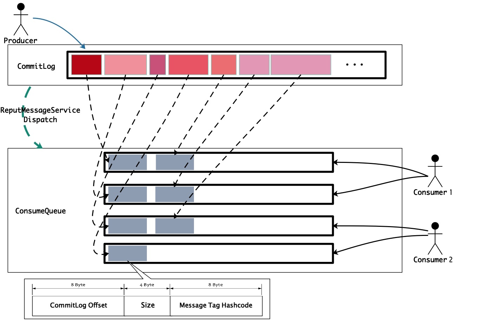

# 消费队列设计与实现

[TOC]

## 概述

消费队列（*ConsumeQueue*）是为了解决消息消费问题的，*ReputMessageService* 为消息转发（*Dispatch*）服务线程，它会将写入 *CommitLog* 的消息的位置信息（*offset （8 bytes）*、消息大小 （*4 bytes*）、*tag hashcode （8 bytes）* ，共 *20 bytes*）写入消费队列中。

> 注意，这里只转发**非事务消息**和 **Commit 消息**，会忽略 *Prepare*、*Rollback* 消息。

如下图所示，



消息消费时，首先根据 *CommitLog offset* 去 *CommitLog* 中（一个 *CommitLog* 文件大小为 *1G*，写满后会创建一个新的 *CommitLog* 文件）找到消息的起始偏移量，然后再根据消息长度，进而能获取整个消息内容。

为了让大家对 *ConsumeQueue* 有一个直观的感受，我们来看一下其本地文件的目录结构。


为了展示的方便，我将每一个 *ConsumeQueue* 文件的大小设置为 *30 \* 20* 字节，又 *ConsumeQueue* 文件的命名规则和 *CommitLog*文件是相同的，所以第二个文件名为 *00000000000000000600*，以此类推。

在上图中，*topic MyTopic* 下有 4 个 *ConsumeQueue* 队列，*queueId* 分别为 *0、1、2、3*。每一个 *ConsumeQueue* 队列有一个 *MappedFileQueue* 来维护其对消息位置信息的读写，也就是说 *ConsumeQueue* 队列下的每一个文件对应一个 *MappedFile* 映射文件。

> 当然啦，*ConsumeQueue* 文件默认为 *30w \* 20* 字节，即一个文件默认能够保存 *30w* 条记录，而每条记录的大小固定为 *20* 字节。

## 源码深入剖析

上一节我们提到 *CommitLogDispatcherBuildConsumeQueue* 用于转发消息的位置（*offset*）、消息大小、*tag hashcode* 信息到消费队列中。下面我们就从 *CommitLogDispatcherBuildConsumeQueue* 为出发点来讲解消费队列的实现。

### CommitLogDispatcherBuildConsumeQueue

```java
class CommitLogDispatcherBuildConsumeQueue implements CommitLogDispatcher {

    @Override
    public void dispatch(DispatchRequest request) {
        final int tranType = MessageSysFlag.getTransactionValue(request.getSysFlag());
        switch (tranType) {
            // 只处理非事务消息和Commit消息，不处理Prepare、Rollback消息
            case MessageSysFlag.TRANSACTION_NOT_TYPE:
            case MessageSysFlag.TRANSACTION_COMMIT_TYPE:
                DefaultMessageStore.this.putMessagePositionInfo(request);
                break;
            case MessageSysFlag.TRANSACTION_PREPARED_TYPE:
            case MessageSysFlag.TRANSACTION_ROLLBACK_TYPE:
                break;
        }
    }
}
```

该类的实现很简单，仅有一个 `dispatch(DispatchRequest request)` 方法，从代码中可以看出，这里只处理**非事务消息**和 **Commit 消息**，不处理 *Prepare*、*Rollback* 消息。

下面我们就来看一下 `putMessagePositionInfo(DispatchRequest dispatchRequest)` 方法。该方法首先根据消息的 *topic* 和 *queueId* 获取对应的 *consumeQueue*。如果不存在，会初始化一个。然后将消息的位置（*offset*）、消息大小、*tag hashcode* 信息写入该 *consumeQueue*。

与 *CommitLog* 类似，其依旧是通过 *MappedFileQueue*、*MappedFile* 实现写入的。

```java
// DefaultMessageStore.java
public void putMessagePositionInfo(DispatchRequest dispatchRequest) {
    // 根据消息的topic和queueId获取对应的consumeQueue。如果不存在，会初始化一个。
    ConsumeQueue cq = this.findConsumeQueue(dispatchRequest.getTopic(), dispatchRequest.getQueueId());
    cq.putMessagePositionInfoWrapper(dispatchRequest);
}
```

### 消费队列获取

根据消息的 *topic* 和 *queueId* 获取对应的 *consumeQueue*。如果不存在，会初始化一个。

```java
public ConsumeQueue findConsumeQueue(String topic, int queueId) {
    // 根据topic获取该topic下所有的consumeQueue
    ConcurrentMap<Integer, ConsumeQueue> map = consumeQueueTable.get(topic);
    if (null == map) { // 如果不存在，则初始化一个
        ConcurrentMap<Integer, ConsumeQueue> newMap = new ConcurrentHashMap<Integer, ConsumeQueue>(128);
        ConcurrentMap<Integer, ConsumeQueue> oldMap = consumeQueueTable.putIfAbsent(topic, newMap);
        if (oldMap != null) {
            map = oldMap;
        } else {
            map = newMap;
        }
    }

    // 根据queueId获取指定queueId所对应的consumeQueue
    ConsumeQueue logic = map.get(queueId);
    if (null == logic) { // 如果不存在，则初始化一个
        ConsumeQueue newLogic = new ConsumeQueue(
                topic, // 消息的topic
                queueId, // 消息的queueId
                StorePathConfigHelper.getStorePathConsumeQueue(this.messageStoreConfig.getStorePathRootDir()), // 所有ConsumeQueue文件的存储根目录  @1
                this.getMessageStoreConfig().getMapedFileSizeConsumeQueue(), // 每个ConsumeQueue文件的大小 @2
                this // DefaultMessageStore
        ); // @3
        ConsumeQueue oldLogic = map.putIfAbsent(queueId, newLogic);
        if (oldLogic != null) {
            logic = oldLogic;
        } else {
            logic = newLogic;
        }
    }

    return logic;
}
```

**代码@1**，获取 *ConsumeQueue* 的根目录。

`getStorePathRootDir()` 方法获取 *RocketMQ* 存储的根目录，默认为 *${user.home}/store*。

`getStorePathConsumeQueue(final String rootDir)` 方法获取 *ConsumeQueue* 的根目录，默认为 *${user.home}/store/consumequeue*。

```java
// MessageStoreConfig.java

private String storePathRootDir = System.getProperty("user.home") + File.separator + "store";

public String getStorePathRootDir() {
    return storePathRootDir;
}
```

```java
// StorePathConfigHelper.java
public static String getStorePathConsumeQueue(final String rootDir) {
    return rootDir + File.separator + "consumequeue";
}
```

**代码@2**，获取 *ConsumeQueue* 文件大小，会进行向上取整运算，保证文件大小是 *20 bytes* 的整数倍。最终求得的大小只会是大于等于 *ConsumeQueue* 文件的默认大小。

```java
// MessageStoreConfig.java

/**
 * ConsumeQueue文件大小，默认30W记录数大小，其中一条记录固定大小为20字节
 */
private int mapedFileSizeConsumeQueue = 300000 * ConsumeQueue.CQ_STORE_UNIT_SIZE;

public int getMapedFileSizeConsumeQueue() {

    int factor = (int) Math.ceil(this.mapedFileSizeConsumeQueue / (ConsumeQueue.CQ_STORE_UNIT_SIZE * 1.0));
    return (int) (factor * ConsumeQueue.CQ_STORE_UNIT_SIZE);
}
```

**代码@3**，调用构造函数创建一个 *ConsumeQueue*。

我们来看一下其构造函数，

```java
/**
 * @param topic               消息的topic
 * @param queueId             消息的queueId
 * @param storePath           所有ConsumeQueue文件的存储根目录
 * @param mappedFileSize      每个ConsumeQueue文件的大小
 * @param defaultMessageStore
 */
public ConsumeQueue(
        final String topic,
        final int queueId,
        final String storePath,
        final int mappedFileSize,
        final DefaultMessageStore defaultMessageStore) {
    this.storePath = storePath; // 所有ConsumeQueue文件的存储根目录
    this.mappedFileSize = mappedFileSize; // 每个ConsumeQueue文件的大小
    this.defaultMessageStore = defaultMessageStore;

    this.topic = topic; // 消息的topic
    this.queueId = queueId; // 消息的queueId

    // 指定topic、queueId的consumeQueue的文件存储目录为“{storePath}/{topic}/{queueId}”
    String queueDir = this.storePath
            + File.separator + topic
            + File.separator + queueId;

    // 一个consumeQueue对应一个mappedFileQueue，用于该consumeQueue下所有文件的读写
    this.mappedFileQueue = new MappedFileQueue(queueDir, mappedFileSize, null);

    this.byteBufferIndex = ByteBuffer.allocate(CQ_STORE_UNIT_SIZE); // 用于写入一条消息位置信息记录

    // 消费队列的扩展，存储不重要的数据，如消息存储时间、filter bit map 等。
    if (defaultMessageStore.getMessageStoreConfig().isEnableConsumeQueueExt()) {
        this.consumeQueueExt = new ConsumeQueueExt(
                topic,
                queueId,
                StorePathConfigHelper.getStorePathConsumeQueueExt(defaultMessageStore.getMessageStoreConfig().getStorePathRootDir()),
                defaultMessageStore.getMessageStoreConfig().getMappedFileSizeConsumeQueueExt(),
                defaultMessageStore.getMessageStoreConfig().getBitMapLengthConsumeQueueExt()
        );
    }
}
```

从这个构造函数也就能得出前面我们提到的两点：

1. 每一个 *ConsumeQueue* 队列有一个 *MappedFileQueue* 来维护其对消息位置信息的读写，也就是说 *ConsumeQueue* 队列下的每一个文件对应一个 *MappedFile* 映射文件；
2. *ConsumeQueue* 目录树结构；

### 消息位置信息写入

在讲解消息位置信息写入之前，先来看一下 *ConsumeQueue* 的成员变量。

| 字段 | 类型 | 说明 |
| --- | --- | --- |
| CQ_STORE_UNIT_SIZE | int | 一条消息在 *ConsumeQueue* 中对应一条消息位置信息记录，该记录固定大小 20 字节 |
| mappedFileQueue | MappedFileQueue | 一个 *consumeQueue* 对应一个 *mappedFileQueue*，用于该 *consumeQueue* 下所有文件的读写 |
| topic | String | 消息的 *topic* |
| queueId | int | 消息的 *queueId* |
| byteBufferIndex | ByteBuffer | *buffer*，用于写入一条消息位置信息记录，20 字节大小 |
| storePath | String | 所有 *ConsumeQueue* 文件的存储根目录 |
| mappedFileSize | int | 每个 *ConsumeQueue* 文件的大小 |
| maxPhysicOffset | long | 当前写入到 *ConsumeQueue* 的消息其在 *CommitLog* 的物理偏移量 |
| minLogicOffset | volatile long | 当前 *ConsumeQueue* 写入的逻辑偏移量 |
| consumeQueueExt | ConsumeQueueExt | 消费队列的扩展，存储不重要的数据，如消息存储时间、*filter bit map* 等。 |

通过 *ConsumeQueue* 的 `putMessagePositionInfoWrapper(DispatchRequest request)` 方法实现消息位置信息的写入。

```java
public void putMessagePositionInfoWrapper(DispatchRequest request) {
    final int maxRetries = 30; // 写入失败，最多尝试30次
    boolean canWrite = this.defaultMessageStore.getRunningFlags().isCQWriteable(); // 是否可写 @1
    for (int i = 0; i < maxRetries && canWrite; i++) {
        long tagsCode = request.getTagsCode();
        if (isExtWriteEnable()) { // 启用ConsumeQueue扩展文件
            ConsumeQueueExt.CqExtUnit cqExtUnit = new ConsumeQueueExt.CqExtUnit();
            cqExtUnit.setFilterBitMap(request.getBitMap());
            cqExtUnit.setMsgStoreTime(request.getStoreTimestamp());
            cqExtUnit.setTagsCode(request.getTagsCode());

            long extAddr = this.consumeQueueExt.put(cqExtUnit);
            if (isExtAddr(extAddr)) {
                tagsCode = extAddr;
            } else {
                log.warn("Save consume queue extend fail, So just save tagsCode! {}, topic:{}, queueId:{}, offset:{}", cqExtUnit,
                        topic, queueId, request.getCommitLogOffset());
            }
        }

        // 将消息的commitLogOffset、msgSize、tagsCode写入consumeQueue
        boolean result = this.putMessagePositionInfo(request.getCommitLogOffset(), // 消息写入CommitLog的物理偏移量
                request.getMsgSize(), // 消息的大小
                tagsCode, // 消息的tags hashcode
                request.getConsumeQueueOffset()); // 这是个自增值，不是真正的 consumeQueue 的偏移量（真正的 consumeQueue 的偏移量为 queueOffset * CQ_STORE_UNIT_SIZE），可以代表这个 consumeQueue 或者 tranStateTable 队列中消息的个数。
        if (result) {
            // 记录当前写入位置信息到consumeQueue的消息的存储时间戳
            this.defaultMessageStore.getStoreCheckpoint().setLogicsMsgTimestamp(request.getStoreTimestamp());
            return;
        } else {
            // XXX: warn and notify me
            log.warn("[BUG]put commit log position info to " + topic + ":" + queueId + " " + request.getCommitLogOffset()
                    + " failed, retry " + i + " times");

            try {
                Thread.sleep(1000);
            } catch (InterruptedException e) {
                log.warn("", e);
            }
        }
    }

    // XXX: warn and notify me
    log.error("[BUG]consume queue can not write, {} {}", this.topic, this.queueId);
    this.defaultMessageStore.getRunningFlags().makeLogicsQueueError(); // 发生错误，标记ConsumeQueue不可写 @2
}
```

**代码@1**，判断 *consumeQueue* 是否可写入。与 `RunningFlags#isWriteable()` 不同的是，忽略了 *DISK_FULL_BIT*。

```java
// RunningFlags.java
public boolean isCQWriteable() {
    if ((this.flagBits & (NOT_WRITEABLE_BIT | WRITE_LOGICS_QUEUE_ERROR_BIT | WRITE_INDEX_FILE_ERROR_BIT)) == 0) {
        return true;
    }

    return false;
}
```

**代码@2**，在消息位置信息写入失败，并尝试 30 次后，标记 *consumeQueue* 不可写，以阻止后续写入的无限失败和重试。

```java
public void makeLogicsQueueError() {
    this.flagBits |= WRITE_LOGICS_QUEUE_ERROR_BIT;
}
```

---

下面我们再来看一下 `putMessagePositionInfo(final long offset, final int size, final long tagsCode, final long cqOffset)` 方法，看它是如何实现写入的。

通过下面代码的分析，你会发现不同于 *CommitLog* 的消息写入，这里的实现比较简单，只是将数据写入到 `fileChannel`，并且也不存在数据刷盘服务。

那怎么保证 *ConsumeQueue* 的数据不丢失呢？我们前面提到过，*broker* 启动时，会检查 *CommitLog* 与消费队列和索引文件中的数据是否一致，如果不一致，需要根据 *CommitLog* 来恢复消费队列和索引文件。

> 关于这一点，我们也会在后面讲解**文件恢复**时再详细阐述。

```java
/**
 * @param offset 消息写入CommitLog的物理偏移量
 * @param size 消息的大小
 * @param tagsCode 消息的tags hashcode
 * @param cqOffset 消息索引
 * @return
 */
private boolean putMessagePositionInfo(final long offset, final int size, final long tagsCode,
                                       final long cqOffset) {

    // 判断是否重复构建消费队列
    if (offset <= this.maxPhysicOffset) {
        return true;
    }

    // 重置buffer，使其可复用
    this.byteBufferIndex.flip();
    this.byteBufferIndex.limit(CQ_STORE_UNIT_SIZE);

    this.byteBufferIndex.putLong(offset); // 消息写入CommitLog的物理偏移量
    this.byteBufferIndex.putInt(size); // 消息的大小
    this.byteBufferIndex.putLong(tagsCode); // 消息的tags hashcode

    final long expectLogicOffset = cqOffset * CQ_STORE_UNIT_SIZE; // 消息在consumeQueue的逻辑偏移量

    MappedFile mappedFile = this.mappedFileQueue.getLastMappedFile(expectLogicOffset); // 获取最后一个映射文件，如果其为null或者已写满，则会创建新的映射文件
    if (mappedFile != null) {
        // 在mappedFile是当前consumeQueue下的第一个映射文件，且未写入任何内容的情况下，如果cqOffset消息索引不是从0开始，则需要填充前置BLANK。
        if (mappedFile.isFirstCreateInQueue() && cqOffset != 0 && mappedFile.getWrotePosition() == 0) { // @1
            this.minLogicOffset = expectLogicOffset;
            this.mappedFileQueue.setFlushedWhere(expectLogicOffset);
            this.mappedFileQueue.setCommittedWhere(expectLogicOffset);
            this.fillPreBlank(mappedFile, expectLogicOffset); // 填充映射文件的前置BLANK @2
            log.info("fill pre blank space " + mappedFile.getFileName() + " " + expectLogicOffset + " "
                    + mappedFile.getWrotePosition());
        }

        if (cqOffset != 0) { // 消息索引不是从0开始
            long currentLogicOffset = mappedFile.getWrotePosition() + mappedFile.getFileFromOffset(); // 获取当前consumeQueue写入的逻辑偏移量

            if (expectLogicOffset < currentLogicOffset) { // 重复构建消费队列
                log.warn("Build  consume queue repeatedly, expectLogicOffset: {} currentLogicOffset: {} Topic: {} QID: {} Diff: {}",
                        expectLogicOffset, currentLogicOffset, this.topic, this.queueId, expectLogicOffset - currentLogicOffset);
                return true;
            }

            if (expectLogicOffset != currentLogicOffset) {
                LOG_ERROR.warn(
                        "[BUG]logic queue order maybe wrong, expectLogicOffset: {} currentLogicOffset: {} Topic: {} QID: {} Diff: {}",
                        expectLogicOffset,
                        currentLogicOffset,
                        this.topic,
                        this.queueId,
                        expectLogicOffset - currentLogicOffset
                );
            }
        }
        this.maxPhysicOffset = offset; // 保存当前写入到consumeQueue的消息其在CommitLog的物理偏移量
        return mappedFile.appendMessage(this.byteBufferIndex.array());
    }
    return false;
}
```

**代码@1**

在 `mappedFile` 是当前 `consumeQueue` 下的第一个映射文件，且未写入任何内容的情况下，如果 `cqOffset` 消息索引不是从 0 开始，则需要填充前置 *BLANK*。

对于这段代码你可能会有疑问，什么场景下会需要该处理逻辑？

猜测：一个 *topic* 长期无消息写入，突然 *n* 天后向其发送消息，*topic* 对应的历史消息以及消费队列数据已经被清理，新生成的映射文件就需要前置占位。

> 对于这个问题，我们先暂时保留这个疑问，在后面讲解**过期文件删除**时再根据消息删除策略来进一步分析该问题。

**代码@2**，填充映射文件的前置 *BLANK*。

```java
/**
 * @param mappedFile 待填充的映射文件
 * @param untilWhere 填充到的截止位置
 */
private void fillPreBlank(final MappedFile mappedFile, final long untilWhere) {
    ByteBuffer byteBuffer = ByteBuffer.allocate(CQ_STORE_UNIT_SIZE);
    byteBuffer.putLong(0L);
    byteBuffer.putInt(Integer.MAX_VALUE);
    byteBuffer.putLong(0L);

    int until = (int) (untilWhere % this.mappedFileQueue.getMappedFileSize());
    for (int i = 0; i < until; i += CQ_STORE_UNIT_SIZE) {
        mappedFile.appendMessage(byteBuffer.array());
    }
}
```

**代码@3**，将消息的位置信息写入到 *ConsumeQueue* 文件。不同于 *CommitLog* 的消息写入，这里的实现比较简单，只是将数据写入到 `fileChannel`，并且也不存在数据刷盘服务。

```java
public boolean appendMessage(final byte[] data) {
    int currentPos = this.wrotePosition.get(); // 获取当前写入的位置

    if ((currentPos + data.length) <= this.fileSize) {
        try {
            this.fileChannel.position(currentPos);
            this.fileChannel.write(ByteBuffer.wrap(data));
        } catch (Throwable e) {
            log.error("Error occurred when append message to mappedFile.", e);
        }
        this.wrotePosition.addAndGet(data.length);
        return true;
    }

    return false;
}
```