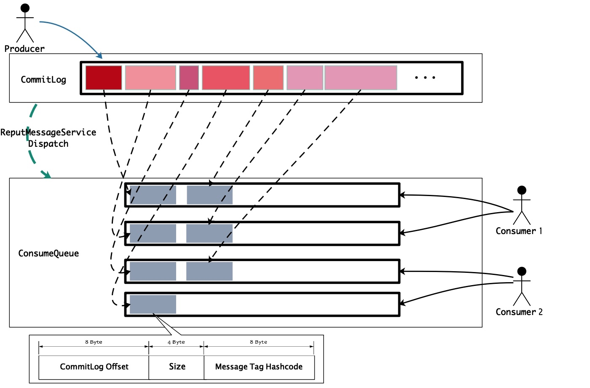

# 第20节 ReputMessageService

[TOC]

## 概述

前面已经很详细的讲解了 *RocketMQ* 消息存储，*RocketMQ* 的存储机制是所有的 *topic* 消息都顺序写入同一 *CommitLog* 文件中，**消息写入是完全的顺序 *IO*，再加上利用内存文件映射/堆外内存池机制，极大的提高了消息的写入性能**。

设想一下，当消费者消费某一 *topic* 下的消息时，如果直接基于 *CommitLog* 进行消费的话，这就很尴尬了。因为 *RocketMQ* 的存储机制是所有的 *topic* 消息都顺序写入同一 *CommitLog* 文件中，如果根据 *topic* 去消费消息，就不得不遍历整个  *CommitLog* 文件，显然 *RocketMQ* 作为一款高性能的消息中间件，是不允许这种事情发生的。

消费队列（*ConsumeQueue*）就是为了解决上面的消息消费问题的，*ReputMessageService* 为消息转发（*Dispatch*）服务线程，它会将写入 *CommitLog* 的消息的位置（*offset*）、消息大小、*tag hashcode* 信息写入消费队列中。如下图所示，



消息消费时，首先根据 *CommitLog offset* 去 *CommitLog* 中（一个 *CommitLog* 文件大小为 *1G*，写满后会创建一个新的 *CommitLog* 文件）找到消息的起始偏移量，然后再根据消息长度，进而能获取整个消息内容。

使用过 *RocketMQ* 的开发者都知道，每个消息都可以指定一个唯一 *key*，如果我们需要根据消息 *key* 来查找消息，而在消费队列中显然并没有存储消息的 *key*，为了避免出现相同的尴尬，*RocketMQ* 又增加了索引文件（*IndexFile*）。同样的，消息索引文件的构建也是由 *ReputMessageService* 消息转发服务线程来完成的。

本模块主要讲解**消费队列（*ConsumeQueue*）**、**索引文件（*IndexFile*）**是如何基于 *CommitLog* 构建的，以及如何根据消费队列和索引文件查找消息。

根据 *CommitLog* 构建消费队列和索引文件存在两种情况：

1. *broker* 正常运行时，生产者向 *broker* 发送消息，并存储到 *CommitLog* 文件，*ReputMessageService* 消息转发服务线程将消息的位置信息和索引信息转发到消费队列和索引文件。
2. *broker* 启动时，会检查 *CommitLog* 与消费队列和索引文件中的数据是否一致，如果不一致，需要根据 *CommitLog* 来恢复消费队列和索引文件。

## 服务启动流程

*ReputMessageService* 服务线程是在 *DefaultMessageStore* 的构造方法中创建的，

```java
public DefaultMessageStore(final MessageStoreConfig messageStoreConfig, final BrokerStatsManager brokerStatsManager,
                           final MessageArrivingListener messageArrivingListener, final BrokerConfig brokerConfig) throws IOException {
    ...
    this.reputMessageService = new ReputMessageService();
    ...
}
```

*ReputMessageService* 既然是服务线程，那肯定会在 *Broker* 启动时进行初始化并启动。下面我们来简单分析下其启动流程。

```text
BrokerStartup#main -> BrokerStartup#start -> BrokerController#start -> DefaultMessageStore#start
```

实际上，这些工作是在 *DefaultMessageStore* 的 `start()` 方法中完成的。

在初始化时，指定 *ReputMessageService* 转发的起始物理偏移量为最后一个映射文件当前具有可刷盘数据的最大物理偏移量。

```java
public void start() throws Exception {
    ...
    if (this.getMessageStoreConfig().isDuplicationEnable()) {
        this.reputMessageService.setReputFromOffset(this.commitLog.getConfirmOffset());
    } else {
        this.reputMessageService.setReputFromOffset(this.commitLog.getMaxOffset());
    }
    this.reputMessageService.start();
    ...
}
```

> `isDuplicationEnable` 默认值 *false*，开源版本目前暂未实现其相关功能。

## 源码深入剖析

### 成员变量

该服务的成员变量很简单，只有一个字段 `reputFromOffset`，该字段表示服务从 *CommitLog* 开始拉取的初始物理偏移量。

```java
private volatile long reputFromOffset = 0;
```

### 核心逻辑

```java
public void run() {
    DefaultMessageStore.log.info(this.getServiceName() + " service started");

    while (!this.isStopped()) {
        try {
            Thread.sleep(1); // 每次doReput操作前线程会先休眠1毫秒
            this.doReput();
        } catch (Exception e) {
            DefaultMessageStore.log.warn(this.getServiceName() + " service has exception. ", e);
        }
    }

    DefaultMessageStore.log.info(this.getServiceName() + " service end");
}
```

只要该服务线程没有停止，就会一直调用 *deReput* 方法生成消息位置（*offset*）到消费队列，并且还会生成消息索引到索引文件。每次 *doReput* 操作前线程会先休眠 1 毫秒，下面重点跟进 *doReput* 方法。

```java
private void doReput() {
    for (boolean doNext = true; this.isCommitLogAvailable() && doNext; ) { // @1

        // isDuplicationEnable 默认值false，开源版本目前暂未实现其相关功能
        if (DefaultMessageStore.this.getMessageStoreConfig().isDuplicationEnable()
                && this.reputFromOffset >= DefaultMessageStore.this.getConfirmOffset()) {
            break;
        }

        SelectMappedBufferResult result = DefaultMessageStore.this.commitLog.getData(reputFromOffset); // @2
        if (result != null) {
            try {
                this.reputFromOffset = result.getStartOffset();

                for (int readSize = 0; readSize < result.getSize() && doNext; ) {
                    // @3
                    DispatchRequest dispatchRequest =
                            DefaultMessageStore.this.commitLog.checkMessageAndReturnSize(result.getByteBuffer(), false, false);
                    int size = dispatchRequest.getMsgSize(); // 解析出的消息长度

                    if (dispatchRequest.isSuccess()) {
                        if (size > 0) { // 成功解析出消息
                            DefaultMessageStore.this.doDispatch(dispatchRequest); // @4

                            // 消息通知
                            // @5^
                            if (BrokerRole.SLAVE != DefaultMessageStore.this.getMessageStoreConfig().getBrokerRole()
                                    && DefaultMessageStore.this.brokerConfig.isLongPollingEnable()) {
                                DefaultMessageStore.this.messageArrivingListener.arriving(dispatchRequest.getTopic(),
                                        dispatchRequest.getQueueId(), dispatchRequest.getConsumeQueueOffset() + 1,
                                        dispatchRequest.getTagsCode(), dispatchRequest.getStoreTimestamp(),
                                        dispatchRequest.getBitMap(), dispatchRequest.getPropertiesMap());
                            }
                            // @5$

                            this.reputFromOffset += size;
                            readSize += size; // 继续读取下一消息

                            // @6^
                            if (DefaultMessageStore.this.getMessageStoreConfig().getBrokerRole() == BrokerRole.SLAVE) {
                                DefaultMessageStore.this.storeStatsService
                                        .getSinglePutMessageTopicTimesTotal(dispatchRequest.getTopic()).incrementAndGet();
                                DefaultMessageStore.this.storeStatsService
                                        .getSinglePutMessageTopicSizeTotal(dispatchRequest.getTopic())
                                        .addAndGet(dispatchRequest.getMsgSize());
                            }
                            // @6$
                        } else if (size == 0) { // 到达MappedFile末尾
                            this.reputFromOffset = DefaultMessageStore.this.commitLog.rollNextFile(this.reputFromOffset); // @7
                            readSize = result.getSize(); // 直接跳出循环，继续读取下一个MappedFile
                        }
                    } else if (!dispatchRequest.isSuccess()) {

                        // for bug
                        if (size > 0) { // 消息长度校验失败
                            log.error("[BUG]read total count not equals msg total size. reputFromOffset={}", reputFromOffset);
                            this.reputFromOffset += size; // 跳过本条消息
                        } else { // MAGIC CODE不合法/CRC校验失败
                            doNext = false;
                            if (DefaultMessageStore.this.brokerConfig.getBrokerId() == MixAll.MASTER_ID) {
                                log.error("[BUG]the master dispatch message to consume queue error, COMMITLOG OFFSET: {}",
                                        this.reputFromOffset);

                                this.reputFromOffset += result.getSize() - readSize; // 跳过当前所有待转发的消息
                            }
                        }
                    }
                }
            } finally {
                result.release();
            }
        } else {
            doNext = false; // 没有待转发的消息，结束循环
        }
    }
}
```


#### (1) isCommitLogAvailable

代码@1，`getMaxOffset()` 方法用于获取最后一个映射文件当前具有可刷盘数据的最大物理偏移量。也就是说，这些消息即使没有刷盘，只要写入映射文件（写入内存），就可以将其位置信息和索引信息转发到消费队列和索引文件。显然，`isCommitLogAvailable()` 方法用于判断是否有新的消息可转发。

```java
private boolean isCommitLogAvailable() {
    return this.reputFromOffset < DefaultMessageStore.this.commitLog.getMaxOffset();
}
```

#### (2) getData

代码@2，根据**物理偏移量**获取待转发的消息。注意，这里获取的是 *offset* 与 *MappedFile* 当前具有的可刷盘数据的最大物理偏移量之间的消息数据。也就是说，获取已写入映射文件，但还未将其位置信息和索引信息分别转发到消费队列和索引文件的这些消息。

```java
// CommitLog.java
public SelectMappedBufferResult getData(final long offset) {
    return this.getData(offset, offset == 0);
}

/**
 * @param offset                物理偏移量
 * @param returnFirstOnNotFound 如果MappedFile没有找到，是否返回第一个
 * @return
 */
public SelectMappedBufferResult getData(final long offset, final boolean returnFirstOnNotFound) {
    // 映射文件的大小，也即CommitLog文件的大小，默认 1G
    int mappedFileSize = this.defaultMessageStore.getMessageStoreConfig().getMapedFileSizeCommitLog();
    // 根据物理偏移量查找MappedFile
    // 如果returnFirstOnNotFound为true，那么如果MappedFile没有找到，则返回第一个
    MappedFile mappedFile = this.mappedFileQueue.findMappedFileByOffset(offset, returnFirstOnNotFound);
    if (mappedFile != null) {
        int pos = (int) (offset % mappedFileSize); // 计算映射文件的相对偏移量
        SelectMappedBufferResult result = mappedFile.selectMappedBuffer(pos);
        return result;
    }

    return null;
}
```

```java
// MappedFileQueue.java
/**
 * 根据物理偏移量查找映射文件。
 * <p>
 * 如果returnFirstOnNotFound为true，那么如果映射文件没有找到，则返回第一个。
 *
 * @param offset                物理偏移量
 * @param returnFirstOnNotFound 如果映射文件没有找到，是否返回第一个
 * @return MappedFile或者null(没有找到映射文件，并且returnFirstOnNotFound为false).
 */
public MappedFile findMappedFileByOffset(final long offset, final boolean returnFirstOnNotFound) {
    try {
        MappedFile firstMappedFile = this.getFirstMappedFile(); // 获取第一个映射文件
        MappedFile lastMappedFile = this.getLastMappedFile(); // 获取最后一个映射文件
        if (firstMappedFile != null && lastMappedFile != null) {
            // 如果offset小于第一个映射文件的起始偏移量，或者offset大于等于最后一个映射文件的起始偏移量加上映射文件的大小，那么offset不匹配，这是不对的
            if (offset < firstMappedFile.getFileFromOffset() || offset >= lastMappedFile.getFileFromOffset() + this.mappedFileSize) {
                LOG_ERROR.warn("Offset not matched. Request offset: {}, firstOffset: {}, lastOffset: {}, mappedFileSize: {}, mappedFiles count: {}",
                        offset,
                        firstMappedFile.getFileFromOffset(),
                        lastMappedFile.getFileFromOffset() + this.mappedFileSize,
                        this.mappedFileSize,
                        this.mappedFiles.size());
            } else {
                // 这里的减法主要是考虑到第一个映射文件的起始偏移量可能不是从0开始（MappedFileQueue在创建映射文件时是支持指定第一个映射文件的起始偏移量的，默认为0）
                int index = (int) ((offset / this.mappedFileSize) - (firstMappedFile.getFileFromOffset() / this.mappedFileSize));
                MappedFile targetFile = null;
                try {
                    targetFile = this.mappedFiles.get(index);
                } catch (Exception ignored) {
                }

                if (targetFile != null && offset >= targetFile.getFileFromOffset()
                        && offset < targetFile.getFileFromOffset() + this.mappedFileSize) {
                    return targetFile;
                }

                for (MappedFile tmpMappedFile : this.mappedFiles) {
                    if (offset >= tmpMappedFile.getFileFromOffset()
                            && offset < tmpMappedFile.getFileFromOffset() + this.mappedFileSize) {
                        return tmpMappedFile;
                    }
                }
            }

            // 如果找不到，返回第一个映射文件
            if (returnFirstOnNotFound) {
                return firstMappedFile;
            }
        }
    } catch (Exception e) {
        log.error("findMappedFileByOffset Exception", e);
    }

    return null;
}
```

```java
// MappedFile.java
/**
 * 根据相对偏移量 {@code pos} 获取消息数据。
 * <p>
 * 这里获取的是 {@code pos} 与 {@link MappedFile} 当前具有可刷盘数据的最大偏移量之间的消息数据。
 *
 * @param pos 映射文件的相对偏移量
 * @return
 */
public SelectMappedBufferResult selectMappedBuffer(int pos) {
    int readPosition = getReadPosition(); // 映射文件当前具有可刷盘数据的最大偏移量
    if (pos < readPosition && pos >= 0) {
        if (this.hold()) {
            ByteBuffer byteBuffer = this.mappedByteBuffer.slice();

            // 这里获取的是pos与映射文件当前具有可刷盘数据的最大偏移量之间的消息数据
            byteBuffer.position(pos);
            int size = readPosition - pos;
            ByteBuffer byteBufferNew = byteBuffer.slice();
            byteBufferNew.limit(size);

            return new SelectMappedBufferResult(this.fileFromOffset + pos, byteBufferNew, size, this);
        }
    }

    return null;
}
```

这里需要留意一下，关于 *hold*、*release* 在前面都已经讲过了，这里之所以执行 *hold* 是为了防止在 *broker* 关闭时过早的释放堆外内存，导致消费队列和映射文件与 *CommitLog* 不一致。

#### (3) checkMessageAndReturnSize

代码@3，该方法根据消息存储格式，解析出消息的核心属性，计算 *tags hashcode*，并构造 *DispatchRequest* 转发请求。

返回的 *DispatchRequest* 会有如下几种结果，

- *msgSize* 大于 0，*success* 为 *true*，表示成功解析出消息，并构造转发请求；
- *msgSize* 等于 0，*success* 为 *true*，表示到达映射文件的末尾；
- *msgSize* 等于 -1，*success* 为 *false*，表示 *MAGIC CODE* 不合法 / *CRC* 校验失败；
- *msgSize* 大于 0，*success* 为 *false*，表示消息长度校验失败；

代码很长，但逻辑很简单。

```java
/**
 * @param byteBuffer buffer
 * @param checkCRC 是否CRC校验
 * @param readBody 是否读取消息体
 * @return
 */
public DispatchRequest checkMessageAndReturnSize(java.nio.ByteBuffer byteBuffer, final boolean checkCRC,
                                                 final boolean readBody) {
    try {
        // 1 TOTAL SIZE
        int totalSize = byteBuffer.getInt();

        // 2 MAGIC CODE
        int magicCode = byteBuffer.getInt();
        switch (magicCode) {
            case MESSAGE_MAGIC_CODE: // 消息
                break;
            case BLANK_MAGIC_CODE: // 标记到达MappedFile文件末尾
                return new DispatchRequest(0, true /* success */);
            default: // MAGIC CODE illegal
                log.warn("found a illegal magic code 0x" + Integer.toHexString(magicCode));
                return new DispatchRequest(-1, false /* success */);
        }

        byte[] bytesContent = new byte[totalSize];

        int bodyCRC = byteBuffer.getInt();

        int queueId = byteBuffer.getInt();

        int flag = byteBuffer.getInt();

        long queueOffset = byteBuffer.getLong();

        long physicOffset = byteBuffer.getLong();

        int sysFlag = byteBuffer.getInt();

        long bornTimeStamp = byteBuffer.getLong();

        ByteBuffer byteBuffer1 = byteBuffer.get(bytesContent, 0, 8);
        
        long storeTimestamp = byteBuffer.getLong();

        ByteBuffer byteBuffer2 = byteBuffer.get(bytesContent, 0, 8);
        
        int reconsumeTimes = byteBuffer.getInt();

        long preparedTransactionOffset = byteBuffer.getLong();

        int bodyLen = byteBuffer.getInt();
        if (bodyLen > 0) {
            if (readBody) {
                // 读取消息体内容到bytesContent
                byteBuffer.get(bytesContent, 0, bodyLen);

                // 消息体循环冗余校验
                if (checkCRC) {
                    int crc = UtilAll.crc32(bytesContent, 0, bodyLen);
                    if (crc != bodyCRC) {
                        log.warn("CRC check failed. bodyCRC={}, currentCRC={}", crc, bodyCRC);
                        return new DispatchRequest(-1, false/* success */);
                    }
                }
            } else {
                byteBuffer.position(byteBuffer.position() + bodyLen); // 如果不读取消息体，就需要跳过消息体区间
            }
        }

        byte topicLen = byteBuffer.get();
        byteBuffer.get(bytesContent, 0, topicLen);
        String topic = new String(bytesContent, 0, topicLen, MessageDecoder.CHARSET_UTF8);

        long tagsCode = 0;
        String keys = "";
        String uniqKey = null;

        short propertiesLength = byteBuffer.getShort();
        Map<String, String> propertiesMap = null;
        if (propertiesLength > 0) {
            byteBuffer.get(bytesContent, 0, propertiesLength);
            String properties = new String(bytesContent, 0, propertiesLength, MessageDecoder.CHARSET_UTF8);
            propertiesMap = MessageDecoder.string2messageProperties(properties);

            keys = propertiesMap.get(MessageConst.PROPERTY_KEYS); // KEYS

            uniqKey = propertiesMap.get(MessageConst.PROPERTY_UNIQ_CLIENT_MESSAGE_ID_KEYIDX); // UNIQ_KEY

            String tags = propertiesMap.get(MessageConst.PROPERTY_TAGS); // TAGS
            if (tags != null && tags.length() > 0) {
                // 获取tags的hashcode
                tagsCode = MessageExtBrokerInner.tagsString2tagsCode(MessageExt.parseTopicFilterType(sysFlag), tags);
            }

            // Timing message processing
            // @@1^
            {
                String t = propertiesMap.get(MessageConst.PROPERTY_DELAY_TIME_LEVEL);
                if (ScheduleMessageService.SCHEDULE_TOPIC.equals(topic) && t != null) {
                    int delayLevel = Integer.parseInt(t);

                    if (delayLevel > this.defaultMessageStore.getScheduleMessageService().getMaxDelayLevel()) {
                        delayLevel = this.defaultMessageStore.getScheduleMessageService().getMaxDelayLevel();
                    }

                    if (delayLevel > 0) {
                        tagsCode = this.defaultMessageStore.getScheduleMessageService().computeDeliverTimestamp(delayLevel,
                                storeTimestamp);
                    }
                }
            }
            // @@1$
        }

        int readLength = calMsgLength(bodyLen, topicLen, propertiesLength); // 计算消息长度
        if (totalSize != readLength) { // 校验消息长度
            doNothingForDeadCode(reconsumeTimes);
            doNothingForDeadCode(flag);
            doNothingForDeadCode(bornTimeStamp);
            doNothingForDeadCode(byteBuffer1);
            doNothingForDeadCode(byteBuffer2);
            log.error(
                    "[BUG]read total count not equals msg total size. totalSize={}, readTotalCount={}, bodyLen={}, topicLen={}, propertiesLength={}",
                    totalSize, readLength, bodyLen, topicLen, propertiesLength);
            return new DispatchRequest(totalSize, false/* success */);
        }

        // 构造转发请求
        return new DispatchRequest(
                topic,
                queueId,
                physicOffset,
                totalSize,
                tagsCode,
                storeTimestamp,
                queueOffset,
                keys,
                uniqKey,
                sysFlag,
                preparedTransactionOffset,
                propertiesMap
        );
    } catch (Exception e) {
    }

    return new DispatchRequest(-1, false /* success */);
}
```

##### 延迟消息处理

代码@@1，对延迟消息的处理。

这里首先要回顾下之前我们在讲解 *CommitLog#putMessage* 时提到延迟消息的一些逻辑，代码如下：

```java
// 获取消息类型
final int tranType = MessageSysFlag.getTransactionValue(msg.getSysFlag());
if (tranType == MessageSysFlag.TRANSACTION_NOT_TYPE
        || tranType == MessageSysFlag.TRANSACTION_COMMIT_TYPE) {
    // Delay Delivery
    if (msg.getDelayTimeLevel() > 0) { // 获取消息延时投递时间级别
        if (msg.getDelayTimeLevel() > this.defaultMessageStore.getScheduleMessageService().getMaxDelayLevel()) {
            msg.setDelayTimeLevel(this.defaultMessageStore.getScheduleMessageService().getMaxDelayLevel());
        }

        // topic值更改为SCHEDULE_TOPIC_XXXX
        topic = ScheduleMessageService.SCHEDULE_TOPIC;
        // 根据延迟级别获取延时消息的队列 ID（ queueId 等于延迟级别减去 1） 并更改 queueId 值
        queueId = ScheduleMessageService.delayLevel2QueueId(msg.getDelayTimeLevel());

        // Backup real topic, queueId
        // 将消息中原 topic 和 queueId 存入消息属性中；
        MessageAccessor.putProperty(msg, MessageConst.PROPERTY_REAL_TOPIC, msg.getTopic());
        MessageAccessor.putProperty(msg, MessageConst.PROPERTY_REAL_QUEUE_ID, String.valueOf(msg.getQueueId()));
        msg.setPropertiesString(MessageDecoder.messageProperties2String(msg.getProperties()));

        msg.setTopic(topic);
        msg.setQueueId(queueId);
    }
}
```

通过上面的代码我们知道，延迟消息有**消息延时投递时间级别**（*DELAY*）属性，同时消息的 *topic* 为 *SCHEDULE_TOPIC_XXXX*。

这里，通过获取**消息延时投递时间级别**和 *topic*，确认该消息为延迟消息，对于延迟消息的 *tagsCode* 设置为该消息将来可被消费的时间戳。

```java
tagsCode = this.defaultMessageStore.getScheduleMessageService().computeDeliverTimestamp(delayLevel, storeTimestamp);
```

#### (4) 消息转发

代码@4，将写入 *MappedFile* 的消息转发到 *ConsumeQueue*、*IndexFile*，即将这些消息加入到消费队列和索引文件中。

```java
// DefaultMessageStore.java
public void doDispatch(DispatchRequest req) {
    for (CommitLogDispatcher dispatcher : this.dispatcherList) {
        dispatcher.dispatch(req);
    }
}
```

其中 `dispatcherList` 是在 *DefaultMessageStore* 构造函数中被初始化的。

```java
// DefaultMessageStore.java

private final LinkedList<CommitLogDispatcher> dispatcherList;

public DefaultMessageStore(final MessageStoreConfig messageStoreConfig, final BrokerStatsManager brokerStatsManager,
    final MessageArrivingListener messageArrivingListener, final BrokerConfig brokerConfig) throws IOException {
    ...
    this.dispatcherList = new LinkedList<>();
    this.dispatcherList.addLast(new CommitLogDispatcherBuildConsumeQueue());
    this.dispatcherList.addLast(new CommitLogDispatcherBuildIndex());
    ...
}
```

*ConsumeQueue* 对应于 *CommitLogDispatcherBuildConsumeQueue*；*IndexFile* 对应于 *CommitLogDispatcherBuildIndex*；

我们会在下面几节分别讨论消费队列和索引文件是如何构建的，以及如何根据消费队列和索引文件查找消息。

#### (5) 消息通知

代码@5，这里就先不介绍了，我们会在讲解如何根据消费队列和索引文件查找消息时，再对该部分的代码进行详细解读。

#### (6) 消息统计

代码@6，回顾下之前我们在讲解 *CommitLog#putMessage* 时，*Master broker* 会对向 *MappedFile* 追加成功的消息执行相关的消息统计，这里也是做同样的工作，不同的是这里是针对 *Slave broker* 而言的。

1. 将当前消息所属 *topic* 下写入消息的次数加 1；
2. 将当前消息所属 *topic* 下写入消息的总字节数加上当前消息的字节数；

#### (7) rollNextFile

代码@7，*msgSize* 等于 0，此时已经到达 *MappedFile* 末尾，需要将 *reputFromOffset* 设置为下一个 *MappedFile* 的起始物理偏移量。

```java
public long rollNextFile(final long offset) {
    int mappedFileSize = this.defaultMessageStore.getMessageStoreConfig().getMapedFileSizeCommitLog();
    return offset + mappedFileSize - offset % mappedFileSize;
}
```

